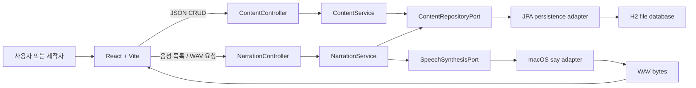
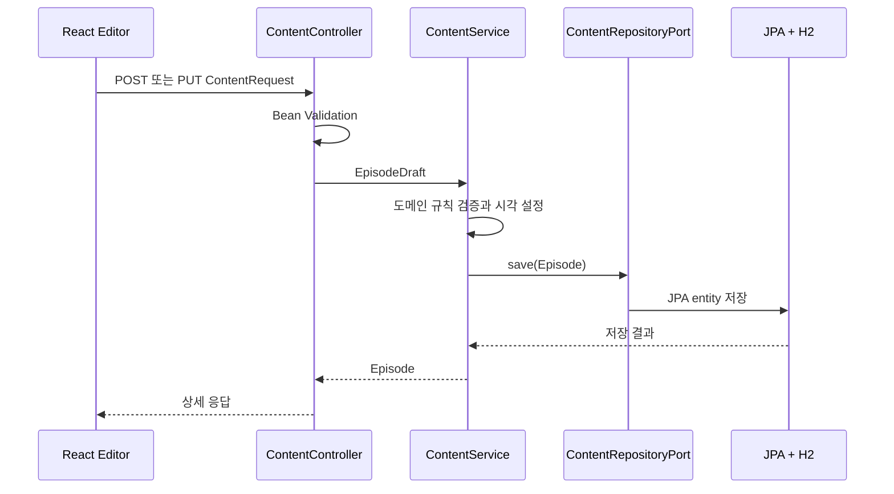
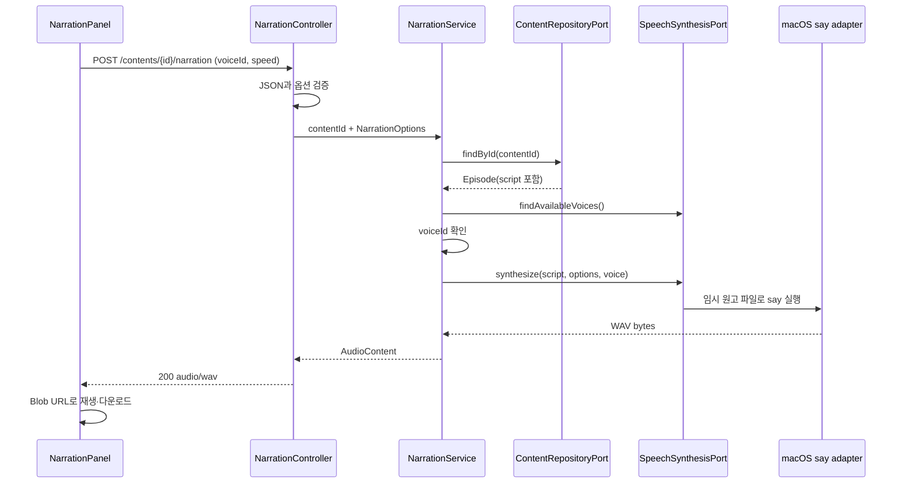

# Architecture Guide

이 문서는 `고요한 지식` MVP에서 콘텐츠가 저장되고 조회되는 흐름과, 그 콘텐츠가 보조 기능인 TTS를 통해 WAV 내레이션으로 만들어지는 흐름을 설명합니다.

## 1. 제품 중심과 설계 목표

이 서비스의 핵심 기능은 **과학 지식 콘텐츠 보관함과 제작 공간**입니다.

- 사용자는 양자역학, 우주론, 천문학, 과학 교양 콘텐츠를 찾아 읽는다.
- 제작자는 제목, 소개, 카테고리, 원고를 작성하고 수정한다.
- 저장된 원고는 선택한 음성으로 미리 듣거나 WAV로 내보낼 수 있다.
- TTS는 독립된 제품이 아니라 콘텐츠 제작을 돕는 supporting capability다.

기술적인 설계 목표는 다음과 같습니다.

- 웹과 향후 모바일 앱이 같은 REST API를 사용한다.
- HTTP, 업무 흐름, 도메인 규칙, JPA, TTS 실행을 서로 분리한다.
- 도메인 모델이 Spring MVC, JPA와 macOS 명령을 알지 않게 한다.
- H2를 PostgreSQL로, macOS `say`를 클라우드 TTS로 교체할 수 있게 한다.
- 현재 MVP의 단순한 동기 합성과 미래 장문 제작 파이프라인을 명확히 구분한다.

이를 위해 간결한 **Ports and Adapters(헥사고날 아키텍처)** 구조를 사용합니다. 현재 코드는 하나의 Spring Boot 애플리케이션이지만 콘텐츠와 내레이션의 책임은 유스케이스와 포트 수준에서 분리되어 있습니다.

## 2. 전체 시스템



Vite는 개발 중 프론트의 `/api` 요청을 `127.0.0.1:8080`의 Spring 서버로 전달합니다. 콘텐츠 데이터는 H2 파일에 남지만, 생성된 WAV는 현재 서버에 저장하지 않고 해당 HTTP 응답으로만 전달합니다.

## 3. 도메인 모델

### `Episode`

잠들기 전에 읽거나 들을 지식 콘텐츠 한 편입니다.

| 필드 | 의미 |
|---|---|
| `id` | 서버가 생성한 UUID |
| `title` | 보관함과 상세 화면의 제목 |
| `summary` | 목록과 상세 화면의 짧은 소개 |
| `category` | 안정적인 카테고리 코드 |
| `script` | 내레이션 생성에 사용하는 전체 원고 |
| `createdAt` | 최초 생성 시각 |
| `updatedAt` | 마지막 수정 시각 |

`Episode`는 JPA entity가 아닌 순수한 Java record입니다. 생성과 수정 시 `EpisodeDraft`를 통해 같은 입력 규칙을 적용합니다.

### `EpisodeDraft`

새 콘텐츠 생성과 기존 콘텐츠 수정에 사용하는 값 객체입니다.

- 제목: 필수, 최대 120자
- 소개: 필수, 최대 500자
- 원고: 필수, 최대 20,000자
- 문자열 앞뒤 공백 제거
- 카테고리 필수

HTTP DTO의 Bean Validation과 도메인의 생성자 검증을 모두 둡니다. HTTP 경계에서는 사용자에게 필드별 오류를 전달하고, 도메인에서는 웹이 아닌 다른 진입점에서도 규칙이 무너지지 않게 보호합니다.

### `ContentCategory`

```text
QUANTUM_PHYSICS
COSMOLOGY
ASTRONOMY
GENERAL_SCIENCE
```

표시 이름은 React가 번역합니다. API와 DB에는 코드가 저장되므로 화면 문구가 바뀌어도 저장된 값의 의미가 유지됩니다.

### 내레이션 모델

- `NarrationOptions`: 음성 ID와 `0.5`~`2.0` 속도
- `Voice`: 제공자와 무관한 음성 ID, 이름, 설명, locale
- `AudioContent`: 생성된 오디오 바이트와 MIME 타입

내레이션 모델은 콘텐츠를 소유하지 않습니다. `NarrationService`가 콘텐츠 ID로 `Episode`를 조회한 뒤 원고만 음성 합성 포트에 전달합니다.

## 4. 계층별 책임

| 계층 | 현재 코드 | 책임 | 알면 안 되는 것 |
|---|---|---|---|
| Inbound web adapter | `ContentController`, `NarrationController`, DTO, `ApiExceptionHandler` | HTTP 요청을 유스케이스 호출로 변환하고 응답 구성 | JPA entity, `ProcessBuilder`, H2 파일 경로 |
| Inbound port | `BrowseContentUseCase`, `CreateContentUseCase`, `UpdateContentUseCase`, `GenerateNarrationUseCase`, `ListNarrationVoicesUseCase` | 외부 진입점에 제공할 애플리케이션 기능 계약 | HTTP status, React 상태, 구체 adapter |
| Application service | `ContentService`, `NarrationService` | 트랜잭션과 유스케이스 순서 조정 | Servlet, `EntityManager`, macOS 명령 옵션 |
| Domain model | `Episode`, `EpisodeDraft`, `ContentCategory`, `NarrationOptions`, `Voice`, `AudioContent` | 기술에 독립적인 데이터와 불변 조건 | Spring MVC, JPA, H2, `say` |
| Outbound port | `ContentRepositoryPort`, `SpeechSynthesisPort` | 애플리케이션이 저장소와 음성 제공자에 요구하는 계약 | Spring Data 인터페이스와 공급자 SDK 타입 |
| Persistence adapter | `JpaContentRepositoryAdapter`, `ContentJpaEntity`, `SpringDataContentRepository` | 도메인과 JPA 모델 변환, H2 읽기·쓰기 | HTTP DTO와 React 화면 |
| Narration adapter | `MacOsSayNarrationAdapter` | 시스템 음성 조회, `say` 실행, WAV 생성과 임시 파일 정리 | 콘텐츠 화면과 JPA entity |
| Configuration | `ApplicationConfiguration`, `NarrationConfiguration`, properties | `Clock`, 포트 구현과 설정 값 조립 | 개별 유스케이스의 업무 흐름 |

의존 방향은 안쪽의 계약을 향합니다.

```text
Web adapter ----> Inbound port <---- Application service ----> Outbound port <---- Outbound adapter
                                              |
                                              +----> Domain model
```

`ContentService`는 `JpaContentRepositoryAdapter`를 직접 만들지 않고 `ContentRepositoryPort`를 생성자로 받습니다. `NarrationService`도 `MacOsSayNarrationAdapter`가 아닌 `SpeechSynthesisPort`에 의존합니다. Spring Configuration과 component scanning이 실제 구현을 연결합니다.

## 5. 콘텐츠 목록과 상세 조회

### 목록

```text
GET /api/v1/contents
  1. ContentController가 BrowseContentUseCase를 호출한다.
  2. ContentService가 ContentRepositoryPort.findAll()을 호출한다.
  3. JPA adapter가 updatedAt 내림차순으로 entity를 읽는다.
  4. entity를 Episode로 변환한다.
  5. Controller DTO가 script를 제외한 요약 목록을 만든다.
```

목록 DTO에서 긴 원고를 의도적으로 제외합니다. React는 목록을 한 번 받은 뒤 제목·소개 검색과 카테고리 필터를 클라이언트에서 수행합니다.

### 상세

```text
GET /api/v1/contents/{contentId}
  -> UUID 검증
  -> 콘텐츠 조회
  -> 없으면 404
  -> script를 포함한 상세 DTO 반환
```

콘텐츠 원고는 상세 화면과 내레이션 제작 시에만 필요합니다.

## 6. 콘텐츠 생성과 수정



- 생성은 `UUID.randomUUID()`와 주입된 `Clock`으로 ID와 시각을 만듭니다.
- 수정은 기존 콘텐츠를 먼저 조회하고 `createdAt`은 유지한 채 `updatedAt`만 변경합니다.
- `ContentService`의 조회 메서드는 읽기 전용 트랜잭션을 사용합니다.
- 생성과 수정 메서드는 쓰기 트랜잭션으로 재정의합니다.
- 생성 성공은 `201 Created`와 `Location` 헤더를 반환합니다.
- 수정 성공은 전체 상세 DTO를 반환합니다.

`Clock`을 주입하면 단위 테스트가 실제 시스템 시간에 의존하지 않아 결정적이 됩니다.

## 7. JPA와 H2 persistence adapter

```text
Episode
  <-> JpaContentRepositoryAdapter
  <-> ContentJpaEntity
  <-> SpringDataContentRepository
  <-> H2 file database
```

도메인 `Episode`에 `@Entity`, `@Id`, `@Lob`을 붙이지 않습니다. 대신 adapter 내부의 `ContentJpaEntity`가 테이블 매핑을 담당합니다.

| 컬럼 | JPA 매핑 |
|---|---|
| `id` | UUID primary key |
| `title` | `varchar(120)`, 필수 |
| `summary` | `varchar(500)`, 필수 |
| `category` | enum 이름 문자열 |
| `script` | `@Lob`, 필수 |
| `createdAt` | 최초 생성 후 수정 불가 |
| `updatedAt` | 마지막 수정 시각 |

현재 데이터베이스 URL은 다음과 같습니다.

```text
jdbc:h2:file:./data/sleepknowledge;AUTO_SERVER=TRUE
```

`ddl-auto: update`가 학습용 테이블을 만들고 갱신하며 `open-in-view: false`로 HTTP 응답 렌더링 단계까지 persistence context를 열어 두지 않습니다.

`ContentSeedData`는 저장된 행이 하나도 없을 때만 고정 UUID를 가진 예시 두 편을 추가합니다. 실제 데이터가 하나라도 있으면 seed를 다시 넣지 않습니다.

현재 persistence 선택의 한계:

- H2와 자동 DDL 갱신은 단일 개발 환경에 적합하지만 운영 마이그레이션 이력을 남기지 않습니다.
- 게시 상태, 작성자, 버전 충돌, 삭제와 감사 이력은 아직 없습니다.
- 목록은 전체 데이터를 한 번에 읽으며 서버 페이지네이션이 없습니다.
- JPA entity와 도메인 사이 수동 mapping이 늘어나면 전용 mapper를 둘 수 있습니다.

운영 단계에서는 PostgreSQL, Flyway migration, `@Version` 기반 optimistic locking, 페이지네이션을 추가하는 것이 좋습니다.

## 8. 내레이션 요청 흐름



이 흐름에서 중요한 점은 원고가 내레이션 요청 JSON에 포함되지 않는다는 것입니다. 반드시 먼저 저장된 콘텐츠를 조회하므로 TTS가 독립적인 임의 텍스트 도구가 아니라 콘텐츠 제작의 보조 기능으로 동작합니다.

`GET /api/v1/narration/voices`도 같은 `SpeechSynthesisPort`를 통해 제공자가 지원하는 음성을 조회합니다.

## 9. macOS `say` adapter

`MacOsSayNarrationAdapter`는 운영체제 의존 작업만 담당합니다.

1. `say -v '?'` 결과를 `Voice` 모델로 변환한다.
2. 선택한 속도에 기준 WPM을 곱해 `say -r` 값으로 바꾼다.
3. 원고를 임시 UTF-8 파일에 기록한다.
4. 셸 문자열 대신 분리된 인자의 `ProcessBuilder`로 명령을 실행한다.
5. `WAVE`, `LEI16@22050` 형식으로 WAV를 생성한다.
6. 프로세스 출력을 임시 로그 파일로 배출해 pipe buffer 교착을 방지한다.
7. timeout, 비정상 종료와 파일 오류를 `SpeechSynthesisException`으로 변환한다.
8. 성공과 실패 모두에서 원고, WAV, 로그 임시 파일을 정리한다.

사용자가 입력한 원고를 셸 명령 문자열에 이어 붙이지 않으므로 command injection 위험을 줄입니다. 음성 ID도 설치된 음성 목록과 대조한 뒤 사용합니다.

## 10. 현재 동기 WAV 계약

MVP는 다음 계약을 사용합니다.

```http
POST /api/v1/contents/{contentId}/narration
200 OK
Content-Type: audio/wav
Cache-Control: no-store
Content-Disposition: inline; filename="narration-{contentId}.wav"
```

Base64 JSON 대신 바이너리를 직접 반환하면 크기 증가를 피하고 브라우저의 `<audio>`와 `Blob` API를 바로 사용할 수 있습니다.

하지만 현재 방식은 다음 작업을 하나의 HTTP 요청 안에서 수행합니다.

```text
전체 원고 합성 -> WAV 전체 byte[] 읽기 -> 응답 -> 브라우저 Blob 보관
```

따라서 이 API는 **로컬 미리 듣기와 수동 WAV 내보내기용**입니다. 원고 입력 제한이 20,000자로 늘어났더라도 운영 수준의 장문 제작 파이프라인을 의미하지 않습니다. 서버 timeout은 5분이며 요청 취소, 진행률, 부분 재시도, 결과 저장과 캐시가 없습니다.

## 11. 프론트엔드 구조

현재 React 앱은 별도 라우팅 라이브러리 없이 `App`의 화면 상태로 세 가지 화면을 전환합니다.

```text
ContentLibrary
  -> ContentCard

ContentDetail
  -> 전체 script
  -> NarrationPanel
      -> VoiceSelector
      -> SpeedControl
      -> AudioResult

ContentEditor
  -> title / summary / category / script
```

역할별 폴더:

| 폴더 | 책임 |
|---|---|
| `api` | HTTP 요청, 오류 읽기, 외부 JSON을 프론트 모델로 변환 |
| `domain` | 콘텐츠·음성 타입, 카테고리 표시, 입력 제한, 예상 청취 시간 |
| `hooks` | 목록·상세·저장·음성·생성 상태와 요청 취소 |
| `components` | 보관함, 카드, 상세, 편집기, 내레이션 UI |

프론트는 목록 응답에 원고가 없음을 전제로 하고, 사용자가 카드를 열 때 상세 API를 호출합니다. 내레이션 결과는 `URL.createObjectURL`로 재생하며 새 결과나 화면 이동, component 해제 시 이전 URL을 해제합니다.

현재 “화면 대기 중단”은 브라우저의 `fetch`를 중단합니다. 서버의 `say` 프로세스까지 전달되는 취소 프로토콜은 구현하지 않았습니다.

## 12. HTTP DTO와 도메인을 나누는 이유

`ContentRequest`는 JSON 필드와 Bean Validation을 담당하고 `EpisodeDraft`로 변환됩니다. 응답도 목록용 `ContentSummaryResponse`와 상세용 `ContentDetailResponse`를 분리합니다.

이 경계가 있으면 다음 변경이 서로 번지지 않습니다.

- API 필드명이나 버전 변경
- 목록에서 원고를 제외하거나 preview 추가
- 도메인 규칙 추가
- JPA 테이블 구조 변경
- 모바일 전용 응답 표현 추가
- 특정 TTS 공급자 요청 형식 변경

JPA entity를 Controller가 직접 반환하지 않는 것도 같은 이유입니다. HTTP 직렬화가 persistence context와 연관관계에 의존하는 문제를 피할 수 있습니다.

## 13. 오류가 API 응답이 되는 과정

| 상황 | 발견 위치 | HTTP 의미 |
|---|---|---|
| 필수 입력 누락, 길이 초과, 잘못된 속도 | Bean Validation 또는 도메인 | `400 Bad Request` |
| 알 수 없는 카테고리 JSON | JSON deserialization | `400 Bad Request` |
| UUID 경로 형식 오류 | Spring MVC argument conversion | `400 Bad Request` |
| 존재하지 않는 콘텐츠 | Application service | `404 Not Found` |
| 지원하지 않는 음성 | Narration service | `400 Bad Request` |
| `say` 실행·timeout·WAV 처리 실패 | Narration adapter | `502 Bad Gateway` |
| 예상하지 못한 오류 | Global exception handler | `500 Internal Server Error` |

`ApiExceptionHandler`는 RFC 9457 `ProblemDetail`로 오류를 통일합니다. Spring MVC가 이미 의미 있는 상태와 헤더를 가진 `404`, `405`, `406`, `415` 등의 오류는 원래 정보를 보존합니다. 내부 스택 트레이스와 프로세스 상세 출력은 응답에 넣지 않습니다.

## 14. 새 TTS 제공자 추가

클라우드 공급자는 `SpeechSynthesisPort`를 구현하는 새 adapter로 추가합니다.

```text
NarrationService
  -> SpeechSynthesisPort
      -> MacOsSayNarrationAdapter
      -> CloudNarrationAdapter (future)
```

추가 순서:

1. 기존 포트의 음성 조회와 합성 계약을 읽습니다.
2. 공급자 SDK 또는 HTTP client를 사용하는 outbound adapter를 만듭니다.
3. `NarrationOptions`와 `Voice`를 공급자 옵션으로 매핑합니다.
4. 공급자 결과 형식이 WAV가 아니라면 현재 API 계약을 유지하도록 변환하거나 API의 포맷 계약을 확장합니다.
5. 설정 값에 따라 구현 Bean을 선택하도록 `NarrationConfiguration`을 확장합니다.
6. timeout, 429, 공급자 4xx·5xx를 애플리케이션 오류로 안전하게 번역합니다.
7. 공급자 계약 테스트와 기존 `NarrationServiceTest`를 실행합니다.

API 키는 React 코드나 Git 저장소에 넣지 않고 백엔드 환경 변수 또는 비밀 저장소에서만 읽습니다.

## 15. 장문 내레이션 목표 구조

30분에서 수시간짜리 콘텐츠는 동기 엔드포인트를 확장하는 방식이 아니라 작업 기반 API로 분리해야 합니다.


권장 API 예시:

```text
POST /api/v1/contents/{id}/narrations   -> 202 Accepted + jobId
GET  /api/v1/narrations/{jobId}         -> QUEUED | PROCESSING | READY | FAILED
GET  /api/v1/media/{assetId}            -> Range 재생 또는 signed URL
```

필요한 데이터:

- 콘텐츠 ID와 합성 당시 원고 버전 또는 checksum
- 공급자, 음성, 속도와 출력 포맷
- 전체 작업과 청크별 상태·재시도 횟수
- 공급자 request ID와 실패 코드
- 저장소 key, MIME 타입, byte 크기, 재생 길이, checksum

중요한 운영 규칙:

- 공급자별 글자 수와 UTF-8 byte 제한에 맞추되 문장 경계에서 나눕니다.
- 429와 일시적인 5xx는 지수 backoff와 jitter로 제한적으로 재시도합니다.
- 영구적인 4xx는 자동 재시도하지 않습니다.
- 같은 원고 checksum과 음성 설정은 재사용해 중복 비용을 막습니다.
- 최종 오디오 전체를 JVM 메모리에 올리지 않습니다.
- DB에는 오디오 blob 대신 객체 저장소 key와 metadata를 저장합니다.
- 청크 상태를 저장해 서버 재시작 후 중간부터 재개합니다.
- 동시 작업 수, 사용자별 quota, provider 비용 한도를 둡니다.

로컬 학습 단계의 `@Async`는 HTTP 요청 분리를 연습하는 데 쓸 수 있지만 내구성 있는 큐는 아닙니다. 실제 운영에서는 transaction 이후 안전하게 발행되는 outbox와 외부 queue/worker를 고려해야 합니다.

## 16. YouTube distribution 로드맵

YouTube 배포는 콘텐츠와 내레이션에 종속되지만 별도의 변경 이유와 상태를 가지므로 향후 `distribution` 기능으로 분리하는 것이 좋습니다.

```text
Episode
  -> READY narration
  -> 배경 이미지·영상 선택
  -> 자막과 챕터 생성
  -> FFmpeg render job
  -> 영상 검수
  -> YouTube OAuth upload
  -> YouTube video ID와 배포 상태 저장
```

오디오 파일만으로는 YouTube 영상을 만들 수 없습니다. 초기 기능은 다음 파일을 묶은 export package가 적합합니다.

- WAV 또는 MP3 내레이션
- 검수 가능한 원고
- SRT 또는 VTT 자막
- 제목, 설명, 출처와 챕터 metadata
- 썸네일 후보와 배경 asset 목록

자동 업로드를 추가할 때는 OAuth token 보관, YouTube API quota, 재시도와 중복 업로드 방지, 기본 비공개·미등록 상태를 다뤄야 합니다. 공개 전에 사람이 과학적 사실, 출처, 발음, 음량, 이미지·음악·원고 저작권, TTS 음성의 상업 이용 조건과 필요한 AI 고지를 검수하는 단계를 두는 것이 안전합니다.

## 17. 테스트 전략

| 테스트 경계 | 대체하는 것 | 검증 내용 |
|---|---|---|
| Content service unit test | `ContentRepositoryPort`, `Clock` | ID·시각, 생성·수정, 없음 처리, 도메인 규칙 |
| Narration service unit test | repository와 TTS port | 저장된 원고 전달, 음성 선택, 예외 전파 |
| Controller integration test | 필요에 따라 application 또는 실제 JPA | JSON, validation, `201`, `Location`, `404`, ProblemDetail |
| Persistence integration test | H2 | domain/entity mapping, 원고 LOB, 정렬과 재조회 |
| Narration adapter parser test | 대표 `say -v '?'` 출력 문자열 | 음성 이름·locale·설명 parsing |
| Frontend API/domain test | 실제 백엔드 | 목록·상세 변환, CRUD body, Blob, 카테고리와 예상 시간 |
| End-to-end smoke test | 대체 없음 | 작성 → 저장 → 상세 → 내레이션 → 재생·다운로드 |

단위 테스트에서는 실제 H2와 `say`를 무조건 실행하지 않습니다. 포트에 가짜 구현을 넣으면 빠르고 결정적인 테스트가 됩니다. persistence mapping과 실제 음성 합성은 각각 별도의 통합 또는 smoke test로 다룹니다.

장문 파이프라인을 추가하면 다음 테스트가 더 필요합니다.

- 한국어 문장 경계를 보존하는 청크 분할과 공급자 제한 준수
- 중복 작업의 idempotency와 checksum cache
- timeout, 429, 5xx 재시도 및 영구 4xx 미재시도
- 일부 청크 실패 후 재개와 임시·고아 파일 정리
- 서버 재시작 이후 QUEUED/PROCESSING 작업 복구
- 미완성 또는 오래된 원고 버전의 오디오 공개 차단
- media `200`, `206`, `416`, ETag와 경로 탐색 차단

## 18. 기능을 추가할 때 바꿀 위치

| 요구사항 | 주로 바꿀 곳 |
|---|---|
| 콘텐츠 필드·규칙 추가 | domain → request/response DTO → JPA entity와 mapping → UI |
| 검색·필터·페이지네이션 | repository port/adapter → content use case → API query → library UI |
| 초안·공개 상태 | Episode 규칙 → persistence → publish use case/API → 보관함 필터 |
| 로그인·작성자 권한 | Spring Security → application authorization policy |
| 새 데이터베이스 | 새 repository adapter와 운영 설정 |
| 새 TTS 제공자 | `SpeechSynthesisPort` 구현과 narration configuration |
| 장문 비동기 합성 | job use case, queue, chunk repository, audio storage adapter, 상태 API |
| 모바일 앱 | 새 REST client; 기존 HTTP 계약 재사용 |
| YouTube 영상 제작 | 별도 distribution use case, renderer와 uploader adapter |

## 19. 권장 코드 읽기 순서

처음에는 한 요청을 세로로 따라가면 구조를 이해하기 쉽습니다.

### 콘텐츠 저장 흐름

1. `ContentController`에서 URL과 `ContentRequest`를 확인합니다.
2. `CreateContentUseCase` 또는 `UpdateContentUseCase` 계약을 읽습니다.
3. `ContentService`의 트랜잭션과 도메인 생성 코드를 봅니다.
4. `ContentRepositoryPort`가 애플리케이션에 어떤 저장 기능을 제공하는지 확인합니다.
5. `JpaContentRepositoryAdapter`와 `ContentJpaEntity`에서 H2로 연결되는 변환을 봅니다.
6. 같은 흐름의 service와 API 테스트를 읽습니다.

### 내레이션 흐름

1. `NarrationController`에서 콘텐츠 종속 URL과 WAV 응답을 확인합니다.
2. `GenerateNarrationUseCase`와 `NarrationService`를 읽습니다.
3. 서비스가 저장소에서 원고를 가져오는 부분을 확인합니다.
4. `SpeechSynthesisPort` 계약을 봅니다.
5. `MacOsSayNarrationAdapter`의 OS 의존 코드를 읽습니다.
6. `NarrationConfiguration`에서 포트와 구현이 연결되는 지점을 확인합니다.
7. 실제 `say` 대신 가짜 포트를 쓰는 테스트와 수동 smoke test의 차이를 비교합니다.

이 순서로 읽으면 Spring 애노테이션을 개별적으로 외우기보다 **콘텐츠 한 편이 HTTP에서 도메인과 저장소를 거쳐 다시 화면으로 돌아오는 과정**을 이해할 수 있습니다.
