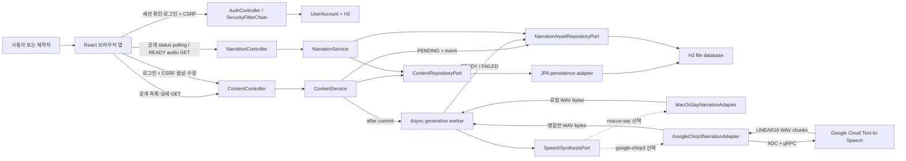
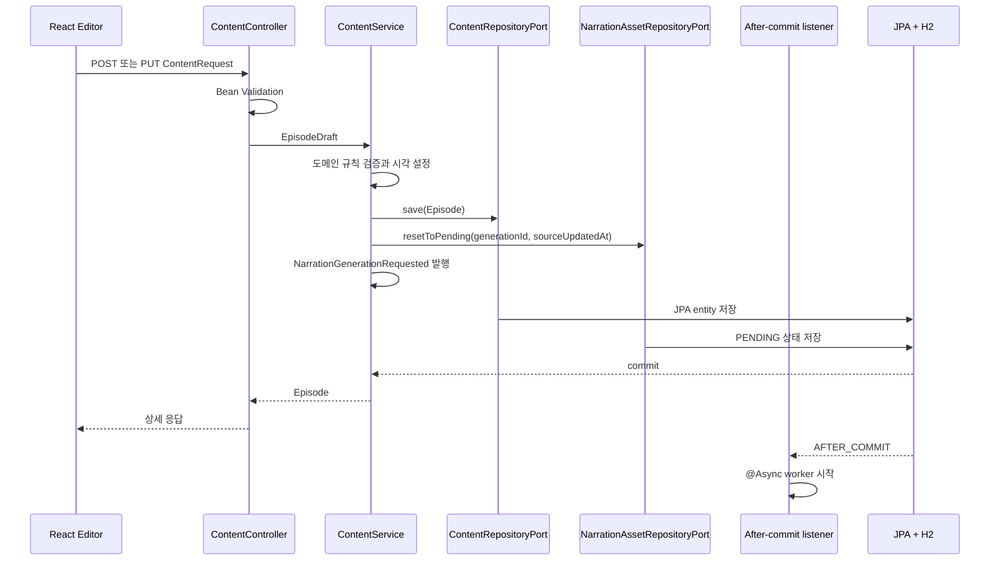
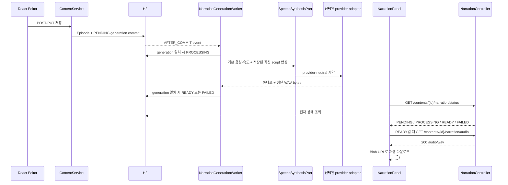

# Architecture Guide

이 문서는 `고요한 지식` MVP에서 콘텐츠가 저장되고 조회되는 흐름과, 그 콘텐츠가 보조 기능인 TTS를 통해 WAV 내레이션으로 만들어지는 흐름을 설명합니다.

## 1. 제품 중심과 설계 목표

이 서비스의 핵심 기능은 **범용 지식 콘텐츠 보관함과 제작 공간**입니다.

- 사용자는 과학, 사회, 역사, 철학, 경제, 기술, 문화, 심리 콘텐츠를 찾아 읽는다.
- 제작자는 제목, 소개, 카테고리, 원고를 작성하고 수정한다.
- 익명 사용자도 저장된 원고와 자동 생성 상태를 확인하고 준비된 WAV를 재생·다운로드할 수 있다.
- 콘텐츠 작성·수정은 로그인 세션과 CSRF 토큰이 필요하다.
- TTS는 독립된 제품이 아니라 콘텐츠 제작을 돕는 supporting capability다.

기술적인 설계 목표는 다음과 같습니다.

- 웹과 향후 모바일 앱이 같은 REST API를 사용한다.
- HTTP, 업무 흐름, 도메인 규칙, JPA, TTS 실행을 서로 분리한다.
- 도메인 모델이 Spring MVC, JPA, macOS 명령과 Google SDK를 알지 않게 한다.
- H2를 PostgreSQL로 바꾸거나, 설정만으로 macOS `say`와 Google Chirp 3를 선택할 수 있게 한다.
- 현재 MVP의 `@Async` 자동 합성과 미래의 durable 장문 제작 파이프라인을 명확히 구분한다.

이를 위해 간결한 **Ports and Adapters(헥사고날 아키텍처)** 구조를 사용합니다. 현재 코드는 하나의 Spring Boot 애플리케이션이지만 콘텐츠와 내레이션의 책임은 유스케이스와 포트 수준에서 분리되어 있습니다.

## 2. 전체 시스템



React 앱의 fetch는 있다면 세션 cookie를 포함하지만, 공개 GET은 세션 없이도 성공합니다. 생성·수정·로그아웃 같은 상태 변경 요청에는 로그인 세션과 `/api/v1/auth/csrf`에서 받은 토큰 헤더를 붙입니다. 로컬 개발에서만 Vite가 프론트의 `/api` 요청을 `127.0.0.1:8080`의 Spring 서버로 전달합니다. 이는 운영 토폴로지가 아니며, 운영은 배포된 정적 프론트와 API를 reverse proxy로 동일 오리진에 묶거나 명시적 API base URL로 연결해야 합니다. 계정, 콘텐츠, 내레이션 상태와 WAV LOB는 H2 파일에 남습니다.

## 3. 도메인 모델

### `Episode`

잠들기 전에 읽거나 들을 지식 콘텐츠 한 편입니다.

| 필드 | 의미 |
|---|---|
| `id` | 서버가 생성한 UUID |
| `title` | 보관함과 상세 화면의 제목 |
| `summary` | 목록과 상세 화면의 짧은 소개 |
| `category` | 안정적인 카테고리 코드 |
| `script` | 내레이션 생성에 사용하는 전체 원고 |
| `createdAt` | 최초 생성 시각 |
| `updatedAt` | 마지막 수정 시각 |

`Episode`는 JPA entity가 아닌 순수한 Java record입니다. 생성과 수정 시 `EpisodeDraft`를 통해 같은 입력 규칙을 적용합니다.

### `EpisodeDraft`

새 콘텐츠 생성과 기존 콘텐츠 수정에 사용하는 값 객체입니다.

- 제목: 필수, 최대 120자
- 소개: 필수, 최대 500자
- 원고: 필수, 최대 20,000자
- 문자열 앞뒤 공백 제거
- 카테고리 필수

HTTP DTO의 Bean Validation과 도메인의 생성자 검증을 모두 둡니다. HTTP 경계에서는 사용자에게 필드별 오류를 전달하고, 도메인에서는 웹이 아닌 다른 진입점에서도 규칙이 무너지지 않게 보호합니다.

### `ContentCategory`

```text
SCIENCE
SOCIETY
HISTORY
PHILOSOPHY
ECONOMY
TECHNOLOGY
CULTURE
PSYCHOLOGY
```

표시 이름은 React가 번역합니다. API와 DB에는 코드가 저장되므로 화면 문구가 바뀌어도 저장된 값의 의미가 유지됩니다. 이전 버전이 저장한 `QUANTUM_PHYSICS`, `COSMOLOGY`, `ASTRONOMY`, `GENERAL_SCIENCE`는 열거형에 호환성 코드로 남겨 H2 row를 계속 읽고, 외부 응답과 화면 필터에서는 `SCIENCE`로 정규화합니다. 새 작성·수정 요청은 위 8개 범용 코드를 사용합니다.

### 내레이션 모델

- `NarrationStatus`: `PENDING`, `PROCESSING`, `READY`, `FAILED`
- `NarrationState`: 콘텐츠 ID, generation ID, 원고 `updatedAt` snapshot, 상태, 오류와 오디오 가용성
- `NarrationOptions`: worker가 선택한 음성 ID와 제품 기본 속도 `0.9`; adapter가 제공자 옵션으로 변환
- `Voice`: 제공자와 무관한 음성 ID, 이름, 설명, locale
- `AudioContent`: 생성된 오디오 바이트와 MIME 타입

내레이션은 콘텐츠 ID에 종속되며 원고 수정 시 새 generation으로 초기화됩니다. worker는 원고의 `updatedAt`과 generation ID를 다시 대조하고, 늦게 끝난 이전 합성이 최신 오디오를 덮어쓰지 못하게 합니다.

### 로컬 계정 모델

`UserAccount`는 UUID, 고유 사용자 이름, BCrypt password hash와 생성 시각을 저장합니다. 계정은 작성·수정 API 접근을 인증하지만 아직 `Episode` 소유자와 연결되지 않습니다. 따라서 모든 원고·오디오는 공개되고, 어느 로그인 사용자든 전체 콘텐츠를 수정할 수 있으며, 사용자별 콘텐츠 격리는 제공하지 않습니다.

## 4. 계층별 책임

| 계층 | 현재 코드 | 책임 | 알면 안 되는 것 |
|---|---|---|---|
| Security/auth web boundary | `SecurityConfiguration`, `AuthController`, auth DTO | 세션, CSRF, JSON 401/403, 가입·로그인·로그아웃 | 콘텐츠 업무 규칙, TTS 공급자 |
| Inbound web adapter | `ContentController`, `NarrationController`, DTO, `ApiExceptionHandler` | 공개 읽기와 인증된 쓰기 HTTP 요청을 유스케이스 호출로 변환하고 응답 구성 | JPA entity, `ProcessBuilder`, H2 파일 경로 |
| Inbound port | 콘텐츠 CRUD port, `BrowseNarrationUseCase`, `ListNarrationVoicesUseCase` | 외부 진입점에 제공할 애플리케이션 기능 계약 | HTTP status, React 상태, 구체 adapter |
| Application service | `ContentService`, `NarrationService`, generation listener/worker | 트랜잭션, 상태 전이와 commit 이후 외부 작업 조정 | Servlet, `EntityManager`, macOS 명령과 Google RPC 옵션 |
| Domain model | `Episode`, `EpisodeDraft`, `ContentCategory`, `NarrationState`, `NarrationOptions`, `Voice`, `AudioContent` | 기술에 독립적인 데이터와 불변 조건 | Spring MVC, JPA, H2, `say`, Google SDK |
| Outbound port | `ContentRepositoryPort`, `NarrationAssetRepositoryPort`, `SpeechSynthesisPort` | 애플리케이션이 저장소와 음성 제공자에 요구하는 계약 | Spring Data 인터페이스와 공급자 SDK 타입 |
| Persistence adapter | 콘텐츠·내레이션 JPA adapter/entity, auth repository | 도메인/계정과 JPA 모델 변환, H2 읽기·쓰기 | HTTP DTO와 React 화면 |
| Narration adapters | `MacOsSayNarrationAdapter`, `GoogleChirp3NarrationAdapter` | 시스템 명령 또는 Google RPC를 provider-neutral 음성·WAV 계약으로 변환 | 콘텐츠 화면과 JPA entity |
| Configuration | `ApplicationConfiguration`, `NarrationConfiguration`, `SecurityConfiguration`, properties | `Clock`, async, 조건부 포트 구현, Google client lifecycle, 세션·CSRF와 설정 값 조립 | 개별 유스케이스의 업무 흐름 |

의존 방향은 안쪽의 계약을 향합니다.

```text
Web adapter ----> Inbound port <---- Application service ----> Outbound port <---- Outbound adapter
                                              |
                                              +----> Domain model
```

`ContentService`는 `JpaContentRepositoryAdapter`를 직접 만들지 않고 `ContentRepositoryPort`를 생성자로 받습니다. `NarrationService`와 worker도 두 구체 adapter가 아닌 `SpeechSynthesisPort`에 의존합니다. `NarrationConfiguration`이 `app.narration.provider`와 `@ConditionalOnProperty`로 구현 하나를 연결하므로 애플리케이션 계층은 로컬 process인지 Google RPC인지에 따라 바뀌지 않습니다.

### 세션 인증과 CSRF 경계

Spring Security는 인증 진입점과 더불어 다음 콘텐츠 읽기 경로를 공개합니다.

```text
GET /api/v1/contents
GET /api/v1/contents/{contentId}
GET /api/v1/contents/{contentId}/narration/status
GET /api/v1/contents/{contentId}/narration/audio
```

`POST /api/v1/contents`, `PUT /api/v1/contents/{contentId}`, `GET /api/v1/narration/voices` 등 나머지 보호 API는 로그인을 요구합니다. 인증 여부와 관계없이 unsafe method는 CSRF 검사를 받으므로, `permitAll`인 회원가입·로그인 POST도 토큰 면제가 아닙니다.

- `CookieCsrfTokenRepository`는 `XSRF-TOKEN` cookie를 만들고 `/csrf`가 `{token, headerName}`을 반환해 deferred token을 실제로 materialize합니다.
- React는 모든 fetch에 `credentials: include`를 쓰고 unsafe method 전에 토큰을 받아 `X-XSRF-TOKEN` 헤더로 보냅니다.
- Controller 기반 로그인은 `ChangeSessionIdAuthenticationStrategy`로 session ID를 교체하고 `SecurityContextRepository`에 인증을 명시적으로 저장합니다.
- 인증 성공과 로그아웃 뒤 프론트는 캐시한 CSRF 값을 버려 다음 쓰기 전에 다시 발급받습니다.
- 비밀번호는 BCrypt hash로 저장하며 JSON 로그인 실패는 자격 증명 상세를 노출하지 않는 `401 ProblemDetail`입니다.

## 5. 콘텐츠 목록과 상세 조회

### 목록

익명 사용자도 조회할 수 있습니다.

```text
GET /api/v1/contents
  1. ContentController가 BrowseContentUseCase를 호출한다.
  2. ContentService가 ContentRepositoryPort.findAll()을 호출한다.
  3. JPA adapter가 updatedAt 내림차순으로 entity를 읽는다.
  4. entity를 Episode로 변환한다.
  5. Controller DTO가 script를 제외한 요약 목록을 만든다.
```

목록 DTO에서 긴 원고를 의도적으로 제외합니다. React는 목록을 한 번 받은 뒤 제목·소개 검색과 카테고리 필터를 클라이언트에서 수행합니다.

### 상세

익명 사용자도 원고를 포함한 상세를 조회할 수 있습니다.

```text
GET /api/v1/contents/{contentId}
  -> UUID 검증
  -> 콘텐츠 조회
  -> 없으면 404
  -> script를 포함한 상세 DTO 반환
```

콘텐츠 원고는 상세 화면과 내레이션 제작 시에만 필요합니다.

## 6. 콘텐츠 생성과 수정



- 생성은 `UUID.randomUUID()`와 주입된 `Clock`으로 ID와 시각을 만듭니다.
- 수정은 기존 콘텐츠를 먼저 조회하고 `createdAt`은 유지한 채 `updatedAt`만 변경합니다.
- `ContentService`의 조회 메서드는 읽기 전용 트랜잭션을 사용합니다.
- 생성과 수정 메서드는 쓰기 트랜잭션으로 재정의합니다.
- 생성 성공은 `201 Created`와 `Location` 헤더를 반환합니다.
- 수정 성공은 전체 상세 DTO를 반환합니다.
- 같은 쓰기 트랜잭션에서 내레이션을 새 generation의 `PENDING`으로 바꿉니다.
- 실제 `say` 호출은 commit 이후 `@TransactionalEventListener(AFTER_COMMIT)`와 `@Async` worker가 수행합니다.

`Clock`을 주입하면 단위 테스트가 실제 시스템 시간에 의존하지 않아 결정적이 됩니다.

## 7. JPA와 H2 persistence adapter

```text
Episode
  <-> JpaContentRepositoryAdapter
  <-> ContentJpaEntity
  <-> SpringDataContentRepository
  <-> H2 file database
```

도메인 `Episode`에 `@Entity`, `@Id`, `@Lob`을 붙이지 않습니다. 대신 adapter 내부의 `ContentJpaEntity`가 테이블 매핑을 담당합니다.

| 컬럼 | JPA 매핑 |
|---|---|
| `id` | UUID primary key |
| `title` | `varchar(120)`, 필수 |
| `summary` | `varchar(500)`, 필수 |
| `category` | enum 이름 문자열 |
| `script` | `@Lob`, 필수 |
| `createdAt` | 최초 생성 후 수정 불가 |
| `updatedAt` | 마지막 수정 시각 |

현재 데이터베이스 URL은 다음과 같습니다.

```text
jdbc:h2:file:./data/sleepknowledge;AUTO_SERVER=TRUE
```

`ddl-auto: update`가 학습용 테이블을 만들고 갱신하며 `open-in-view: false`로 HTTP 응답 렌더링 단계까지 persistence context를 열어 두지 않습니다.

`ContentSeedData`는 저장된 행이 하나도 없을 때만 고정 UUID를 가진 예시 두 편을 추가합니다. 실제 데이터가 하나라도 있으면 seed를 다시 넣지 않습니다.

별도 `user_accounts` 테이블은 BCrypt hash를, `narration_assets` 테이블은 콘텐츠별 generation·상태·원고 시각·선택된 음성·오류·WAV LOB를 보관합니다. seed 콘텐츠처럼 narration row가 없는 기존 콘텐츠는 첫 status 조회에서 `PENDING` row를 만들고 생성을 예약합니다.

현재 persistence 선택의 한계:

- H2와 자동 DDL 갱신은 단일 개발 환경에 적합하지만 운영 마이그레이션 이력을 남기지 않습니다.
- 게시 상태, 작성자, 버전 충돌, 삭제와 감사 이력은 아직 없습니다.
- 목록은 전체 데이터를 한 번에 읽으며 서버 페이지네이션이 없습니다.
- JPA entity와 도메인 사이 수동 mapping이 늘어나면 전용 mapper를 둘 수 있습니다.

운영 단계에서는 PostgreSQL, Flyway migration, `@Version` 기반 optimistic locking, 페이지네이션을 추가하는 것이 좋습니다.

## 8. 자동 내레이션 생성과 조회 흐름



프런트는 음성·속도나 임의 원고를 전송하지 않습니다. worker가 DB의 최신 `Episode`를 조회하고 제품 기본 속도 `0.9`를 선택합니다. 제공자가 반환한 목록에서 첫 한국어 음성, 없으면 첫 음성을 고르는 provider-neutral 정책입니다. `macos-say`는 설치 목록을 반환하고, `google-chirp3`는 설정된 `ko-KR` 음성 하나를 반환해 그 이름과 속도를 요청에 사용합니다. Chirp 3의 `speaking_rate` pace control은 [전용 문서](https://docs.cloud.google.com/text-to-speech/docs/chirp3-hd)에서 0.25~2.0 범위의 Preview 기능으로 안내되므로, 현재 고정값 사용과 향후 안정적인 사용자 설정 제공은 별개의 제품 결정입니다. 어느 경우든 generation ID와 `sourceUpdatedAt`이 바뀐 오래된 결과는 저장하지 않습니다.

`GET /api/v1/narration/voices`는 진단과 공급자 확인용으로 남아 있지만 React는 호출하지 않습니다.

## 9. 내레이션 provider adapters와 조립

두 adapter는 `SpeechSynthesisPort`의 `findAvailableVoices()`와 `synthesize()` 계약을 구현하고 최종 `AudioContent.wav(...)`를 반환합니다. 애플리케이션 안쪽에서는 SDK request, process exit code, RIFF chunk 같은 기술 세부를 보지 않습니다.

### macOS `say`

`MacOsSayNarrationAdapter`는 운영체제 의존 작업만 담당합니다.

1. `say -v '?'` 결과를 `Voice` 모델로 변환한다.
2. worker가 선택한 기본 속도에 기준 WPM을 곱해 `say -r` 값으로 바꾼다.
3. 원고를 임시 UTF-8 파일에 기록한다.
4. 셸 문자열 대신 분리된 인자의 `ProcessBuilder`로 명령을 실행한다.
5. `WAVE`, `LEI16@22050` 형식으로 WAV를 생성한다.
6. 프로세스 출력을 임시 로그 파일로 배출해 pipe buffer 교착을 방지한다.
7. timeout, 비정상 종료와 파일 오류를 `SpeechSynthesisException`으로 변환한다.
8. 성공과 실패 모두에서 원고, WAV, 로그 임시 파일을 정리한다.

사용자가 입력한 원고를 셸 명령 문자열에 이어 붙이지 않으므로 command injection 위험을 줄입니다. 음성 ID도 설치된 음성 목록과 대조한 뒤 사용합니다.

### Google Cloud Chirp 3

`GoogleChirp3NarrationAdapter`는 Google Cloud Java client의 타입과 제약을 outbound 경계 안에 가둡니다.

1. 설정된 `language-code`, Chirp 3: HD `voice-name`과 worker의 `speed`를 Google 요청으로 매핑한다.
2. 원고를 Unicode 문자 중간에서 자르지 않고 각 청크가 `max-input-bytes` 이하가 되도록 나눈다. 기본 `5,000`은 동기 Cloud TTS 요청의 최대 UTF-8 byte 수이며 문자 수 제한이 아니다.
3. 청크 수가 `max-chunks`를 넘으면 원격 호출을 계속하지 않고 명시적인 합성 실패로 바꾼다.
4. 각 청크를 `LINEAR16`으로 동기 합성한다. Google 응답에는 이미 WAV 헤더가 포함된다.
5. 각 RIFF/WAV의 PCM 형식이 호환되는지 확인하고 `data`를 연결한 뒤 전체 길이를 반영한 하나의 WAV를 다시 만든다. WAV 파일 자체를 단순 byte 연결하지 않는다.
6. SDK/RPC, 잘못된 WAV와 입력 제한 오류를 `SpeechSynthesisException`으로 번역해 worker가 현재 generation을 `FAILED`로 기록하게 한다.

`NarrationProperties`는 `voice-name`이 대소문자와 무관하게 `${language-code}-Chirp3-HD-`로 시작하는지 부팅 때 검증합니다. Cloud client library는 [Application Default Credentials](https://cloud.google.com/text-to-speech/docs/authentication)를 사용합니다. `NarrationConfiguration`은 `google-chirp3`가 선택됐을 때만 `TextToSpeechClient`를 만들고 endpoint와 청크별 RPC timeout을 설정하며, 자동 재시도는 끄고 Spring 종료 시 `close()`합니다. `@ConditionalOnMissingBean`은 테스트용 client 대체 지점입니다. 한국어 Chirp 3: HD 음성과 이름은 [지원 음성 목록](https://cloud.google.com/text-to-speech/docs/voices), 요청당 byte 제한은 [quota 문서](https://cloud.google.com/text-to-speech/quotas), LINEAR16 컨테이너 계약은 [AudioEncoding 문서](https://cloud.google.com/text-to-speech/docs/reference/rest/v1/AudioEncoding)가 기준입니다.

## 10. 현재 status/audio 계약과 비동기 범위

MVP는 로그인 없이 사용할 수 있는 두 GET 계약을 사용합니다.

```http
GET /api/v1/contents/{contentId}/narration/status
200 OK
Cache-Control: no-store
Content-Type: application/json

GET /api/v1/contents/{contentId}/narration/audio
200 OK
Content-Type: audio/wav
Cache-Control: no-store
Content-Disposition: inline; filename="narration-{contentId}.wav"
```

status 응답은 `PENDING | PROCESSING | READY | FAILED`, 선택적 `errorMessage`, `updatedAt`, READY일 때의 `audioUrl`을 반환합니다. 오디오는 READY일 때만 제공하며 그 전에는 현재 상태를 담은 `409 Conflict`입니다. WAV를 Base64 JSON 대신 바이너리로 반환해 브라우저의 `<audio>`와 `Blob` API를 바로 사용합니다.

콘텐츠 목록, 상세의 전체 원고, READY WAV까지 공개되는 것은 첫 화면의 탐색 경험을 위한 제품 결정입니다. 비공개·유료 자료의 접근 경계로 사용하면 안 되며, 이런 요구가 생기면 `Episode`에 게시 상태와 공개 권한을 추가하고 조회 유스케이스에서 필터링해야 합니다. 또한 status GET은 narration row가 없거나 stale일 때 `PENDING`을 저장하고 생성을 예약할 수 있습니다. `google-chirp3`에서는 익명 GET이 과금되는 외부 호출로 이어질 수 있으므로 rate limit, bounded queue, idempotency/checksum, 사용자 quota와 예산 경보 없이 공개하면 안 됩니다.

저장 HTTP 요청은 합성을 기다리지 않지만 현재 비동기 구현은 다음 제약이 있습니다.

```text
로컬 @Async thread -> 선택 adapter
  -> macOS say 1회 또는 Google UTF-8 5,000-byte 이하 N회 + RIFF/WAV 병합
  -> H2 LOB 저장 -> READY audio GET -> 브라우저 Blob
```

`PENDING` 상태는 status 재조회로 다시 발행되지만 외부 queue가 없고, 프로세스가 `PROCESSING` 중 죽었을 때 lease 기반 복구가 없습니다. Google adapter의 청크는 메모리 안의 기술적 분할일 뿐 청크 상태, 부분 재개, 진행률, 취소, 애플리케이션 수준 backpressure와 checksum cache는 없습니다. 최종 WAV도 JVM byte 배열과 H2 LOB에 통째로 둡니다. 따라서 자동 생성과 결과 저장이 생겼어도 운영 수준의 장문 제작 파이프라인을 의미하지 않습니다.

## 11. 프론트엔드 구조

현재 React 앱은 `useAuth`로 세션을 확인하지만 그 결과가 콘텐츠 목록 마운트를 차단하지는 않습니다. 익명 사용자도 보관함과 상세를 보며, 헤더의 로그인을 명시적으로 선택하거나 새 이야기·원고 편집 같은 보호 동작을 시도했을 때만 `AuthScreen`을 보게 됩니다. 콘텐츠 화면은 별도 라우팅 라이브러리 없이 `App`의 화면 상태로 전환합니다.

```text
ContentApp (익명·인증 모두)
  -> ContentLibrary
  -> ContentCard

ContentDetail
  -> 전체 script
  -> NarrationPanel
      -> PENDING / PROCESSING 상태
      -> FAILED 안내
      -> AudioResult

ContentEditor
  -> title / summary / category / script

AuthScreen
  <- 명시적 로그인 선택
  <- 익명 상태의 생성·수정 시도
  -> login / register 성공 후 요청했던 쓰기 흐름
```

역할별 폴더:

| 폴더 | 책임 |
|---|---|
| `api` | auth/content 요청, credential·CSRF, 오류 읽기와 외부 JSON 변환 |
| `domain` | 인증·콘텐츠·내레이션 상태 타입, 입력 제한, 예상 청취 시간 |
| `hooks` | 세션, 목록·상세·저장, status polling·timer·Blob 수명 |
| `components` | 인증, 보관함, 카드, 상세, 편집기, 재생 전용 내레이션 UI |

프론트는 목록 응답에 원고가 없음을 전제로 하고, 사용자가 카드를 열 때 상세 API를 호출합니다. 상세의 `useAutomaticNarration`은 status를 2초마다 polling하고 READY일 때 한 번만 audio를 가져옵니다. 결과는 `URL.createObjectURL`로 재생하며 retry·화면 이동·component 해제 시 URL, timer와 fetch를 정리합니다.

프론트에는 생성 시작·취소 버튼이 없습니다. 상세 화면을 떠나면 polling만 중단되며 이미 실행 중인 서버 worker와 로컬 process 또는 Google RPC는 계속됩니다.

## 12. HTTP DTO와 도메인을 나누는 이유

`ContentRequest`는 JSON 필드와 Bean Validation을 담당하고 `EpisodeDraft`로 변환됩니다. 응답도 목록용 `ContentSummaryResponse`와 상세용 `ContentDetailResponse`를 분리합니다.

이 경계가 있으면 다음 변경이 서로 번지지 않습니다.

- API 필드명이나 버전 변경
- 목록에서 원고를 제외하거나 preview 추가
- 도메인 규칙 추가
- JPA 테이블 구조 변경
- 모바일 전용 응답 표현 추가
- 특정 TTS 공급자 요청 형식 변경

JPA entity를 Controller가 직접 반환하지 않는 것도 같은 이유입니다. HTTP 직렬화가 persistence context와 연관관계에 의존하는 문제를 피할 수 있습니다.

## 13. 오류가 API 응답이 되는 과정

| 상황 | 발견 위치 | HTTP 의미 |
|---|---|---|
| 필수 입력 누락, 길이 초과, 잘못된 계정·콘텐츠 값 | Bean Validation 또는 도메인 | `400 Bad Request` |
| 로그인 실패·익명 쓰기/진단 API | 인증 처리·Security filter | `401 Unauthorized` |
| CSRF 누락·불일치 | Security filter | `403 Forbidden` |
| 중복 사용자 이름 | Authentication service | `409 Conflict` |
| 알 수 없는 카테고리 JSON | JSON deserialization | `400 Bad Request` |
| UUID 경로 형식 오류 | Spring MVC argument conversion | `400 Bad Request` |
| 존재하지 않는 콘텐츠 | Application service | `404 Not Found` |
| READY 전 오디오 조회 | Narration service | `409 Conflict` + 현재 status |
| 로컬 명령, Google RPC·입력 제한 또는 WAV 처리 실패 | Background worker | `FAILED` 상태 저장 |
| 예상하지 못한 오류 | Global exception handler | `500 Internal Server Error` |

`ApiExceptionHandler`는 RFC 9457 `ProblemDetail`로 오류를 통일합니다. Spring MVC가 이미 의미 있는 상태와 헤더를 가진 `404`, `405`, `406`, `415` 등의 오류는 원래 정보를 보존합니다. 내부 스택 트레이스와 프로세스 상세 출력은 응답에 넣지 않습니다.

## 14. TTS 제공자 선택과 확장

현재 로컬과 클라우드 공급자가 모두 `SpeechSynthesisPort` 뒤에 있습니다.

```text
NarrationGenerationWorker
  -> SpeechSynthesisPort
      -> MacOsSayNarrationAdapter          when provider=macos-say (default)
      -> GoogleChirp3NarrationAdapter      when provider=google-chirp3
           -> TextToSpeechClient (ADC, close on Spring shutdown)
```

`NarrationProperties`는 공통 provider와 두 구현의 중첩 설정을 타입으로 바인딩하고 기본값·범위를 검증합니다. `NarrationConfiguration`은 조건부 Bean으로 구현 하나만 만듭니다. 특히 Google client를 기본 실행에서 미리 만들지 않기 때문에 macOS 학습자는 ADC 없이 시작할 수 있고, Google 테스트는 `TextToSpeechClient` 대역을 주입할 수 있습니다.

Google Cloud를 선택하려면 프로젝트의 billing과 Cloud Text-to-Speech API를 활성화하고 ADC를 준비해야 합니다. 현재 기본값은 endpoint `texttospeech.googleapis.com:443`, 언어 `ko-KR`, 음성 `ko-KR-Chirp3-HD-Kore`, UTF-8 청크 `5,000` bytes, 최대 `32`청크, 병합 PCM `268435456` bytes(256 MiB), 무재시도 RPC timeout `30s`입니다. 잘못된 provider, 범위와 언어-음성 조합은 외부 호출 전 부팅을 실패시킵니다. 가격과 quota는 코드 상수가 아닌 외부 운영 조건이므로 [가격](https://cloud.google.com/text-to-speech/pricing)과 [quota](https://cloud.google.com/text-to-speech/quotas)를 배포 시점에 다시 확인합니다.

세 번째 공급자를 추가하는 순서:

1. 기존 포트의 음성 조회와 합성 계약을 읽습니다.
2. 공급자 SDK 또는 HTTP client를 사용하는 outbound adapter를 만듭니다.
3. worker의 기본 음성 선택, `NarrationOptions`와 `Voice`를 공급자 옵션으로 매핑합니다.
4. 공급자 결과 형식이 WAV가 아니라면 현재 API 계약을 유지하도록 변환하거나 API의 포맷 계약을 확장합니다.
5. `NarrationProperties`와 조건부 Bean을 확장하되 동시에 `SpeechSynthesisPort` 구현이 둘 이상 생기지 않게 합니다.
6. timeout, 429, 공급자 4xx·5xx를 애플리케이션 오류로 안전하게 번역합니다.
7. 공급자 계약 테스트, `NarrationGenerationWorkerTest`와 `NarrationServiceTest`를 실행합니다.

Google Java client는 ADC를 사용합니다. credential을 React 코드나 Git 저장소에 넣지 않고 실행 환경의 workload identity 또는 로컬 ADC로 공급합니다. SDK 타입과 인증 방식은 adapter/configuration 바깥의 domain·application 계층으로 새지 않아야 합니다.

## 15. 장문 내레이션 목표 구조

현재 `@Async` 자동 합성은 HTTP thread 분리를 보여 주는 중간 단계입니다. Google adapter는 동기 API의 5,000-byte 제한 때문에 원고를 나누지만 모든 청크를 한 worker와 JVM 메모리 안에서 처리합니다. 30분에서 수시간짜리 콘텐츠는 이 in-process worker를 단순 확장하지 말고 durable 작업 기반 API로 분리해야 합니다.


권장 API 예시:

```text
POST /api/v1/contents/{id}/narrations   -> 202 Accepted + jobId
GET  /api/v1/narrations/{jobId}         -> QUEUED | PROCESSING | READY | FAILED
GET  /api/v1/media/{assetId}            -> Range 재생 또는 signed URL
```

필요한 데이터:

- 콘텐츠 ID와 합성 당시 원고 버전 또는 checksum
- 공급자, 음성, 속도와 출력 포맷
- 전체 작업과 청크별 상태·재시도 횟수
- 공급자 request ID와 실패 코드
- 저장소 key, MIME 타입, byte 크기, 재생 길이, checksum

중요한 운영 규칙:

- 공급자별 글자 수와 UTF-8 byte 제한에 맞추되 문장 경계에서 나눕니다.
- 429와 일시적인 5xx는 지수 backoff와 jitter로 제한적으로 재시도합니다.
- 영구적인 4xx는 자동 재시도하지 않습니다.
- 같은 원고 checksum과 음성 설정은 재사용해 중복 비용을 막습니다.
- 최종 오디오 전체를 JVM 메모리에 올리지 않습니다.
- DB에는 오디오 blob 대신 객체 저장소 key와 metadata를 저장합니다.
- 청크 상태를 저장해 서버 재시작 후 중간부터 재개합니다.
- 동시 작업 수, 사용자별 quota, provider 비용 한도를 둡니다.

로컬 학습 단계의 `@Async`는 HTTP 요청 분리를 연습하는 데 쓸 수 있지만 내구성 있는 큐는 아닙니다. 실제 운영에서는 transaction 이후 안전하게 발행되는 outbox와 외부 queue/worker를 고려해야 합니다.

## 16. YouTube distribution 로드맵

YouTube 배포는 콘텐츠와 내레이션에 종속되지만 별도의 변경 이유와 상태를 가지므로 향후 `distribution` 기능으로 분리하는 것이 좋습니다.

```text
Episode
  -> READY narration
  -> 배경 이미지·영상 선택
  -> 자막과 챕터 생성
  -> FFmpeg render job
  -> 영상 검수
  -> YouTube OAuth upload
  -> YouTube video ID와 배포 상태 저장
```

오디오 파일만으로는 YouTube 영상을 만들 수 없습니다. 초기 기능은 다음 파일을 묶은 export package가 적합합니다.

- WAV 또는 MP3 내레이션
- 검수 가능한 원고
- SRT 또는 VTT 자막
- 제목, 설명, 출처와 챕터 metadata
- 썸네일 후보와 배경 asset 목록

자동 업로드를 추가할 때는 OAuth token 보관, YouTube API quota, 재시도와 중복 업로드 방지, 기본 비공개·미등록 상태를 다뤄야 합니다. 공개 전에 사람이 사실 관계, 출처, 발음, 음량, 이미지·음악·원고 저작권, TTS 음성의 상업 이용 조건과 필요한 AI 고지를 검수하는 단계를 두는 것이 안전합니다.

## 17. 테스트 전략

| 테스트 경계 | 대체하는 것 | 검증 내용 |
|---|---|---|
| Content service unit test | `ContentRepositoryPort`, `Clock` | ID·시각, 생성·수정, 없음 처리, 도메인 규칙 |
| Auth API integration test | 실제 Security filter와 H2 | BCrypt 가입, login/session/logout, cookie CSRF, 익명 쓰기 401/403/409 |
| Narration service unit test | content/narration repository와 event publisher | 상태 생성·재예약, 원고 버전 무효화, READY-only audio |
| Generation worker unit test | repository와 TTS port | 기본 음성, 상태 전이, FAILED, 오래된 generation 차단 |
| Controller integration test | 실제 Security/JPA + fake TTS | 익명 목록·상세·status·audio, 인증된 생성·수정, `201`, 자동 async와 ProblemDetail |
| Persistence integration test | H2 | content/narration mapping, 원고·WAV LOB, 상태 원자 전이 |
| macOS adapter parser test | 대표 `say -v '?'` 출력 문자열 | 음성 이름·locale·설명 parsing |
| Google adapter contract test | 대체 `TextToSpeechClient` | `ko-KR` voice·speed 요청, UTF-8 5,000-byte 청크, RIFF/WAV 병합과 오류 번역 |
| Frontend API/domain/component test | fetch stub·server render | 세션 확인 중 공개 첫 화면, 요청형 로그인, CSRF/credentials, CRUD, status/audio Blob, 카테고리와 예상 시간 |
| End-to-end smoke test | 대체 없음 | 익명 탐색·재생 → 쓰기 시도로 로그인 → 작성 → 자동 상태 전이 → 로그아웃 후 공개 조회 |

단위 테스트에서는 실제 H2, `say`와 과금되는 Google RPC를 무조건 실행하지 않습니다. 포트와 client에 가짜 구현을 넣으면 빠르고 결정적인 테스트가 됩니다. persistence mapping과 각 실제 음성 합성은 별도의 통합 또는 smoke test로 다루며, Google smoke는 ADC·billing·quota 사용 사실을 기록합니다.

장문 파이프라인을 추가하면 다음 테스트가 더 필요합니다.

- 청크별 상태 저장과 일부 실패 이후 재개
- 중복 작업의 idempotency와 checksum cache
- timeout, 429, 5xx 재시도 및 영구 4xx 미재시도
- 일부 청크 실패 후 재개와 임시·고아 파일 정리
- 서버 재시작 이후 QUEUED/PROCESSING 작업 복구
- 미완성 또는 오래된 원고 버전의 오디오 공개 차단
- media `200`, `206`, `416`, ETag와 경로 탐색 차단

## 18. 기능을 추가할 때 바꿀 위치

| 요구사항 | 주로 바꿀 곳 |
|---|---|
| 콘텐츠 필드·규칙 추가 | domain → request/response DTO → JPA entity와 mapping → UI |
| 검색·필터·페이지네이션 | repository port/adapter → content use case → API query → library UI |
| 초안·공개 상태 | Episode 규칙 → persistence → publish use case/API → 보관함 필터 |
| 계정별 콘텐츠 소유권 | Episode owner → repository query → application authorization policy → UI |
| 새 데이터베이스 | 새 repository adapter와 운영 설정 |
| 새 TTS 제공자 | `SpeechSynthesisPort` 구현과 narration configuration |
| 장문 비동기 합성 | job use case, queue, chunk repository, audio storage adapter, 상태 API |
| 모바일 앱 | 새 REST client; 기존 HTTP 계약 재사용 |
| YouTube 영상 제작 | 별도 distribution use case, renderer와 uploader adapter |

## 19. 권장 코드 읽기 순서

처음에는 한 요청을 세로로 따라가면 구조를 이해하기 쉽습니다.

### 콘텐츠 저장 흐름

1. `ContentController`에서 URL과 `ContentRequest`를 확인합니다.
2. `CreateContentUseCase` 또는 `UpdateContentUseCase` 계약을 읽습니다.
3. `ContentService`의 트랜잭션과 도메인 생성 코드를 봅니다.
4. `ContentRepositoryPort`가 애플리케이션에 어떤 저장 기능을 제공하는지 확인합니다.
5. `JpaContentRepositoryAdapter`와 `ContentJpaEntity`에서 H2로 연결되는 변환을 봅니다.
6. 같은 흐름의 service와 API 테스트를 읽습니다.

### 내레이션 흐름

1. `ContentService.resetAndRequestNarration()`에서 PENDING row와 event가 같은 transaction에 들어가는지 확인합니다.
2. `NarrationGenerationListener`의 `AFTER_COMMIT`과 `@Async` 경계를 읽습니다.
3. `NarrationGenerationWorker`가 최신 원고·generation을 확인하고 TTS port를 호출하는 흐름을 봅니다.
4. `NarrationAssetRepositoryPort`와 JPA adapter의 원자적인 상태 전이를 확인합니다.
5. `NarrationController`와 `BrowseNarrationUseCase`의 status/audio GET 계약을 봅니다.
6. `useAutomaticNarration`의 polling, READY audio fetch와 cleanup을 확인합니다.
7. `NarrationProperties`와 `NarrationConfiguration`에서 설정 binding, 조건부 Bean과 Google client lifecycle을 확인합니다.
8. `MacOsSayNarrationAdapter`와 `GoogleChirp3NarrationAdapter`가 같은 포트를 어떻게 다르게 구현하는지 비교합니다.
9. 실제 `say`·Google RPC 대신 fake port/client를 쓰는 테스트를 비교합니다.

이 순서로 읽으면 Spring 애노테이션을 개별적으로 외우기보다 **콘텐츠 한 편이 HTTP에서 도메인과 저장소를 거쳐 다시 화면으로 돌아오는 과정**을 이해할 수 있습니다.
