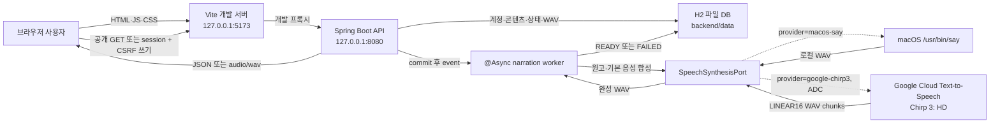
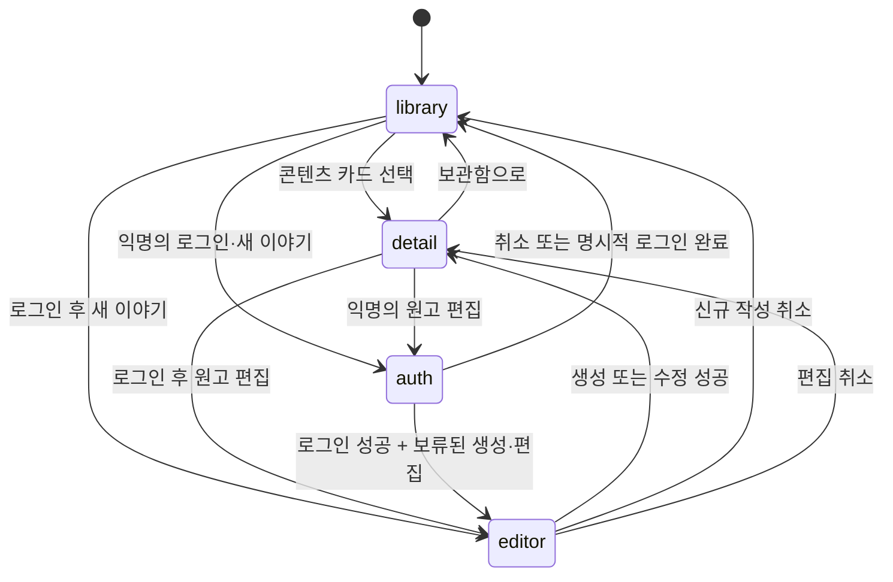
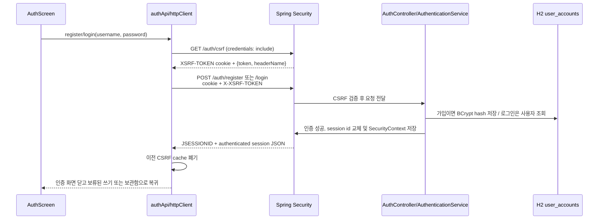
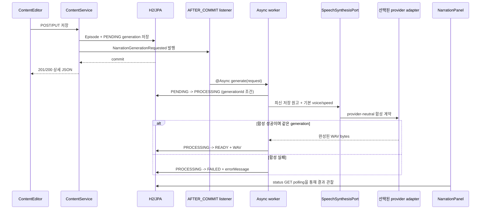

# Runtime Flow & Practical Review Guide

이 문서는 `고요한 지식` 프로젝트를 처음 접한 개발자가 실제 동작을 따라가고, 장애를 찾고, 변경 코드를 실무적으로 리뷰할 수 있도록 만든 실행 흐름 안내서입니다.

문서의 역할은 다음과 같이 구분합니다.

| 문서 | 답하는 질문 |
|---|---|
| `README.md` | 어떻게 설치하고 실행하며 API를 사용하는가? |
| `ARCHITECTURE.md` | 왜 이 계층과 경계로 설계했는가? |
| `FLOW.md` | 요청이 실제로 어디를 지나며, 어떻게 분석·디버깅·리뷰하는가? |

`ARCHITECTURE.md`를 먼저 외울 필요는 없습니다. 이 문서의 한 흐름을 끝까지 추적한 뒤 아키텍처 문서를 읽으면 각 계층을 나눈 이유가 더 잘 보입니다.

---

## 1. 한 장으로 보는 실행 구조

개발 중에는 로컬 애플리케이션 경계와 선택적인 외부 TTS 경계가 존재합니다.



이 그림은 로컬 **개발 실행 구조**입니다. TTS 기본값은 네트워크와 credential이 필요 없는 `macos-say`이고, `google-chirp3`를 명시했을 때만 Google client가 ADC를 찾고 외부 RPC를 보냅니다. Vite의 `/api` 프록시는 5173과 8080 포트를 자연스럽게 연결하는 개발 편의 기능일 뿐 운영 토폴로지가 아닙니다. 운영은 정적 프론트와 API를 reverse proxy로 같은 오리진에 배치하거나, `VITE_API_BASE_URL`과 적절한 CORS·cookie 정책으로 다른 오리진을 명시하는 별도 설계가 필요합니다.

핵심 제품 흐름은 다음과 같습니다.

```text
지식 이야기 작성·저장·조회
          |
          +-- 저장 commit 후 자동 나레이션 상태 확인·재생·다운로드
```

프런트가 임의 텍스트나 음성 옵션을 TTS 요청으로 보내지 않고 worker가 `contentId`로 저장된 최신 원고를 다시 조회하는 이유도 이 제품 경계를 유지하기 위해서입니다.

### 실행 주소를 혼동하지 않는 법

| 주소 | 역할 | 정상 확인 방법 |
|---|---|---|
| `http://localhost:5173` | React 사용자 화면 | 익명이어도 보관함이 보이고, 로그인·쓰기를 선택할 때 인증 화면이 열린다. |
| `http://localhost:8080/api/v1/auth/session` | 공개 세션 확인 API | 익명이면 `{authenticated:false}`가 보인다. |
| `http://localhost:8080/api/v1/contents` | 공개 콘텐츠 목록 API | 세션 없이도 `200` 요약 JSON이 보인다. |
| `http://localhost:8080/` | 별도 구현이 없는 API 서버 루트 | `404`여도 정상이다. |

Gradle 터미널이 `EXECUTING`에서 멈춘 것처럼 보이는 것은 Spring 서버가 종료되지 않고 요청을 기다리는 정상 상태일 수 있습니다. `Started SleepKnowledgeApplication` 로그와 8080 포트를 함께 확인합니다.

---

## 2. 분석 전 기준 상태 만들기

코드를 읽기 전에 먼저 정상 상태를 재현해야 합니다. 정상 결과를 모르면 변경 후 무엇이 깨졌는지 판단하기 어렵습니다.

### 2.1 백엔드 실행

프로젝트의 `backend` 디렉터리에서 실행해야 상대 경로인 `./data/sleepknowledge`가 예상 위치에 만들어집니다.

```bash
cd backend
./gradlew clean test
./gradlew bootRun
```

이 명령은 기본 `app.narration.provider=macos-say`를 사용합니다. Google 흐름을 분석할 때만 먼저 Cloud Text-to-Speech API와 billing을 활성화하고 [ADC](https://cloud.google.com/text-to-speech/docs/authentication)를 준비한 뒤 명시적으로 선택합니다.

```bash
gcloud auth application-default login
gcloud auth application-default set-quota-project PROJECT_ID
APP_NARRATION_PROVIDER=google-chirp3 ./gradlew bootRun
```

Google smoke test는 실제 quota와 비용을 사용할 수 있으므로 일반 `test`와 분리해 기록합니다. credential 파일이나 token은 저장소, `application.yml`, 터미널 출력 캡처에 남기지 않습니다.

오래 실행했던 구버전 서버가 있다면 먼저 `Ctrl+C`로 종료하고 `clean`을 사용합니다. 소스 파일을 옮기거나 main class 이름을 바꾼 뒤에는 이전 `build` 산출물이 남아 혼동을 줄 수 있기 때문입니다.

### 2.2 프론트엔드 실행

다른 터미널에서 실행합니다.

```bash
cd frontend
npm install
npm test
npm run build
npm run dev
```

개발 서버에서는 `frontend/vite.config.ts`가 `/api`를 `http://127.0.0.1:8080`으로 전달합니다. `VITE_API_BASE_URL`을 지정하면 `frontend/src/api/httpClient.ts`가 해당 주소를 직접 사용합니다.

### 2.3 최소 정상 흐름

다음 순서가 모두 성공해야 기능 변경 전 기준 상태가 만들어집니다.

1. 로그인하지 않은 채 첫 화면의 보관함에서 예시 콘텐츠를 본다.
2. 카드를 열어 전체 원고와 자동 내레이션 상태를 본다.
3. `READY`가 되면 익명 상태로 재생하거나 다운로드한다.
4. 헤더의 로그인을 선택하거나 새 이야기·편집을 시도하면 인증 화면이 열린다.
5. 새 계정을 만들거나 기존 계정으로 로그인한 후 작성·편집 흐름을 이어 간다.
6. 새 이야기를 저장하면 즉시 상세 화면으로 이동하고 `PENDING` 또는 `PROCESSING`이 보인다.
7. 원고를 수정하면 이전 WAV가 무효화되고 새 generation이 시작된다.
8. 로그아웃해도 공개 보관함·상세·오디오는 계속 보이고, 다음 쓰기 시도는 다시 로그인을 요구한다.

API만 먼저 확인하려면 다음 요청을 사용합니다.

```bash
curl -i http://localhost:8080/api/v1/auth/session
curl -i http://localhost:8080/api/v1/auth/csrf
curl -i http://localhost:8080/api/v1/contents  # 익명 200이 정상
```

공개 GET은 cookie jar가 필요 없습니다. 콘텐츠 POST·PUT 같은 보호 쓰기를 `curl`로 확인하려면 README의 cookie jar + CSRF 가입·로그인 순서를 먼저 수행합니다.

이 기준 흐름을 깨뜨리는 변경은 테스트가 통과하더라도 회귀일 수 있습니다.

---

## 3. 애플리케이션 부팅 흐름

### 3.1 Spring Boot 부팅

```text
SleepKnowledgeApplication.main()
  -> SpringApplication.run()
  -> application.yml 설정 바인딩
  -> Controller / Service / Repository 탐색
  -> H2 DataSource와 JPA EntityManagerFactory 구성
  -> Spring Data repository proxy 생성
  -> Spring Security filter chain, BCrypt와 session/CSRF 구성
  -> SpeechSynthesisPort 구현체 조립
  -> @Async executor와 narration listener/worker 구성
  -> ContentSeedData 실행
  -> Tomcat이 127.0.0.1:8080에서 요청 대기
```

확인할 파일과 의미는 다음과 같습니다.

| 순서 | 파일 | 확인할 내용 |
|---|---|---|
| 1 | `SleepKnowledgeApplication.java` | 시작점과 configuration properties scan |
| 2 | `application.yml` | DB URL, 서버 포트, CORS, TTS provider별 음성·청크·timeout |
| 3 | `ApplicationConfiguration.java` | 테스트 가능한 `Clock` bean |
| 4 | `SecurityConfiguration.java` | 세션, BCrypt, JSON 401/403, cookie CSRF와 보호 경로 |
| 5 | `NarrationProperties.java`, `NarrationConfiguration.java` | 중첩 설정 binding, `@EnableAsync`, 조건부 `SpeechSynthesisPort`와 Google client lifecycle |
| 6 | content/narration/auth JPA model | 콘텐츠, 상태·WAV와 계정 테이블 매핑 |
| 7 | `ContentSeedData.java` | 빈 DB일 때만 예시 두 편을 넣는 조건 |

`ContentSeedData`는 `contentRepository.count() == 0`일 때만 실행됩니다. DB에 한 행이라도 있다면 누락된 예시만 추가하는 방식이 아니라 seed 전체를 건너뜁니다.

### 3.2 React 부팅

```text
index.html
  -> src/main.tsx
  -> React StrictMode
  -> App 마운트
      +-> useAuth: GET /api/v1/auth/session (credentials 포함)
      +-> useContentLibrary: GET /api/v1/contents (익명 허용)
      +-> 초기 screen = library
      +-> 익명이면 헤더에 로그인 동작 표시
      +-> 인증이면 새 이야기·편집·로그아웃 동작 표시
```

콘텐츠 훅은 인증 세션 확인 결과로 마운트를 차단하지 않습니다. 개발 모드의 `StrictMode`는 effect의 안전성을 확인하기 위해 session이나 목록 effect의 실행과 정리를 반복할 수 있으므로 Network 탭에서 초기 GET이 두 번 보일 수 있습니다. 운영 빌드의 중복 요청과 구분해서 판단해야 합니다.

---

## 4. 프론트 화면 상태 모델

최상위 `App`은 `checking | authenticated | unauthenticated | error` 인증 상태와 콘텐츠 화면 상태를 독립적으로 다룹니다. 인증 여부와 관계없이 목록과 상세를 열 수 있고, `AuthScreen`은 명시적 로그인·가입 또는 익명 쓰기 시도에서만 열립니다. 아직 React Router는 사용하지 않습니다.

```ts
type Screen = 'library' | 'detail' | 'editor';
```



| 상태 | 주 컴포넌트 | 핵심 데이터 |
|---|---|---|
| 명시적 로그인·가입/익명 쓰기 | `AuthScreen` | login/register mode, username/password, auth 오류 |
| `library` | `ContentLibrary` | `contents`, `listStatus`, 검색어, 카테고리 |
| `detail` | `ContentDetail`, `NarrationPanel` | `selectedContent`, status polling, WAV Blob 결과 |
| `editor` | `ContentEditor` | 신규 또는 선택 콘텐츠에서 만든 `ContentDraft` |

`isCreating`은 같은 `editor` 화면이 POST를 사용할지 PUT을 사용할지 결정합니다.

- `true`: 신규 작성, 저장 시 POST, 취소 시 보관함
- `false`: 기존 편집, 저장 시 PUT, 취소 시 상세

현재 URL에는 이 상태가 나타나지 않습니다. 따라서 상세 주소 공유, 브라우저 뒤로 가기, 상세 화면 새로고침 복원은 지원하지 않습니다.

---

## 5. 흐름을 추적하는 공통 형식

모든 기능은 다음 순서로 세로 추적합니다.

```text
사용자 동작
  -> Security session / CSRF boundary
  -> React component event
  -> React hook
  -> frontend API function
  -> HTTP method + path
  -> Controller + request DTO
  -> inbound port
  -> application service
  -> domain model
  -> outbound port
  -> adapter
  -> DB 또는 외부 프로세스
  -> transaction commit event / async worker (해당 시)
  -> HTTP response
  -> frontend response normalization
  -> hook state
  -> 화면 렌더링
```

흐름을 분석할 때 아래 여덟 가지를 기록하면 리뷰 누락이 크게 줄어듭니다.

| 항목 | 질문 |
|---|---|
| Trigger | 어떤 사용자 행동이나 시스템 이벤트가 시작점인가? |
| Contract | HTTP 메서드, URL, 입력, 출력, status는 무엇인가? |
| File chain | 실제 파일과 함수는 어떤 순서로 호출되는가? |
| Transformation | DTO, domain, entity, Blob 사이에서 값이 어떻게 바뀌는가? |
| Transaction | DB 트랜잭션은 어디서 열리고 언제 끝나는가? |
| Side effect | session/cookie, DB 쓰기, event, worker, 프로세스, 임시 파일, Object URL 생성이 있는가? |
| Failure | 실패 종류가 어디서 어떤 오류로 바뀌는가? |
| Evidence | 어떤 테스트, 로그, 헤더, 화면 상태로 성공을 증명하는가? |

---

## 6. 콘텐츠 목록 조회 흐름

### 6.1 전체 호출 사슬

이 흐름은 세션 없이도 동일하게 실행됩니다.

```text
App 마운트
  -> useContentLibrary.useEffect()
  -> loadContents()
  -> contentApi.getContents(signal)
  -> httpClient.apiRequestJson()
  -> GET /api/v1/contents
  -> ContentController.listContents()
  -> BrowseContentUseCase.listContents()
  -> ContentService.listContents()
  -> ContentRepositoryPort.findAll()
  -> JpaContentRepositoryAdapter.findAll()
  -> SpringDataContentRepository.findAllByOrderByUpdatedAtDesc()
  -> H2 contents 테이블
  -> ContentJpaEntity.toDomain()
  -> Episode
  -> ContentSummaryResponse
  -> { contents: [...] }
  -> contentApi.toSummary()
  -> setContents()
  -> ContentLibrary / ContentCard
```

### 6.2 중요한 데이터 결정

- DB 조회 순서는 `updatedAt DESC`입니다.
- HTTP 목록 응답은 `script`를 제외합니다.
- 프론트는 제목과 소개를 대상으로 검색합니다.
- 검색과 카테고리 필터는 API를 다시 호출하지 않고 이미 받은 배열에서 처리합니다.
- 화면 필터는 과학, 사회, 역사, 철학, 경제, 기술, 문화, 심리 8개 범용 분류를 사용합니다.
- 기존 `QUANTUM_PHYSICS`, `COSMOLOGY`, `ASTRONOMY`, `GENERAL_SCIENCE` 데이터는 `SCIENCE`로 정규화되어 과학 필터에 함께 들어갑니다.
- 목록 응답에는 원고나 예상 시간이 없으므로 `estimatedMinutes`는 `0`이 되고 카드에는 `원고 보기`가 표시됩니다.

### 6.3 상태와 취소

`useContentLibrary`는 목록 상태를 `idle → loading → success/error`로 바꿉니다.

- 새 목록 요청 전 이전 `AbortController`를 중단합니다.
- loading 중에는 카드 스켈레톤을 표시합니다.
- 실패하면 오류와 `다시 불러오기` 버튼을 표시합니다.
- 성공했지만 필터 결과가 없으면 빈 결과 안내를 표시합니다.
- `AbortError`는 사용자 오류로 보여 주지 않습니다.

### 6.4 리뷰할 지점

응답에 원고가 없다고 해서 DB 비용까지 사라지는 것은 아닙니다. 현재 `findAllByOrderByUpdatedAtDesc()`는 `ContentJpaEntity` 전체를 만들기 때문에 `@Lob script`도 함께 읽을 수 있습니다. 콘텐츠가 늘어나면 목록 projection, 페이지네이션, 서버 검색을 검토해야 합니다.

### 6.5 이 흐름을 보호하는 테스트

- `ContentApiIntegrationTest.시드된_콘텐츠_목록은_긴_원고를_제외한다`
- `contentApi.test.ts`의 목록 envelope 변환 테스트
- `content.test.ts`의 카테고리 표시 테스트

---

## 7. 콘텐츠 상세 조회 흐름

### 7.1 전체 호출 사슬

```text
ContentCard 클릭
  -> App.openContent(id)
  -> screen = detail
  -> useContentLibrary.openContent(id)
  -> 이전 상세 요청 abort
  -> selectedContent = null
  -> detailStatus = loading
  -> contentApi.getContent(id, signal)
  -> GET /api/v1/contents/{id}
  -> ContentController.getContent(UUID)
  -> BrowseContentUseCase.getContent()
  -> ContentService.getContent()
  -> ContentRepositoryPort.findById()
  -> JPA + H2
  -> ContentDetailResponse(script 포함)
  -> contentApi.toContent()
  -> 예상 청취 시간 계산
  -> selectedContent 저장
  -> ContentDetail + 읽기 전용 NarrationPanel 렌더링
  -> useAutomaticNarration(contentId, title) 시작
```

예상 청취 시간은 프론트에서 공백을 제외한 330자당 1분으로 계산하며 최소 1분입니다. 이는 실제 음성 속도나 문장 부호를 측정한 값이 아니라 UI용 추정치입니다.

### 7.2 실패 분기

| 상황 | 백엔드 | 프론트 |
|---|---|---|
| UUID 형식 오류 | `400 ProblemDetail` | 상세 오류 화면 |
| 존재하지 않는 UUID | `404 ProblemDetail` | 상세 오류 화면 |
| 로그인 세션 없음 | 공개 GET이므로 정상 `200` | 상세 원고와 내레이션 패널 표시 |
| 연결 실패 | 요청이 서버에 도달하지 않음 | `ApiError(status=0)` |
| 응답에 script가 없음 | 서버 계약 위반 | `콘텐츠 응답 형식이 올바르지 않습니다.` |
| 다른 카드를 빠르게 선택 | 새 요청 전에 이전 요청 중단 | 마지막 요청 결과만 사용 |

보관함 버튼은 현재 진행 중인 상세 fetch를 직접 중단하지 않습니다. 요청이 나중에 완료되면 hook 상태는 바뀔 수 있지만 `screen=library`라 상세는 렌더링되지 않습니다. 요청 수와 불필요한 상태 변경을 줄이려면 화면 이탈 시 상세 요청도 취소하는 방식을 검토할 수 있습니다.

### 7.3 이 흐름을 보호하는 테스트

- `ContentApiIntegrationTest.콘텐츠_상세에서_원고를_조회한다`
- 없는 콘텐츠와 잘못된 UUID의 통합 테스트
- `contentApi.test.ts`의 상세 변환과 예상 시간 테스트

---

## 8. 콘텐츠 생성 흐름

### 8.1 화면에서 DB까지

```text
헤더의 새 이야기 클릭
  -> App.startCreate()
  -> 익명이면 AuthScreen을 열고 작성 요청을 인증 후까지 보류
  -> 인증되면 작성 흐름 진행
  -> isCreating = true
  -> screen = editor
  -> ContentEditor가 EMPTY_DRAFT로 마운트
  -> 사용자가 제목·요약·카테고리·원고 입력
  -> ContentEditor.submit()
  -> trim한 ContentDraft 전달
  -> App.saveEditor()
  -> useContentLibrary.saveContent(draft, undefined)
  -> contentApi.createContent(draft)
  -> httpClient가 CSRF token을 확보하고 session cookie와 함께 전송
  -> POST /api/v1/contents
  -> ContentController.createContent()
  -> @Valid ContentRequest
  -> ContentRequest.toDraft()
  -> EpisodeDraft 생성과 도메인 재검증
  -> CreateContentUseCase.createContent()
  -> ContentService.createContent()
  -> Clock.instant() + UUID.randomUUID()
  -> Episode.create()
  -> ContentRepositoryPort.save()
  -> NarrationAssetRepositoryPort.resetToPending()
  -> generationId + sourceUpdatedAt를 가진 NarrationGenerationRequested 발행
  -> ContentJpaEntity.from()
  -> Spring Data JPA save
  -> 콘텐츠와 narration 상태를 H2에 함께 commit
  -> AFTER_COMMIT listener가 @Async worker 실행
  -> 201 Created + Location + 상세 JSON
  -> contentApi.toContent()
  -> selectedContent 갱신
  -> screen = detail
  -> useAutomaticNarration이 상태 GET polling 시작
  -> 목록 GET은 화면 전환을 막지 않고 background 재호출
```

### 8.2 검증이 두 번 있는 이유

HTTP 경계의 `ContentRequest`는 Bean Validation으로 빠르게 사용자 입력 오류를 만듭니다.

| 필드 | 규칙 |
|---|---|
| `title` | 공백 제외 필수, 최대 120자 |
| `summary` | 공백 제외 필수, 최대 500자 |
| `category` | 8개 범용 enum 중 하나, 필수 |
| `script` | 공백 제외 필수, 최대 20,000자 |

그 뒤 `EpisodeDraft`도 같은 핵심 규칙을 검증합니다. REST가 아닌 배치, 테스트, 메시지 소비자가 나중에 유스케이스를 호출해도 잘못된 도메인 객체가 생기지 않게 하기 위해서입니다.

프론트의 `required`, `maxLength`, 저장 버튼 비활성화는 사용자 편의를 위한 1차 방어입니다. 서버와 도메인 검증을 대체하지 않습니다.

### 8.3 시간과 트랜잭션

- `ContentService.createContent()`에 쓰기 `@Transactional`이 적용됩니다.
- `Clock` bean은 UTC 시스템 시간을 제공합니다.
- 생성 시 `createdAt`과 `updatedAt`은 같습니다.
- 테스트에서는 고정 Clock을 넣어 시간을 결정적으로 검증합니다.
- 콘텐츠와 `PENDING` narration row는 같은 transaction에서 저장됩니다.
- `@TransactionalEventListener(AFTER_COMMIT)`이므로 rollback된 콘텐츠에 외부 TTS를 실행하지 않습니다.
- `@Async` worker가 HTTP 요청과 별도 thread에서 실행되므로 `201` 응답은 WAV 생성 완료를 기다리지 않습니다.

### 8.4 프론트 저장 상태

```text
saveStatus: idle -> loading -> success 또는 error
narration: PENDING -> PROCESSING -> READY 또는 FAILED
```

저장 성공 시 `saveContent()`는 반환된 상세를 즉시 선택하고 `App`은 상세 화면으로 이동합니다. `loadContents()`는 await하지 않고 background로 실행하므로 목록 재조회가 느리거나 실패해도 상세 전환과 저장 성공을 되돌리지 않습니다. 상세의 `NarrationPanel`은 자동 상태를 확인하며 별도의 생성 버튼이나 음성·속도 입력을 제공하지 않습니다.

### 8.5 성공 증거

- HTTP status가 `201 Created`
- `Location: /api/v1/contents/{UUID}` 헤더 존재
- 응답의 `id`, `createdAt`, `updatedAt` 존재
- 상세 화면에 방금 입력한 원고 표시
- 내레이션 영역에 `PENDING` 또는 `PROCESSING`, 이후 `READY`/`FAILED` 표시
- `READY`이면 WAV 재생기와 다운로드 링크 표시
- 보관함 재진입 시 새 카드 표시
- 서버 재시작 후에도 같은 콘텐츠 표시

### 8.6 이 흐름을 보호하는 테스트

- `ContentServiceTest.콘텐츠를_생성하고_목록과_상세에서_조회한다`
- `ContentApiIntegrationTest.콘텐츠를_생성한다`
- 저장 commit 후 자동 생성 worker가 시작되는 통합 테스트
- Bean Validation과 알 수 없는 카테고리 통합 테스트
- `contentApi.test.ts`의 POST 요청과 CSRF-aware HTTP 계약 테스트

---

## 9. 콘텐츠 수정 흐름

수정은 부분 변경이 아닌 전체 필드를 보내는 PUT입니다. PATCH는 아직 없습니다.

```text
상세 화면의 원고 편집 클릭
  -> App.startEdit()
  -> 익명이면 AuthScreen을 열고 편집 요청을 인증 후까지 보류
  -> 인증되면 편집 흐름 진행
  -> isCreating = false
  -> screen = editor
  -> selectedContent를 폼 초기값으로 사용
  -> ContentEditor.submit()
  -> App.saveEditor()
  -> useContentLibrary.saveContent(draft, selectedContent.id)
  -> contentApi.updateContent()
  -> PUT /api/v1/contents/{id}
  -> ContentController.updateContent()
  -> ContentService.updateContent()
  -> 기존 Episode 조회
  -> Episode.update(draft, clock.instant())
  -> id와 createdAt 보존
  -> 나머지 콘텐츠 값과 updatedAt 교체
  -> JPA save + narration resetToPending
  -> 새 generationId와 sourceUpdatedAt로 자동 생성 event 발행
  -> commit 후 @Async worker 실행
  -> 200 상세 JSON
  -> selectedContent 교체
  -> 상세 화면
  -> 새 narration 상태 polling
  -> 목록은 background 재조회
```

### 현재 리뷰에서 놓치기 쉬운 점

1. `@Version`이 없으므로 두 사용자가 동시에 PUT하면 마지막 저장이 앞선 변경을 덮어씁니다.
2. 편집 이탈 전 저장하지 않은 변경을 묻는 경고가 없습니다.
3. 저장하지 않고 편집 화면에 머무는 동안에는 기존 WAV가 유효합니다. 실제 PUT이 성공하면 서버가 narration row를 새 `PENDING` 세대로 교체하므로 이전 WAV는 더 이상 READY audio로 제공되지 않습니다.
4. 이전 합성이 늦게 끝나도 `generationId`와 `sourceUpdatedAt` 조건이 맞지 않으면 저장하지 않아 새 원고의 결과를 덮어쓰지 않습니다.

### 이 흐름을 보호하는 테스트

- `ContentServiceTest.콘텐츠를_수정하면_생성시각은_보존한다`
- `ContentApiIntegrationTest.콘텐츠를_수정한다`
- 원고 수정 시 이전 WAV 무효화와 새 세대 생성 통합 테스트
- `contentApi.test.ts`의 PUT 요청 테스트

현재 동시 수정과 저장하지 않은 입력 경고는 자동 테스트가 없습니다. 이전 WAV 무효화와 오래된 worker 결과 폐기는 백엔드 테스트로 보호합니다.

---

## 10. 세션 인증과 CSRF 흐름

### 10.1 앱 시작과 현재 세션 확인

```text
App 마운트
  -> useAuth.useEffect()
  -> authApi.getAuthSession(signal)
  -> GET /api/v1/auth/session
     credentials = include
  -> AuthController.session(Authentication)
  -> 익명: { authenticated: false, username: null }
     인증: { authenticated: true, username }
  -> useAuth status 결정
  -> 익명/인증 모두: 공개 ContentLibrary는 계속 표시
  -> 세션 결과는 헤더의 login/user 표시와 쓰기 권한에만 반영
```

`/csrf`와 `/session`에 더해 콘텐츠 목록·상세, 내레이션 status·audio GET은 익명 접근이 가능합니다. 따라서 앱은 session 확인 중에도 콘텐츠 탐색을 시작할 수 있고, 인증 화면은 사용자가 로그인을 선택하거나 생성·수정을 시도할 때만 표시합니다.

### 10.2 회원가입·로그인과 CSRF



모든 fetch는 `credentials: 'include'`를 사용합니다. `httpClient`는 `GET`, `HEAD`, `OPTIONS`, `TRACE`가 아닌 요청 전에 `/api/v1/auth/csrf`에서 받은 `token`과 `headerName`을 캐시하고 해당 header를 붙입니다. 회원가입·로그인 URL이 `permitAll`이어도 CSRF filter는 그대로 적용되므로 token이 없거나 틀리면 `403`입니다.

인증 성공 시 session fixation 방어를 위해 session ID를 교체하고, Spring Security가 CSRF token도 교체합니다. 따라서 `authApi`는 성공 직후 기존 token cache를 비우며 다음 POST/PUT 전에 새 token을 받습니다.

| 동작 | 성공 | 주요 실패 |
|---|---|---|
| `POST /api/v1/auth/register` | `201`, 즉시 로그인된 `{authenticated:true, username}` | 검증 `400`, 중복 이름 `409`, CSRF `403` |
| `POST /api/v1/auth/login` | `200`, `{authenticated:true, username}` | 자격 증명 `401`, 검증 `400`, CSRF `403` |

사용자 이름은 3~50자이고 문자·숫자·마침표·밑줄·하이픈만 허용합니다. 비밀번호는 8자 이상이며 BCrypt 경계 때문에 UTF-8 72바이트를 넘기지 않습니다. DB에는 평문 대신 BCrypt hash만 저장합니다.

### 10.3 로그아웃

```text
헤더의 로그아웃 클릭
  -> useAuth.endSession()
  -> httpClient가 현재 CSRF header 추가
  -> POST /api/v1/auth/logout
  -> Spring Security LogoutFilter
  -> session 무효화 + SecurityContext 삭제
  -> JSESSIONID와 XSRF-TOKEN 삭제
  -> 204 No Content
  -> 프론트 CSRF cache 삭제
  -> 공개 보관함·상세를 유지하고 헤더를 익명 상태로 전환
```

로그아웃 실패 시 현재 인증 화면을 강제로 버리지 않고 헤더에 오류를 표시합니다.

### 10.4 현재 권한 경계

- `OPTIONS /api/**`, 인증 진입점, 콘텐츠 목록·상세·narration status·audio GET은 공개합니다.
- 콘텐츠 POST·PUT과 진단용 voices GET은 로그인을 요구하고, unsafe method는 CSRF 검사도 받습니다.
- 인증 실패와 권한/CSRF 실패는 각각 JSON `401`과 `403`으로 반환됩니다.
- 모든 사용자가 목록·원고·완성 오디오를 조회할 수 있다는 것은 현재 MVP의 의도된 공개 정책입니다. 비공개 원고나 유료 오디오를 저장하면 안 됩니다.
- 현재 계정과 콘텐츠 사이에 작성자 관계가 없습니다. 로그인 사용자라면 모든 콘텐츠를 생성·수정할 수 있으므로 사용자별 보관함으로 오해하면 안 됩니다.
- 로그인 rate limit, 계정 잠금, 비밀번호 재설정, 세션 만료 UX는 아직 없습니다.

### 10.5 이 흐름을 보호하는 테스트

- `AuthApiIntegrationTest`: CSRF JSON/cookie, 익명 session, 가입·로그인·로그아웃 session
- `AuthApiIntegrationTest`: 익명 쓰기 API `401`, 잘못된 로그인 `401`, 중복 가입 `409`, CSRF 누락 `403`
- `ContentApiIntegrationTest`: 익명 목록·상세·narration status·audio GET이 허용되는지 검증
- `AuthApiIntegrationTest`: 인증된 쓰기에도 CSRF가 필요한지 검증
- `authApi.test.ts`: session 정규화, 자격 증명 요청의 CSRF/credentials, 로그아웃 보호

---

## 11. 자동 WAV 내레이션 흐름

### 11.1 저장 commit부터 백그라운드 합성까지



외부 `say` 프로세스나 Google RPC는 콘텐츠 저장 transaction과 HTTP 응답 밖에서 실행됩니다. worker는 먼저 조건부 update로 같은 세대의 `PENDING`만 `PROCESSING`으로 바꾸므로 중복 event가 같은 합성을 동시에 시작하지 않게 합니다. 원고가 다시 저장되면 새 `generationId`와 `sourceUpdatedAt`가 생기며, 이전 worker의 성공·실패 결과는 조건이 맞지 않아 폐기됩니다.

worker의 제품 기본 속도는 `0.9`입니다. 음성은 provider가 반환한 목록에서 locale이 `ko`로 시작하는 첫 항목을 고르고, 없으면 첫 항목을 사용하는 provider-neutral 정책입니다.

- `macos-say`: 설치된 음성 목록에서 위 정책으로 선택
- `google-chirp3`: `language-code=ko-KR`인 설정 `voice-name` 한 개만 반환하므로 그 음성과 `speakingRate=0.9`를 요청에 명시

Chirp 3의 pace control은 [전용 공식 문서](https://docs.cloud.google.com/text-to-speech/docs/chirp3-hd)에서 `speaking_rate` 0.25~2.0 범위의 Preview 기능으로 안내됩니다. 현재 `0.9`는 서버의 고정 제품값이며, Preview 제어를 사용자 입력으로 노출하는 기능은 아닙니다.

상세 UI에는 음성·속도 선택이나 수동 생성 버튼이 없습니다. `GET /api/v1/narration/voices`는 adapter 진단용으로 남아 있지만 프론트는 호출하지 않습니다. Google adapter는 매번 유료·원격 `ListVoices` RPC를 호출하지 않고 설정된 음성 하나를 반환합니다.

### 11.2 상태 조회와 복구 trigger

```text
ContentDetail 렌더링
  -> NarrationPanel
  -> useAutomaticNarration(contentId, title)
  -> GET /api/v1/contents/{id}/narration/status
  -> NarrationService.getNarrationStatus()
  -> 콘텐츠와 narration state 조회
  -> row가 없거나 sourceUpdatedAt가 다르면 새 PENDING 세대로 reset
  -> PENDING이면 NarrationGenerationRequested 재발행
  -> { status, errorMessage, updatedAt, audioUrl }
  -> PENDING/PROCESSING이면 2초 뒤 다시 조회
  -> READY이면 audio GET
  -> FAILED이면 errorMessage와 상태 재확인 버튼 표시
```

상태는 `PENDING → PROCESSING → READY` 또는 `PENDING → PROCESSING → FAILED`로 이동합니다. 저장 직후 event를 놓쳤더라도 `PENDING` status GET이 event를 다시 발행하는 제한적 복구 경로가 됩니다. 반면 프로세스가 `PROCESSING` 저장 뒤 비정상 종료되면 lease나 timeout 기반 회수가 없어 계속 멈출 수 있습니다. 프론트의 `상태 다시 확인`은 상태 GET만 재시도하며 `FAILED` 작업 자체를 다시 합성하지 않습니다. 다시 생성하려면 현재는 콘텐츠를 다시 저장해야 합니다.

status와 audio GET은 공개이므로 익명 상세 화면도 이 흐름을 그대로 사용합니다. status GET은 row가 없거나 stale일 때 DB 상태를 만들고 합성 event를 발행할 수 있는 조회입니다. `google-chirp3`에서는 이 GET이 실제 billing·quota를 쓰는 여러 RPC로 이어질 수 있으므로 외부 공개 전 rate limit, bounded worker, idempotency/checksum, 사용자 quota와 예산 경보를 반드시 검토해야 합니다. 현재 [Cloud TTS 가격](https://cloud.google.com/text-to-speech/pricing)과 [quota](https://cloud.google.com/text-to-speech/quotas)는 운영 시점에 다시 확인합니다.

### 11.3 HTTP 조회 계약

상태 조회:

```text
GET /api/v1/contents/{id}/narration/status
200 application/json
Cache-Control: no-store

{
  "status": "PENDING | PROCESSING | READY | FAILED",
  "errorMessage": null,
  "updatedAt": "...",
  "audioUrl": null 또는 "/api/v1/contents/{id}/narration/audio"
}
```

프론트는 `status`, `errorMessage`, `updatedAt`를 사용하고 READY audio는 고정된 GET endpoint에서 받습니다. `audioUrl`은 READY 응답에만 채워지는 보조 필드입니다.

오디오 조회:

```text
GET /api/v1/contents/{id}/narration/audio

READY:
  200 audio/wav
  Content-Length: 실제 byte 길이
  Cache-Control: no-store
  Content-Disposition: inline; filename="narration-{UUID}.wav"

PENDING/PROCESSING/FAILED:
  409 application/problem+json
  status: 현재 narration 상태
```

없는 콘텐츠는 `404`, 잘못된 UUID는 `400`이며 익명 요청도 허용됩니다. 프론트는 빈 Blob만 명시적으로 거절하며 MIME 타입과 RIFF header까지 검증하지는 않습니다.

### 11.4 브라우저 Blob과 정리

```text
READY status
  -> getNarrationAudio(signal)
  -> response.blob()
  -> URL.createObjectURL(blob)
  -> <audio src=url> + download link
```

`useAutomaticNarration` effect가 content/title/retry로 다시 실행되거나 상세 화면에서 unmount될 때 fetch를 abort하고 polling timer를 지우며 생성한 Object URL을 revoke합니다. 다운로드 파일명은 제목을 정규화해 최대 48자로 만들고, 사용할 문자가 없으면 `knowledge-narration.wav`가 됩니다. 화면 이탈은 브라우저 polling과 audio fetch만 중단하며 이미 실행 중인 서버 worker, `say` 프로세스나 Google RPC를 취소하지 않습니다.

### 11.5 provider adapter의 안전장치와 저장 비용

`macos-say`:

- 원고를 shell 문자열에 이어 붙이지 않고 UTF-8 임시 파일에 씁니다.
- `ProcessBuilder`에 각 인자를 분리하고 설치 목록에서 선택한 음성을 사용합니다.
- stdout/stderr를 임시 log로 보내 pipe buffer 교착을 피합니다.
- 기본 timeout은 5분이며 timeout/interrupt 시 process를 강제 종료합니다.
- 성공과 실패 모두에서 원고, WAV, log 파일 정리를 시도합니다.
- WAV 형식은 PCM 16-bit, mono, 22,050Hz입니다.

`google-chirp3`:

- `NarrationConfiguration`은 이 provider일 때만 `TextToSpeechClient`를 만들며 ADC, 설정 endpoint와 무재시도 30초 RPC timeout을 사용하고 Spring 종료 시 client를 닫습니다.
- 한국어 `BreakIterator`의 문장 경계, 그다음 공백, 마지막으로 Unicode code point 경계를 사용해 각 청크를 최대 5,000 UTF-8 bytes로 나눕니다. 한글의 문자 수와 byte 수를 같다고 가정하지 않습니다.
- 최대 32청크를 순서대로 plain text + 설정된 `ko-KR` Chirp 3: HD voice + `LINEAR16` + `speakingRate=0.9`로 동기 합성합니다.
- 각 LINEAR16 응답은 이미 RIFF/WAV 헤더를 포함합니다. `fmt`와 non-empty `data`, PCM 16-bit, frame 정렬, 청크 간 같은 채널·sample rate를 검증한 뒤 PCM data만 모아 canonical WAV 헤더를 다시 씁니다.
- 합친 PCM은 기본 `max-audio-bytes=268435456`을 넘을 수 없습니다. SDK 상세와 원고를 공개 status에 넣지 않고 고정된 안전한 오류 메시지로 바꿉니다.

어느 provider든 생성 WAV는 현재 H2 LOB에 전체 byte로 저장되고 응답과 브라우저 Blob에서도 전체 파일을 메모리에 둡니다. Google 청크도 한 worker의 임시 `List<byte[]>`이므로 입력 분할이 heap·DB·동시성 문제를 해결하지 않습니다.

`NarrationProperties`는 provider별 수치와 `${language-code}-Chirp3-HD-` 음성 prefix를 부팅 시 검증합니다. Google client의 자동 재시도는 꺼져 있어 timeout이나 일시적 RPC 실패도 현재 generation을 `FAILED`로 만듭니다. 비용이 드는 청크를 몇 번 실행했는지 모른 채 다시 보내지 않으려는 보수적 MVP 정책이며, 운영 재시도는 job·backoff·idempotency와 함께 추가해야 합니다.

### 11.6 이 흐름을 보호하는 테스트

- `NarrationGenerationWorkerTest`: 첫 한국어/첫 제공자 음성 기본값, READY/FAILED, 오래된 세대 폐기
- `NarrationServiceTest`: row 없음·stale row의 PENDING 생성, PENDING 재발행, READY-only audio, non-ready `409`
- `ContentApiIntegrationTest`: 저장·수정 후 자동 생성, 이전 WAV 무효화, 익명 status/audio 계약, 구형 POST 제거
- `contentApi.test.ts`: 상태 응답 정규화와 WAV GET
- `MacOsSayNarrationAdapterTest`: 음성 목록 parser와 process adapter 경계
- `GoogleChirp3NarrationAdapterTest`와 utility tests: 설정 음성·속도 요청, ASCII/한글 UTF-8 경계, 최대 청크, RIFF parser·병합, 크기 제한과 안전한 provider 오류

자동 테스트의 합성은 fake `SpeechSynthesisPort` 또는 대체 Google client를 사용합니다. 실제 `/usr/bin/say`, ADC를 사용하는 과금 Google 호출, WAV 청취와 앱 재시작 중 `PROCESSING` 복구는 별도 smoke/운영 테스트가 필요합니다.

---

## 12. 데이터 변환과 소유권

### 12.1 콘텐츠 생성 방향

```text
브라우저 ContentDraft
  -> JSON ContentRequest
  -> EpisodeDraft
  -> Episode
  -> ContentJpaEntity
  -> H2 contents row
```

### 12.2 콘텐츠 조회 방향

```text
H2 contents row
  -> ContentJpaEntity
  -> Episode
  -> ContentSummaryResponse 또는 ContentDetailResponse
  -> JSON
  -> KnowledgeContentSummary 또는 KnowledgeContent
  -> React component props
```

### 12.3 각 모델의 소유 책임

| 모델 | 소유 계층 | 역할 |
|---|---|---|
| `ContentRequest` | web adapter | JSON과 HTTP 검증 |
| `EpisodeDraft` | domain | 생성·수정 입력의 불변 조건 |
| `Episode` | domain | 핵심 콘텐츠와 시간 불변 조건 |
| `ContentJpaEntity` | persistence adapter | 테이블과 컬럼 매핑 |
| `ContentSummaryResponse` | web adapter | 목록에서 원고를 숨기는 계약 |
| `ContentDetailResponse` | web adapter | 상세 원고를 포함하는 계약 |
| `KnowledgeContent*` | frontend domain | 화면에서 사용할 안정적인 타입 |
| `AuthCredentialsRequest` | web adapter | 가입·로그인 JSON과 형식 검증 |
| `UserAccount` | authentication/persistence | 사용자 이름과 BCrypt hash 영속화 |
| `AuthSession` | frontend domain | 인증 여부와 현재 사용자 화면 상태 |
| `NarrationState` | domain | 세대, 원고 시각, 상태와 오류 메타데이터 |
| `NarrationJpaEntity` | persistence adapter | 상태·기본 옵션·WAV LOB 저장 |
| `NarrationJob` | frontend domain | polling UI가 사용하는 상태 projection |

리뷰에서는 한 계층의 모델을 다른 계층이 직접 사용하지 않는지 확인합니다. 예를 들어 Controller가 `ContentJpaEntity`를 반환하거나 JPA entity가 `ContentRequest`를 받기 시작하면 경계가 무너진 신호입니다.

---

## 13. 트랜잭션과 부수 효과 경계

| 흐름 | 트랜잭션 | 외부 부수 효과 |
|---|---|---|
| 목록·상세 | `ContentService` 읽기 전용 | 없음 |
| 회원가입 | `AuthenticationService.register()` 쓰기 | BCrypt hash와 H2 계정 저장, 이후 HTTP session 생성 |
| 로그인·로그아웃 | 계정 조회는 읽기 전용 / logout filter | session ID 교체 또는 session 무효화, CSRF cookie 교체·삭제 |
| 생성·수정 | `ContentService` 쓰기 | 콘텐츠와 `PENDING` 상태 저장, event 발행 |
| seed | `ContentSeedData.run()` 쓰기 | 빈 DB에 두 행 저장 |
| narration 상태 GET | `NarrationService` 쓰기 가능 | 없거나 stale이면 PENDING 저장, PENDING event 재발행 |
| WAV GET | `NarrationService` 쓰기 가능 | stale 확인 후 READY LOB 조회, 아니면 409 |
| 자동 WAV worker | repository 작업별 짧은 쓰기 | 별도 thread에서 `say` process 또는 Google RPC·WAV 병합, H2 WAV 저장 |
| 진단용 음성 목록 | `NarrationService` 읽기 전용 선언 | macOS는 `say -v ?`; Google은 설정 음성 반환으로 추가 RPC 없음 |

콘텐츠 저장 event는 같은 transaction 안에서 발행하지만 listener가 `AFTER_COMMIT`에만 실행되므로 rollback된 원고를 합성하지 않습니다. `NarrationGenerationWorker` 자체에는 긴 transaction이 없고, `PENDING → PROCESSING`, 결과 저장을 repository adapter의 짧은 transaction으로 분리합니다. 느린 로컬 process나 여러 Google RPC를 기다리는 동안 DB transaction을 열어 두지 않는 것이 현재 구조의 핵심입니다.

다만 DB와 event broker가 하나의 원자적 시스템인 것은 아닙니다. 현재 event는 in-process이며 durable queue/outbox가 없습니다. commit 뒤 process가 종료되면 `PENDING`은 다음 status GET으로 다시 요청할 수 있지만, `PROCESSING` 중 종료되면 자동 회수되지 않습니다.

---

## 14. 오류가 사용자 메시지로 바뀌는 흐름

백엔드의 `ApiExceptionHandler`는 오류를 RFC Problem Details 형식으로 통일합니다.

| 원인 | 서버 예외 | HTTP | 사용자에게 전달되는 성격 |
|---|---|---:|---|
| 필드 검증 실패 | `MethodArgumentNotValidException` | 400 | `errors`에 필드별 메시지 |
| JSON 문법·타입·enum 오류 | `HttpMessageNotReadableException` | 400 | JSON과 카테고리 확인 안내 |
| 잘못된 UUID | `MethodArgumentTypeMismatchException` | 400 | UUID 형식 안내 |
| 없는 콘텐츠 | `ContentNotFoundException` | 404 | 콘텐츠 없음 |
| 쓰기·진단 API의 익명 요청 | Security authentication entry point | 401 | 로그인 필요 ProblemDetail |
| 잘못된 로그인 | `AuthenticationException` | 401 | 사용자 이름·비밀번호 확인 |
| CSRF 누락·불일치/권한 거절 | Security access denied handler | 403 | 요청 거절 ProblemDetail |
| 중복 사용자 이름 | `UsernameAlreadyExistsException` | 409 | 다른 이름 선택 |
| READY 전 audio GET | `NarrationNotReadyException` | 409 | 현재 `status` 포함 |
| 로컬 명령, Google RPC·입력/오디오 제한·WAV 실패 | adapter가 `SpeechSynthesisException`으로 번역하고 worker가 포착 | 상태 `FAILED` | provider 내부 상세를 숨긴 안전한 메시지 |
| 진단용 음성 목록 실패 | `SpeechSynthesisException` | 502 | 내부 출력은 숨기고 일반화된 메시지 |
| 예상하지 못한 오류 | `Exception` | 500 | 일반 서버 오류, 상세는 로그 |

Spring MVC가 이미 상태 정보를 가진 `ErrorResponse`인 경우 원래 status와 headers를 보존합니다.

프론트의 `httpClient.readErrorMessage()`는 JSON 오류에서 다음 순서로 문자열을 고릅니다.

```text
detail -> message -> title -> status 기반 기본 메시지
```

현재 필드별 `errors` map은 폼 각 입력 옆에 연결하지 않고 대표 메시지만 표시합니다. 실무 폼 UX를 개선하려면 `ApiError`가 ProblemDetail 전체를 보존하도록 확장해야 합니다.

광범위한 `IllegalArgumentException`을 모두 400으로 바꾸고 원문 메시지를 내보내는 정책은 편리하지만, 향후 내부 프로그래밍 오류의 정보가 노출될 수 있습니다. 사용자가 일으킬 수 있는 명시적 도메인 예외로 좁히는 것을 검토합니다.

현재 프론트는 앱 시작 때 session을 확인하지만 이후 보호 쓰기 API의 `401`을 전역으로 가로채 인증 화면으로 되돌리지는 않습니다. session 만료 중 저장이 발생하면 해당 기능 오류로만 보일 수 있지만 목록·상세는 공개 GET으로 계속 동작합니다. 또한 stale CSRF로 받은 `403`을 token 재발급 후 한 번 재시도하는 정책도 없습니다.

---

## 15. 증상별 디버깅 플레이북

### 15.1 `localhost:8080/`이 404다

정상일 수 있습니다. Spring은 HTML 홈을 제공하지 않습니다.

```bash
curl -i http://localhost:8080/api/v1/auth/session
```

- JSON 200: 백엔드는 정상, UI는 5173으로 접속
- 연결 실패: Spring 실행과 8080 listener 확인
- 500: Spring 로그와 H2 경로 확인

익명 `GET /api/v1/contents`는 현재 공개 계약상 `200`이 정상입니다. `401`이면 예전 Security 설정이 남았는지 확인합니다. cookie jar + CSRF 가입·로그인 절차는 POST·PUT 같은 보호 쓰기를 확인할 때만 필요합니다.

### 15.2 Gradle이 `EXECUTING`에 머문다

다음을 확인합니다.

1. 로그에 `Started SleepKnowledgeApplication`이 있는가?
2. `Tomcat started on port 8080`이 있는가?
3. API curl이 응답하는가?

세 항목이 맞으면 서버가 요청을 기다리는 정상 상태입니다. 서버는 `Ctrl+C` 전까지 종료되지 않습니다.

### 15.3 보관함이 계속 로딩되거나 연결 오류가 난다

```text
브라우저 Network의 /api/v1/contents
  -> 익명 GET이 200인가? session 상태는 목록 조회의 전제가 아니다.
  -> Vite가 5173에서 실행 중인가?
  -> vite.config.ts의 proxy가 8080을 보는가?
  -> Spring이 8080에서 실행 중인가?
  -> VITE_API_BASE_URL이 잘못 덮어쓰지 않았는가?
  -> 직접 호출이면 CORS 허용 origin과 credentials 설정이 맞는가?
```

Vite 프록시를 사용하는 상대 URL 요청에는 브라우저 CORS가 개입하지 않습니다. 별도 API base URL로 직접 호출할 때는 Spring CORS 설정이 중요합니다.

이 체크리스트는 Vite 개발 서버를 쓰는 로컬 환경에만 해당합니다. 배포 환경에서는 정적 프론트 호스팅, reverse proxy/API base URL, HTTPS와 cookie 정책을 해당 토폴로지 기준으로 점검합니다.

### 15.4 보관함이 비어 있거나 seed가 보이지 않는다

1. `backend/data`에 기존 H2 파일이 있는지 확인합니다.
2. `ContentSeedData`는 DB가 완전히 비었을 때만 동작함을 확인합니다.
3. 백엔드를 어느 working directory에서 실행했는지 확인합니다.
4. `GET /api/v1/contents`의 실제 응답을 확인합니다.

상대 H2 경로 때문에 다른 디렉터리에서 실행하면 다른 DB 파일을 보고 있을 수 있습니다.

### 15.5 저장 버튼은 눌리지만 400 또는 403이 발생한다

브라우저 Network에서 요청 JSON과 `application/problem+json` 응답을 함께 봅니다.

```text
ContentEditor의 trim/길이 제한
  -> ContentRequest Bean Validation
  -> category enum 변환
  -> EpisodeDraft 도메인 검증
```

특히 프론트가 모르는 새 category 문자열과 백엔드 enum 변경이 함께 배포됐는지 확인합니다.

`403`이면 입력 검증보다 먼저 session cookie와 CSRF를 봅니다. unsafe 요청에 `credentials: include`, `X-XSRF-TOKEN`, 같은 session에서 발급된 최신 token이 모두 있는지 확인합니다. 로그인 직후에는 기존 token이 교체되므로 새로 발급받아야 합니다.

### 15.6 저장 후 목록에 바로 보이지 않는다

1. POST/PUT 응답이 성공했는지 확인합니다.
2. background로 이어지는 GET `/api/v1/contents`가 성공했는지 확인합니다.
3. `updatedAt DESC` 정렬을 확인합니다.
4. 프론트 검색어와 카테고리 필터가 새 항목을 숨기고 있지 않은지 확인합니다.
5. 서버 재시작 후에도 남는지 확인해 H2 commit을 검증합니다.

### 15.7 회원가입·로그인이 403이거나 로그인 상태가 유지되지 않는다

1. 먼저 `GET /api/v1/auth/csrf`의 JSON token과 `XSRF-TOKEN` cookie를 확인합니다.
2. POST에 응답의 `headerName`과 token을 그대로 보냈는지 확인합니다.
3. CSRF GET과 auth POST가 같은 cookie jar/브라우저 session을 사용하는지 확인합니다.
4. 성공 응답에 `JSESSIONID`가 생기고 다음 `/auth/session`이 `authenticated:true`인지 확인합니다.
5. 별도 origin에서 직접 API를 호출하면 브라우저 fetch의 `credentials: include`와 credentialed CORS를 함께 확인합니다.

curl에서는 README의 cookie jar 예제를 그대로 사용하는 편이 안전합니다. token 문자열만 복사하고 cookie를 빼면 같은 token처럼 보여도 `403`이 날 수 있습니다.

### 15.8 내레이션이 PENDING/PROCESSING에 머물거나 FAILED가 된다

공통 확인 순서는 다음과 같습니다.

1. 콘텐츠가 존재하고 원고가 저장됐는가?
2. 공개 `GET .../narration/status`의 `status`, `errorMessage`, `updatedAt`가 변하는가?
3. `app.narration.provider`가 의도한 `macos-say` 또는 `google-chirp3`인가?
4. READY이면 audio 응답의 `Content-Type`, byte 크기, 처음 네 byte `RIFF`를 확인했는가?

`macos-say`라면 다음을 봅니다.

- `/usr/bin/say -v '?'`에 한국어 또는 최소 한 음성이 있는가?
- `app.narration.macos-say.command`, 5분 timeout, 임시 디렉터리 공간·권한이 맞는가?
- 서버 log에서 process timeout과 exit code 원인을 확인했는가?

`google-chirp3`라면 다음을 봅니다.

- 프로젝트에 Cloud Text-to-Speech API와 billing이 활성화됐고 현재 실행 환경에서 ADC를 찾을 수 있는가?
- endpoint, `ko-KR`와 `${language-code}-Chirp3-HD-` prefix의 `voice-name`이 [지원 음성](https://cloud.google.com/text-to-speech/docs/voices)과 일치하는가?
- 원고의 UTF-8 byte 수가 `max-input-bytes × max-chunks` 범위에 들어오고, 합친 PCM이 `max-audio-bytes` 이내인가?
- [quota](https://cloud.google.com/text-to-speech/quotas), 권한, 30초 RPC timeout 또는 일시적 provider 장애인가?
- status에는 provider 내부 상세 대신 고정 메시지만 보이므로 server log의 cause를 확인하되 원고, access token이나 ADC 파일 본문을 복사해 공유하지 않았는가?

`PENDING` status GET은 event를 다시 발행합니다. 반면 서버가 `PROCESSING` 도중 종료된 경우 현재 lease/recovery가 없으므로 재저장으로 새 generation을 만들거나 DB 상태를 운영 절차에 따라 복구해야 합니다. `FAILED`의 상태 확인 버튼은 worker 재시작 버튼이 아닙니다.

### 15.9 상세 화면을 떠났는데 서버 CPU가 계속 사용된다

현재 설계에서는 예상 가능한 동작입니다. 화면 이탈은 polling fetch, timer, Blob URL을 정리하지만 이미 시작된 `@Async` worker와 `say` process 또는 Google RPC cancellation으로 전파되지 않습니다. 운영용 취소는 job ID, server-side 상태 전이와 provider 취소 연결이 필요합니다.

### 15.10 개발 중 요청이 두 번 발생한다

먼저 React 개발 `StrictMode`의 session/list/status effect 재실행인지 확인합니다. 그다음 실제 코드에서 effect dependency, 재시도 버튼, 컴포넌트 remount와 2초 polling이 추가 호출을 만드는지 구분합니다. PENDING status GET이 event를 반복 발행해도 worker의 조건부 `markProcessing`이 같은 generation 중복 합성을 막아야 합니다. 운영 build에서도 의도한 polling 이상으로 재현될 때 중복 요청 버그로 단정합니다.

---

## 16. 프로젝트를 처음 분석하는 실무 순서

### 16.1 1차: 실행 계약만 읽기

다음 다섯 파일에서 실행 환경과 외부 경계를 먼저 파악합니다.

1. `README.md`
2. `backend/build.gradle`
3. `backend/src/main/resources/application.yml`
4. `frontend/package.json`
5. `frontend/vite.config.ts`

이 단계의 결과물은 다음 한 문장이면 충분합니다.

```text
5173 React가 8080 Spring REST API를 호출하고,
Spring은 H2 파일과 설정으로 선택된 macOS say 또는 Google Chirp 3를 사용한다.
```

### 16.2 2차: HTTP 계약 확정

다음 순서로 읽습니다.

1. `SecurityConfiguration`, `AuthController`
2. `ContentController`
3. `NarrationController`
4. auth/content/narration status 응답 DTO
5. `ApiExceptionHandler`

이 단계에서는 구현 세부보다 아래 표를 직접 적습니다.

| Method | Path | Request | Success | 주요 실패 |
|---|---|---|---|---|
| GET | `/api/v1/auth/csrf` | 없음 | 200 token/header + cookie | 500 |
| GET | `/api/v1/auth/session` | cookie 선택 | 200 인증 상태 | 500 |
| POST | `/api/v1/auth/register` | 자격 증명 + CSRF | 201 인증 상태 | 400, 403, 409 |
| POST | `/api/v1/auth/login` | 자격 증명 + CSRF | 200 인증 상태 | 400, 401, 403 |
| POST | `/api/v1/auth/logout` | session + CSRF | 204 | 403 |
| GET | `/api/v1/contents` | 없음 (공개) | 200 요약 목록 | 500 |
| GET | `/api/v1/contents/{id}` | UUID (공개) | 200 상세 | 400, 404 |
| POST | `/api/v1/contents` | session + CSRF + 전체 원고 | 201 + Location | 400, 401, 403, 500 |
| PUT | `/api/v1/contents/{id}` | session + CSRF + 전체 원고 | 200 상세 | 400, 401, 403, 404, 500 |
| GET | `/api/v1/contents/{id}/narration/status` | UUID (공개) | 200 상태 | 400, 404 |
| GET | `/api/v1/contents/{id}/narration/audio` | UUID (공개) | 200 WAV | 400, 404, 409 |
| GET | `/api/v1/narration/voices` | session | 200 진단 목록 | 401, 502 |

### 16.3 3차: 백엔드 세로 추적

콘텐츠 흐름:

```text
Controller
  -> inbound use case
  -> ContentService
  -> Episode / EpisodeDraft
  -> ContentRepositoryPort
  -> JpaContentRepositoryAdapter
  -> ContentJpaEntity
  -> H2
```

내레이션 흐름:

```text
ContentService save/update
  -> NarrationAssetRepositoryPort.resetToPending
  -> NarrationGenerationRequested
  -> AFTER_COMMIT async listener
  -> NarrationGenerationWorker
  -> ContentRepositoryPort + SpeechSynthesisPort
  -> NarrationConfiguration의 조건부 Bean
      -> MacOsSayNarrationAdapter
      -> GoogleChirp3NarrationAdapter + TextToSpeechClient(ADC)
  -> NarrationAssetRepositoryPort.markReady/markFailed

NarrationController status/audio GET
  -> BrowseNarrationUseCase
  -> NarrationService
  -> ContentRepositoryPort + NarrationAssetRepositoryPort
```

각 화살표에서 구체 구현 이름이 안쪽 계층으로 새지 않는지 확인합니다. 예를 들어 `ContentService`가 `JpaRepository`나 `ProcessBuilder`를 직접 알면 port 경계가 깨집니다.

### 16.4 4차: 프론트 세로 추적

추천 읽기 순서입니다.

1. `App.tsx`: 화면 전환과 훅 조합
2. 사용자가 누르는 component
3. 해당 상태를 소유한 hook
4. `authApi.ts` 또는 `contentApi.ts`
5. `httpClient.ts`
6. 응답을 받는 hook의 상태 변경
7. loading/error/success를 그리는 component

```text
App
  -> Component event
  -> Hook
  -> API adapter
  -> httpClient
  -> Spring
  -> Hook state
  -> Component render
```

JSX부터 모든 CSS를 읽기 시작하면 핵심 동작을 놓치기 쉽습니다. 먼저 event handler와 data flow를 고정한 뒤 스타일을 검토합니다.

### 16.5 5차: 횡단 관심사 검토

세로 흐름을 이해한 다음에만 다음 주제를 가로로 확인합니다.

- 입력 검증은 프론트, DTO, 도메인에서 어떻게 겹치는가?
- 예외는 어디서 status와 사용자 메시지로 바뀌는가?
- session 인증과 CSRF token은 어느 요청 경계에서 적용되는가?
- 트랜잭션 안에 외부 네트워크나 process가 있는가?
- commit과 background event 사이 실패를 어떻게 복구하는가?
- 요청 취소가 어느 계층까지만 전달되는가?
- 메모리와 임시 파일은 누가 만들고 누가 정리하는가?
- 같은 설정 값이 프론트와 백엔드에 중복되어 있는가?
- 테스트가 fake로 대체하는 지점과 실제 실행하는 지점은 어디인가?

### 16.6 분석 기록 템플릿

새 기능을 분석할 때 아래를 복사해서 작성합니다.

```markdown
## 기능명

- Trigger:
- HTTP contract:
- Frontend chain:
- Backend chain:
- Data transformations:
- Transaction boundary:
- External side effects:
- Success evidence:
- Failure branches:
- Cancellation/cleanup:
- Existing tests:
- Missing tests:
- Operational risk:
```

---

## 17. 실무 코드 리뷰 순서

### 17.1 리뷰 시작 전

1. 변경 목적을 사용자 행동 한 문장으로 바꿉니다.
2. 변경 전 정상 흐름을 실행하거나 테스트 결과를 확인합니다.
3. 변경 파일 목록을 기능 흐름 순서로 재배열합니다.
4. 포맷 변경과 기능 변경을 분리합니다.
5. 생성 파일, lockfile, migration 포함 여부를 확인합니다.

좋은 목적 문장 예시:

```text
로그인한 사용자가 지식 원고를 저장하면 백그라운드에서 자동 합성하고,
누구나 상세 화면에서 상태를 확인해 준비된 나레이션을 재생할 수 있게 한다.
```

### 17.2 1단계: 제품 불변 조건

먼저 이 프로젝트의 핵심 규칙이 유지되는지 확인합니다.

- 콘텐츠가 메인이고 TTS는 저장 콘텐츠에 종속되는가?
- 내레이션 요청이 임의 script를 다시 받지 않는가?
- 저장·수정이 새 narration 세대를 만들고 이전 WAV를 무효화하는가?
- 목록은 긴 원고를 외부 응답에 노출하지 않는가?
- 모바일 클라이언트도 사용할 수 있는 REST 계약인가?
- 기술 구현이 domain model에 침투하지 않는가?

### 17.3 2단계: 계약 리뷰

- Method와 URL이 의도에 맞는가?
- POST, PUT, 향후 PATCH의 의미가 분명한가?
- 성공 status와 headers가 맞는가?
- 목록과 상세 응답의 차이가 의도적인가?
- enum과 필드 이름 변경이 프론트에 반영됐는가?
- 오류가 ProblemDetail 계약을 유지하는가?
- 공개 auth 경로와 보호 API 경계가 의도대로인가?
- 목록·상세·status·audio GET은 익명에게 공개되고, 생성·수정은 세션을 요구하는가?
- unsafe 요청이 최신 CSRF token과 session cookie를 요구하는가?
- narration 상태 enum과 READY-only audio 계약이 일치하는가?
- 바이너리 응답의 MIME, cache, filename이 맞는가?
- 기존 모바일 클라이언트를 깨뜨릴 breaking change인가?

### 17.4 3단계: 도메인과 유스케이스 리뷰

- 불변 조건이 Controller에만 있지 않고 domain에도 있는가?
- Service는 순서를 조율하고 기술 세부를 직접 실행하지 않는가?
- 생성과 수정이 ID와 시간 규칙을 지키는가?
- 없는 데이터와 READY 전 audio가 명시적 예외인가?
- 자동 기본 음성과 속도 정책이 한 곳에 정의되는가?
- 오래된 generation의 worker 결과를 저장하지 않는가?
- `Clock`, repository, provider를 주입해 테스트할 수 있는가?
- 새로운 분기마다 성공과 실패 테스트가 있는가?

### 17.5 4단계: 트랜잭션과 persistence 리뷰

- 읽기와 쓰기 transaction이 구분되는가?
- 외부 API나 process를 transaction 안에서 오래 기다리지 않는가?
- 외부 합성 event가 반드시 content commit 뒤에 시작되는가?
- PENDING/PROCESSING 작업의 재시작·회수 정책이 있는가?
- entity와 domain mapping에서 필드가 누락되지 않았는가?
- enum 저장 방식과 migration 호환성이 안전한가?
- `@Lob`가 목록 쿼리에 불필요하게 로드되지 않는가?
- 동시 수정 정책과 `@Version`이 필요한가?
- seed가 사용자 데이터를 덮어쓰지 않는가?
- schema 변경에 migration이 있는가?

### 17.6 5단계: 프론트 비동기 상태 리뷰

- loading, success, empty, error가 모두 렌더링되는가?
- 빠른 연속 클릭에서 오래된 응답이 최신 상태를 덮지 않는가?
- 화면 이탈과 unmount에서 요청을 정리하는가?
- Blob URL, timer, event listener를 해제하는가?
- 저장 성공과 목록 refresh 실패를 구분하는가?
- 수정 후 이전 파생 결과인 WAV를 무효화하는가?
- 저장하지 않은 입력을 잃는 경로가 있는가?
- 키보드와 스크린리더로 상태를 이해할 수 있는가?

### 17.7 6단계: 운영·보안·비용 리뷰

- 인증과 작성 권한이 필요한 endpoint인가?
- 원고·오디오의 공개 정책이 의도된 제품 결정인가? 초안·유료 자료가 노출되지 않는가?
- 익명 status GET이 합성 작업을 유발할 수 있다는 비용·rate-limit 영향을 확인했는가?
- 인증된 사용자와 콘텐츠 소유권이 실제로 연결되어 있는가?
- CSRF token 교체와 session 만료를 클라이언트가 처리하는가?
- body 크기, rate limit, TTS 동시 실행 수 제한이 있는가?
- timeout, retry, idempotency 정책이 있는가?
- API key가 서버 secret에만 있는가?
- 원고와 공급자 오류가 로그나 응답에 과도하게 노출되는가?
- 요청 수, 글자 수, 생성 시간과 공급자 비용을 측정할 수 있는가?
- 실패 후 임시 파일과 외부 job이 남지 않는가?
- 서비스 종료 시 진행 중인 합성을 어떻게 처리하는가?

### 17.8 7단계: 테스트를 실패 분기와 연결

테스트 개수보다 각 흐름의 위험을 보호하는지가 중요합니다.

```text
happy path
  + 입력 경계값
  + 존재하지 않는 리소스
  + provider 실패
  + timeout
  + 요청 경쟁
  + 취소와 cleanup
  + 재시작 후 영속성
```

리뷰어는 코드에서 발견한 위험마다 다음 질문을 해야 합니다.

```text
이 실패를 재현하는 테스트가 있는가?
없다면 이번 변경에 포함해야 하는가, 후속 작업으로 분리해도 되는가?
```

### 17.9 리뷰 의견 작성 형식

리뷰 의견은 취향이 아니라 재현 가능한 영향으로 작성합니다.

```markdown
[우선순위] 짧은 제목

- Trigger: 어떤 입력·상태·동시성에서 발생하는가
- Impact: 사용자·데이터·비용에 어떤 문제가 생기는가
- Evidence: 어느 코드 흐름에서 확인되는가
- Suggestion: 가장 작은 수정 방향은 무엇인가
- Test: 어떤 회귀 테스트가 필요한가
```

우선순위 예시:

| 우선순위 | 의미 |
|---|---|
| P0 | 즉시 장애·데이터 손상·치명적 보안 문제 |
| P1 | 공개 또는 병합 전 해결해야 할 주요 정확성·보안 문제 |
| P2 | 현실적인 조건에서 생기는 오류나 큰 유지보수 위험 |
| P3 | 품질·가독성·장기 개선 제안 |

버그인지 확신할 수 없는 설계 선호는 질문이나 후속 제안으로 남기고 P1처럼 단정하지 않습니다.

---

## 18. 현재 코드에서 우선 리뷰할 위험

아래는 반드시 즉시 고쳐야 한다는 뜻이 아니라, 다음 변경을 리뷰할 때 먼저 다시 판단할 항목입니다.

| 우선 검토 항목 | 현재 증상 또는 위험 | 다음 판단 |
|---|---|---|
| 공개 원고·오디오 | 익명도 상세 script와 READY WAV를 전체 조회할 수 있음 | 현재 제품 결정으로 유지하되, 비공개·유료 요구 전 게시 상태와 조회 권한 추가 |
| 콘텐츠 소유권 | 누구나 읽고, 로그인 사용자가 모든 콘텐츠를 수정할 수 있음 | 계정-콘텐츠 관계와 service 권한 규칙 추가 |
| 공개 status의 부수 효과 | 익명 GET이 PENDING 저장·합성 event와 과금 Google RPC를 유발할 수 있음 | rate limit, idempotency/checksum, 사용자 quota, 예산 경보, bounded worker와 조회/명령 분리 검토 |
| 로그인 남용 방어 | rate limit, 잠금, 재설정·복구 흐름이 없음 | 공개 전 brute-force 방어와 계정 정책 정의 |
| session 만료 UX | 보호 API `401`이 전역 logout으로 연결되지 않음 | httpClient/auth 상태 연동 |
| CSRF 재동기화 | stale token `403` 뒤 자동 재발급·재시도 없음 | 안전한 1회 retry와 오류 구분 |
| in-process 비동기 작업 | commit 뒤 event와 worker가 durable하지 않음 | outbox/queue와 idempotent worker |
| PROCESSING 복구 | process crash 후 lease 없이 영구 정체 가능 | heartbeat, lease timeout, 재큐잉 |
| worker backpressure | 제품 수준 동시 합성 수·사용자 quota가 없음 | bounded executor/semaphore와 admission control |
| 전체 WAV 저장·메모리 | H2 LOB와 JVM/browser가 전체 byte를 보유 | object storage와 streaming 검토 |
| 목록 LOB 조회 | 응답에는 script가 없지만 entity 전체를 읽음 | projection과 pagination |
| 취소 전파 | 화면 이탈이 worker/`say`/Google RPC 종료를 보장하지 않음 | server-side job cancellation과 provider 취소 연결 |
| 동시 PUT | version column이 없어 last-write-wins | optimistic locking과 409 |
| 공급자 음성 조회 | macOS worker가 각 합성 전에 설치 목록을 조회; Google은 설정 음성만 반환 | macOS 목록 TTL cache와 설정 음성 유효성 사전 점검 |
| URL 상태 없음 | 상세 새로고침·공유·뒤로 가기 불가 | router 도입 |
| 입력 유실 | editor 이탈 경고 없음 | dirty state와 confirm 정책 |
| 운영 DB | H2와 `ddl-auto:update` | PostgreSQL + Flyway |
| 의존성 재현성 | `package.json`에 `latest` 사용 | 명시 버전과 `npm ci` |
| 관측성 | TTS 실패 로그 외 provider별 입력 bytes·청크·시간·비용 metric 부족 | 원고 본문 없는 request ID, timer, counter와 예산 경보 |
| 테스트 공백 | component/E2E와 실제 `say`·Google cloud smoke 자동 검증 없음 | 과금 smoke는 분리하고 위험 기반 계약 테스트 추가 |

---

## 19. 테스트 전략과 체크리스트

### 19.1 현재 자동 테스트가 보호하는 범위

백엔드:

- Cookie CSRF 발급, session 가입·로그인·로그아웃, JSON 401/403
- 중복 사용자 이름, 잘못된 로그인, BCrypt 72-byte 경계
- 익명 목록·상세·narration status·READY audio GET
- 인증된 쓰기의 CSRF 필수 여부
- 콘텐츠 생성·수정·조회 service 규칙
- UUID와 시간 보존
- MockMvc 기반 CRUD와 H2 연동
- 목록에서 script 제외
- Bean Validation과 ProblemDetail
- credentialed CORS preflight
- 저장 commit 뒤 자동 생성과 FAILED 상태
- PENDING 재예약, stale READY 무효화, READY-only audio와 409
- 기본 음성 선택, generation 경쟁에서 오래된 WAV 폐기
- 구형 수동 narration POST가 노출되지 않는지
- fake port를 통한 상태·WAV HTTP contract
- macOS 음성 목록 parser
- provider 설정 기본값·범위와 조건부 Bean 선택
- 언어-음성 prefix의 부팅 실패와 Google RPC 무재시도 timeout
- Google 설정 음성·`speakingRate`, UTF-8 ASCII/한글 청크 경계와 최대 청크
- LINEAR16 RIFF/fmt/data 검증, PCM 병합, `max-audio-bytes`와 provider 오류 메시지

프론트엔드:

- 세션 확인 중이나 익명일 때도 로그인 화면 대신 공개 보관함을 렌더링
- 익명 헤더의 로그인 동작과, 명시적 로그인·쓰기 시도에서만 열리는 `AuthScreen`
- 목록·상세 응답 정규화
- POST와 PUT 요청 형태
- session/가입/로그인/로그아웃 응답과 요청 형태
- unsafe 요청의 CSRF header, credentials와 token cache 갱신
- narration status 정규화와 READY audio Blob GET
- 카테고리 문구와 예상 청취 시간

### 19.2 실행 명령

```bash
cd backend
./gradlew clean test
```

```bash
cd frontend
npm test
npm run build
```

테스트 개수는 변경에 따라 달라지므로 CI에서는 단순 개수보다 `0 failures`와 실제 보호 범위를 함께 봅니다.

### 19.3 추가할 가치가 높은 테스트

- [ ] 제목 120/121, 요약 500/501, 원고 20,000/20,001 경계
- [ ] 사용자 이름 3/50자와 허용 문자, 비밀번호 문자·UTF-8 byte 경계
- [ ] 동시 중복 가입과 session fixation 방어
- [ ] session 만료 뒤 공개 조회는 유지하고 쓰기 시도만 auth 화면으로 연결, stale CSRF token 갱신
- [ ] 기존 데이터가 있을 때 seed가 실행되지 않는지
- [ ] 파일 H2를 재시작해도 데이터가 유지되는지
- [ ] 두 PUT이 충돌할 때의 정책
- [ ] 실제 `say` 합성 macOS smoke test
- [ ] ADC·billing·quota 사용을 기록한 별도 Google Chirp 3 smoke test
- [ ] process/RPC timeout, 비정상 exit, interrupt, 임시 파일·client 정리
- [ ] 5,000/5,001 ASCII bytes와 같은 문자 수지만 byte 수가 다른 한글 경계
- [ ] `max-chunks`, `max-audio-bytes`, 형식이 다른 WAV 청크의 전체 작업 실패
- [ ] 목록·상세·편집 component의 loading/error/empty 상태
- [ ] 빠른 상세 전환에서 오래된 응답 무시
- [ ] 저장 실패 후 입력 유지
- [ ] 편집 이탈 시 입력 유실 경고
- [ ] `useAutomaticNarration`의 PENDING/PROCESSING polling과 terminal 상태 중단
- [ ] status network 실패·FAILED·READY component 상태
- [ ] 상세 화면 이탈과 새 audio에서 timer, fetch, Object URL 해제
- [ ] 서버 재시작 뒤 PENDING 재예약과 PROCESSING lease 복구
- [ ] worker 동시 실행 제한, 중복 event, 종료 중 작업 정책
- [ ] 키보드, focus, screen reader, reduced-motion 접근성
- [ ] 익명 목록·상세·재생 → 쓰기 시도 → 가입/로그인 → 작성 → 자동 상태 전이 → 로그아웃 후 공개 조회 E2E
- [ ] 긴 원고의 시간, thread, heap 사용량 측정

### 19.4 실제 기능 smoke test 기록 형식

```markdown
- 실행 환경: macOS 버전, JDK, Node, 브라우저
- DB 상태: 신규/기존, 데이터 행 수
- 사용자 이름 / session 상태:
- 콘텐츠 ID:
- 원고 글자 수:
- provider / endpoint / 원고 UTF-8 bytes / 청크 수:
- generation 상태 전이 / updatedAt:
- 서버가 선택한 voice / speed / 생성 시간 / 원격 요청 수:
- HTTP status / Content-Type / byte size:
- Google smoke일 때 프로젝트·quota·비용 확인 여부(credential 값은 기록하지 않음):
- 실제 재생 여부:
- 다운로드 파일명:
- 실패 로그 또는 특이사항:
```

---

## 20. 운영·보안·성능 체크리스트

### 운영

- [ ] JDK와 Node 버전을 CI·배포 환경에서 고정
- [ ] CI 설치는 lockfile 기반 `npm ci` 사용
- [ ] H2 파일 경로, 쓰기 권한, 백업·복구 확인
- [ ] 운영에서 `ddl-auto:update` 제거
- [ ] PostgreSQL과 Flyway migration 도입
- [ ] 배포 환경에 맞춰 `macos-say` 또는 `google-chirp3`를 명시하고 잘못된 provider는 부팅 단계에서 실패
- [ ] Google 사용 시 Cloud Text-to-Speech API·billing·ADC·최소 IAM 권한과 quota project 확인
- [ ] 임시 디렉터리 용량과 정리 실패 감시
- [ ] health/readiness endpoint 추가
- [ ] 원고 본문 없이 provider·요청 ID·UTF-8 bytes·청크 수·생성 시간·오류율 기록
- [ ] Google quota 사용량, 비용과 예산 알림 확인
- [ ] graceful shutdown 중 진행 작업 정책 정의
- [ ] 생성 오디오 보존·삭제 정책 정의

### 보안

- [ ] 로컬 MVP 동안 `127.0.0.1` bind 유지
- [ ] 계정과 콘텐츠 소유권을 연결하고 작성자·관리자 권한 분리
- [ ] 목록·상세 원고·완성 오디오가 의도적 공개 자료인지 배포 전 확인
- [ ] 초안·비공개·유료 자료가 필요하면 게시 상태와 조회 권한 추가
- [ ] 로그인/가입 rate limit, 잠금, 비밀번호 변경·복구 정책
- [ ] session 만료, 동시 session, cookie 보안 속성 운영 정책
- [ ] CORS를 인증이나 권한 검사로 오해하지 않기
- [ ] POST·PUT body size와 rate limit 적용
- [ ] TTS 사용자별 quota와 동시 실행 수 제한
- [ ] Google ADC는 실행 환경의 service account/Workload Identity로 제공하고 credential 파일·token을 소스와 `VITE_`에 넣지 않기
- [ ] H2·백업 파일 접근 권한 제한
- [ ] 공급자 내부 오류와 원고를 응답·로그에 과도하게 노출하지 않기
- [ ] Cookie session을 사용하는 모든 unsafe 요청의 CSRF 방어 유지
- [ ] 향후 HTML 원고를 허용하면 sanitization 추가
- [ ] 음성 라이선스, 음성 복제 동의, 원고 출처 확인
- [ ] 배경음·이미지·영상의 저작권 확인

현재 긍정적인 보안 경계도 유지해야 합니다.

- 비밀번호는 BCrypt hash로 저장하고 72-byte 경계를 검증한다.
- 인증 성공 시 session ID와 CSRF token을 교체한다.
- 보호된 쓰기·진단 API는 익명 `401`, CSRF/권한 거절은 `403` JSON으로 응답한다.
- 공개 목록·상세·status·audio GET의 경계를 테스트로 유지한다.
- macOS adapter는 `ProcessBuilder`에 분리된 인자를 전달하고 원고를 셸 명령으로 평가하지 않는다.
- Google adapter는 설정 음성만 사용하고 추가 ListVoices RPC를 만들지 않는다.
- Google 입력을 UTF-8 byte와 Unicode 경계로 나누고 최대 청크·오디오 크기를 제한한다.
- LINEAR16의 RIFF/fmt/data와 PCM 호환성을 확인한 뒤 WAV를 병합한다.
- 로컬 임시 파일을 `finally`에서 정리하고 Google client를 Spring 종료 때 닫는다.
- TTS의 상세 내부 오류를 클라이언트에 그대로 노출하지 않는다.
- React가 원고를 text node로 렌더링해 HTML을 실행하지 않는다.

### 성능

- [ ] 목록 projection과 서버 페이지네이션
- [ ] 검색·필터·정렬의 서버 이동 기준 정의
- [ ] 목록 응답에 글자 수 또는 예상 시간 제공
- [ ] macOS 음성 목록 TTL cache
- [ ] 동시 TTS process/RPC semaphore 또는 bounded worker와 Cloud quota 연동
- [ ] 같은 원고·음성·속도 조합의 checksum cache
- [ ] in-process `@Async`를 durable queue/outbox worker로 전환
- [ ] PROCESSING lease, heartbeat와 재시작 복구
- [ ] WAV 전체 byte 배열 대신 object storage와 streaming
- [ ] H2 동시 쓰기 한계와 운영 DB 전환 시점 측정

---

## 21. 변경 유형별 영향 범위

### 카테고리 추가

```text
ContentCategory.java
  -> DB에 저장되는 enum 문자열
  -> ContentRequest JSON 계약
  -> frontend/domain/content.ts 라벨·색상
  -> 필터 UI
  -> backend/frontend tests
```

기존 enum 이름을 바꾸는 것은 단순 문구 변경이 아니라 저장 데이터 migration이 필요한 breaking change입니다. 현재는 이 문제를 피하기 위해 레거시 과학 코드 4개를 내부에서 계속 읽고 `SCIENCE`로 정규화하는 호환 계층을 둡니다.

### TTS provider 전환

가능하면 유지할 것:

- `NarrationController`의 content-bound status/audio API
- 저장된 최신 원고만 합성하고 generation으로 stale 결과를 막는 규칙
- `SpeechSynthesisPort`
- 프론트의 자동 상태 polling과 읽기 전용 재생 UI

현재 조립 흐름:

```text
application.yml / environment
  -> NarrationProperties의 provider별 중첩 record와 범위 검증
  -> NarrationConfiguration의 @ConditionalOnProperty
      -> macos-say: MacOsSayNarrationAdapter
      -> google-chirp3: TextToSpeechClient(ADC, close) + GoogleChirp3NarrationAdapter
  -> SpeechSynthesisPort 하나를 worker에 주입
```

제공자별로 달라지는 것:

- macOS command/설치 음성/임시 파일과 Google SDK/ADC/endpoint
- 설치 목록의 첫 한국어/첫 음성 fallback과 configured `ko-KR` Chirp 3: HD singleton voice
- process timeout과 무재시도 RPC timeout
- 단일 로컬 WAV와 UTF-8 5,000-byte Google 청크·LINEAR16 WAV 병합
- 로컬 자원 사용과 Google 요청 quota·billing·비용 metric

유지되는 port가 “두 구현이 우연히 메서드 이름만 같은 것”에 그치지 않는지 리뷰합니다. 두 adapter 모두 provider 내부 모델을 `Voice`, `NarrationOptions`, `AudioContent.wav`로 번역하고, 상세 오류를 안전한 `SpeechSynthesisException`으로 바꿔야 합니다. `NarrationConfiguration`은 선택되지 않은 provider의 client를 만들거나 credential을 요구해서는 안 됩니다.

### 게시 상태와 작성자 추가

```text
Episode / EpisodeDraft
  -> request/response DTO
  -> ContentJpaEntity + migration
  -> repository query
  -> service 권한 규칙
  -> editor와 library UI
  -> API·도메인·E2E 테스트
```

단순히 entity column만 추가하면 공개 목록에 초안이 노출될 수 있습니다. 조회 유스케이스의 정책부터 설계합니다.

### 모바일 앱 추가

Spring REST API는 재사용할 수 있습니다. 다만 다음을 추가로 결정해야 합니다.

- 브라우저식 session cookie+CSRF를 유지할지 모바일 token 인증을 별도 제공할지
- session/CSRF를 유지한다면 cookie jar와 token 재발급 처리
- API version 호환성
- 모바일 네트워크 timeout과 재시도
- 백그라운드 다운로드
- 오디오 파일 cache와 저장 권한
- 네이티브 앱에는 브라우저 CORS가 적용되지 않지만 서버의 공개 읽기/인증된 쓰기 경계는 동일

---

## 22. 장문 콘텐츠·유튜브 제작 구조로 전환할 때

현재도 저장 뒤 HTTP 응답과 분리된 `@Async` 자동 합성과 상태 polling을 사용합니다. Google adapter는 5,000-byte 제한 때문에 메모리에서 원고를 나누지만, in-process event와 H2 한 행에 의존하므로 여전히 짧은 작업에 맞습니다. 수십 분짜리 지식 영상 제작에서는 다음처럼 내구성·진행률·artifact 계약까지 확장해야 합니다.

| 현재 MVP | 장문 운영 구조 |
|---|---|
| content commit 뒤 in-process event | transactional outbox + durable queue |
| Spring `@Async` worker | 수평 확장 가능한 bounded worker |
| 콘텐츠별 최신 상태 한 행 | 독립 job ID와 실행 이력 |
| PENDING/PROCESSING/READY/FAILED | queued/running/progress/succeeded/failed/cancelled |
| macOS 1회 또는 Google 메모리 청크를 한 worker에서 연속 합성 | 영속 문단·문장 chunk와 부분 retry·재개 |
| 화면 이탈은 polling만 중단 | 서버 job 취소 API와 process/RPC cancellation |
| H2에 WAV byte 저장 | object storage와 signed/authorized URL |
| 상태 GET으로 PENDING만 재예약 | lease, heartbeat, retry/backoff, dead-letter |
| 같은 요청도 다시 합성 | script+voice+speed checksum cache |
| WAV 재생·다운로드 | BGM, 자막, 이미지, 영상 timeline export |

권장 흐름 예시는 다음과 같습니다.

```text
POST /api/v1/contents/{id}/narration-jobs
  -> 원고 snapshot과 checksum 저장
  -> 202 { jobId, status: "QUEUED" }
  -> queue
  -> worker가 원고를 segment로 분할
  -> 공급자 TTS 호출과 부분 재시도
  -> segment audio 결합
  -> object storage 업로드
  -> job status = SUCCEEDED
  -> 클라이언트 polling 또는 SSE
  -> audio URL과 제작 artifact 제공
```

이때 `Episode`와 `NarrationJob`을 같은 생명주기로 취급하지 않습니다. 원고가 수정되어도 이미 만들어진 job이 어느 원고 버전을 사용했는지 재현할 수 있도록 snapshot 또는 content version을 기록해야 합니다.

---

## 23. PR 최종 체크리스트

### 기능 계약

- [ ] 사용자 행동에서 응답 화면까지 세로 흐름을 추적했다.
- [ ] 익명, 가입/로그인, session 만료, 로그아웃 흐름을 추적했다.
- [ ] 익명 목록·상세·status·audio와 인증된 생성·수정 경계를 추적했다.
- [ ] 콘텐츠 중심, TTS 보조라는 제품 경계를 유지한다.
- [ ] API method, path, status, headers가 문서와 일치한다.
- [ ] 모바일 클라이언트를 깨뜨리는 변경 여부를 확인했다.

### 백엔드

- [ ] DTO와 domain validation을 확인했다.
- [ ] 보호 경로, session 저장, CSRF token 교체를 확인했다.
- [ ] transaction 범위에 느린 외부 호출이 들어가지 않는다.
- [ ] commit 이후 event, generation 경쟁과 worker 복구를 확인했다.
- [ ] domain이 JPA, Servlet, provider SDK를 알지 않는다.
- [ ] provider 설정 binding과 조건부 Bean이 구현 하나만 만들고 선택하지 않은 client를 초기화하지 않는다.
- [ ] UTF-8 입력·청크/오디오 상한, RIFF/WAV 병합과 안전한 provider 오류를 확인했다.
- [ ] entity mapping과 migration이 데이터 손실 없이 맞는다.
- [ ] 오류가 올바른 ProblemDetail status로 변환된다.
- [ ] 동시성, timeout, retry, idempotency를 검토했다.

### 프론트엔드

- [ ] loading, success, empty, error 상태가 모두 있다.
- [ ] auth 확인 중이나 익명 상태에도 공개 콘텐츠 훅이 마운트된다.
- [ ] 로그인 화면은 명시적 로그인·가입 또는 익명 쓰기 시도에서만 열린다.
- [ ] 모든 fetch가 credentials를 포함하고 unsafe 요청에 CSRF가 붙는다.
- [ ] 연속 요청과 화면 이탈 시 오래된 응답을 처리한다.
- [ ] Blob URL과 AbortController를 정리한다.
- [ ] 파생 결과가 원본 수정 후 무효화된다.
- [ ] 저장하지 않은 입력 유실 여부를 확인했다.
- [ ] 키보드, focus, screen reader 상태를 확인했다.

### 운영과 보안

- [ ] secret이 소스나 `VITE_` 환경 변수에 없다.
- [ ] Google 사용 시 API·billing·ADC·최소 권한과 quota project가 준비됐다.
- [ ] 인증, 권한, quota, rate limit 영향을 확인했다.
- [ ] 원고·WAV가 공개되는 제품 정책과 익명 status GET의 작업 유발 비용을 확인했다.
- [ ] 로그인만으로 콘텐츠 소유권이 생긴다고 가정하지 않는다.
- [ ] 로그에 원고와 provider 내부 정보가 노출되지 않는다.
- [ ] 처리 시간, 실패율, 메모리와 외부 비용을 관측할 수 있다.
- [ ] 임시 파일과 실패한 작업의 정리 정책이 있다.

### 검증

- [ ] 백엔드 테스트가 통과한다.
- [ ] 프론트 테스트와 production build가 통과한다.
- [ ] 실제 브라우저 핵심 흐름을 확인했다.
- [ ] 실제 TTS adapter를 별도 smoke test했다.
- [ ] 발견한 각 회귀 위험에 테스트가 있거나 후속 이유가 기록됐다.

---

## 24. 가장 빠른 학습 과제

Spring을 공부하는 입장에서 다음 순서로 작은 변경을 해보면 각 계층의 역할을 익히기 좋습니다.

1. 카테고리 하나를 추가하고 백엔드·프론트 테스트까지 연결한다.
2. 상세 조회에 `scriptLength`를 추가하되 domain 계산과 DTO 표현을 구분한다.
3. 목록 projection을 만들어 script를 DB에서도 읽지 않게 한다.
4. `@Version`과 409 응답으로 동시 수정 충돌을 처리한다.
5. `SpeechSynthesisPort`의 fake adapter를 개발 profile로 추가한다.
6. `NarrationConfigurationTest`에 세 번째 provider 조건을 추가해 Controller와 Service 계약이 유지되는지 확인한다.
7. `Utf8TextChunker`의 분할 정책 하나를 바꾸고 property·adapter 테스트가 어떤 경계를 보호하는지 비교한다.
8. 현재 in-process 자동 합성을 durable `NarrationJob`·queue·lease 기반으로 전환한다.

각 과제 후에는 이 문서의 분석 기록 템플릿으로 흐름을 다시 적습니다. 코드를 외우는 것보다 “어느 경계에서 어떤 값과 책임이 바뀌는지” 설명할 수 있으면 프로젝트를 제대로 이해한 것입니다.
