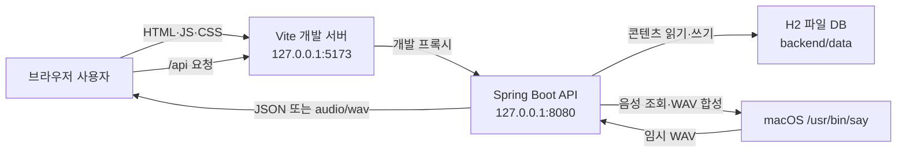
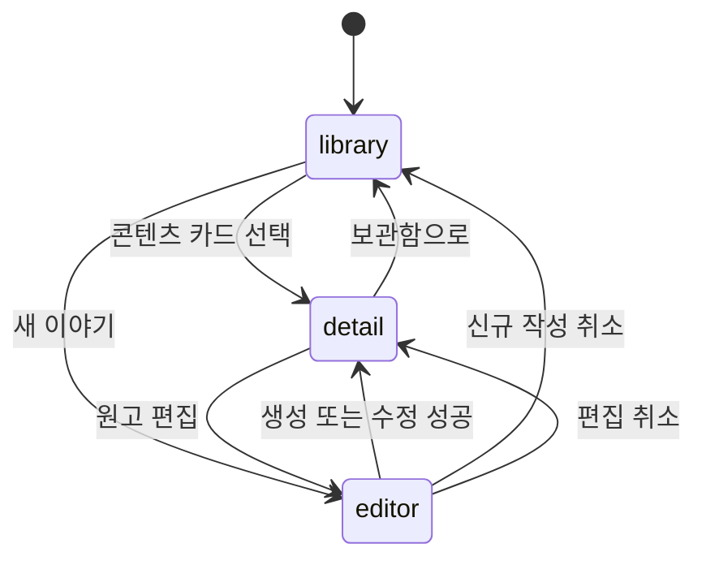
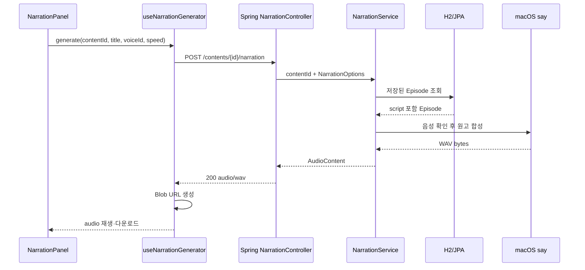

# Runtime Flow & Practical Review Guide

이 문서는 `고요한 지식` 프로젝트를 처음 접한 개발자가 실제 동작을 따라가고, 장애를 찾고, 변경 코드를 실무적으로 리뷰할 수 있도록 만든 실행 흐름 안내서입니다.

문서의 역할은 다음과 같이 구분합니다.

| 문서 | 답하는 질문 |
|---|---|
| `README.md` | 어떻게 설치하고 실행하며 API를 사용하는가? |
| `ARCHITECTURE.md` | 왜 이 계층과 경계로 설계했는가? |
| `FLOW.md` | 요청이 실제로 어디를 지나며, 어떻게 분석·디버깅·리뷰하는가? |

`ARCHITECTURE.md`를 먼저 외울 필요는 없습니다. 이 문서의 한 흐름을 끝까지 추적한 뒤 아키텍처 문서를 읽으면 각 계층을 나눈 이유가 더 잘 보입니다.

---

## 1. 한 장으로 보는 실행 구조

개발 중에는 세 개의 실행 경계가 존재합니다.



핵심 제품 흐름은 다음과 같습니다.

```text
과학 이야기 작성·저장·조회
          |
          +-- 저장된 원고를 사용한 나레이션 미리 듣기·다운로드
```

TTS 요청이 임의 텍스트를 직접 받지 않고 `contentId`로 저장된 원고를 다시 조회하는 이유도 이 제품 경계를 유지하기 위해서입니다.

### 실행 주소를 혼동하지 않는 법

| 주소 | 역할 | 정상 확인 방법 |
|---|---|---|
| `http://localhost:5173` | React 사용자 화면 | 보관함 화면이 보인다. |
| `http://localhost:8080/api/v1/contents` | Spring 콘텐츠 API | JSON이 보인다. |
| `http://localhost:8080/` | 별도 구현이 없는 API 서버 루트 | `404`여도 정상이다. |

Gradle 터미널이 `EXECUTING`에서 멈춘 것처럼 보이는 것은 Spring 서버가 종료되지 않고 요청을 기다리는 정상 상태일 수 있습니다. `Started SleepKnowledgeApplication` 로그와 8080 포트를 함께 확인합니다.

---

## 2. 분석 전 기준 상태 만들기

코드를 읽기 전에 먼저 정상 상태를 재현해야 합니다. 정상 결과를 모르면 변경 후 무엇이 깨졌는지 판단하기 어렵습니다.

### 2.1 백엔드 실행

프로젝트의 `backend` 디렉터리에서 실행해야 상대 경로인 `./data/sleepknowledge`가 예상 위치에 만들어집니다.

```bash
cd backend
./gradlew clean test
./gradlew bootRun
```

오래 실행했던 구버전 서버가 있다면 먼저 `Ctrl+C`로 종료하고 `clean`을 사용합니다. 소스 파일을 옮기거나 main class 이름을 바꾼 뒤에는 이전 `build` 산출물이 남아 혼동을 줄 수 있기 때문입니다.

### 2.2 프론트엔드 실행

다른 터미널에서 실행합니다.

```bash
cd frontend
npm install
npm test
npm run build
npm run dev
```

개발 서버에서는 `frontend/vite.config.ts`가 `/api`를 `http://127.0.0.1:8080`으로 전달합니다. `VITE_API_BASE_URL`을 지정하면 `frontend/src/api/httpClient.ts`가 해당 주소를 직접 사용합니다.

### 2.3 최소 정상 흐름

다음 순서가 모두 성공해야 기능 변경 전 기준 상태가 만들어집니다.

1. 보관함에 예시 콘텐츠가 보인다.
2. 카드를 열면 전체 원고가 보인다.
3. 새 이야기를 작성하면 상세 화면으로 이동한다.
4. 원고를 수정하면 수정된 내용이 다시 보인다.
5. 상세 화면에서 음성을 선택하고 WAV를 만든다.
6. 브라우저에서 재생하거나 다운로드할 수 있다.

API만 먼저 확인하려면 다음 요청을 사용합니다.

```bash
curl -i http://localhost:8080/api/v1/contents
curl -i http://localhost:8080/api/v1/narration/voices
```

이 기준 흐름을 깨뜨리는 변경은 테스트가 통과하더라도 회귀일 수 있습니다.

---

## 3. 애플리케이션 부팅 흐름

### 3.1 Spring Boot 부팅

```text
SleepKnowledgeApplication.main()
  -> SpringApplication.run()
  -> application.yml 설정 바인딩
  -> Controller / Service / Repository 탐색
  -> H2 DataSource와 JPA EntityManagerFactory 구성
  -> Spring Data repository proxy 생성
  -> SpeechSynthesisPort 구현체 조립
  -> ContentSeedData 실행
  -> Tomcat이 127.0.0.1:8080에서 요청 대기
```

확인할 파일과 의미는 다음과 같습니다.

| 순서 | 파일 | 확인할 내용 |
|---|---|---|
| 1 | `SleepKnowledgeApplication.java` | 시작점과 configuration properties scan |
| 2 | `application.yml` | DB URL, 서버 포트, CORS, TTS 명령과 timeout |
| 3 | `ApplicationConfiguration.java` | 테스트 가능한 `Clock` bean |
| 4 | `NarrationConfiguration.java` | `SpeechSynthesisPort`에 어떤 adapter가 연결되는지 |
| 5 | `ContentJpaEntity.java` | `contents` 테이블 매핑 |
| 6 | `ContentSeedData.java` | 빈 DB일 때만 예시 두 편을 넣는 조건 |

`ContentSeedData`는 `contentRepository.count() == 0`일 때만 실행됩니다. DB에 한 행이라도 있다면 누락된 예시만 추가하는 방식이 아니라 seed 전체를 건너뜁니다.

### 3.2 React 부팅

```text
index.html
  -> src/main.tsx
  -> React StrictMode
  -> App 마운트
      +-> useContentLibrary: GET /api/v1/contents
      +-> useVoices: GET /api/v1/narration/voices
  -> 초기 screen = library
```

초기 화면에 나레이션 패널이 보이지 않더라도 `useVoices()`는 `App`이 마운트될 때 바로 음성 목록을 조회합니다. 개발 모드의 `StrictMode`는 effect의 안전성을 확인하기 위해 실행과 정리를 반복할 수 있으므로 Network 탭에서 초기 요청이 두 번 보일 수 있습니다. 운영 빌드의 중복 요청과 구분해서 판단해야 합니다.

---

## 4. 프론트 화면 상태 모델

이 앱은 아직 React Router를 사용하지 않습니다. URL 대신 `App.tsx`의 상태가 현재 화면을 결정합니다.

```ts
type Screen = 'library' | 'detail' | 'editor';
```



| 상태 | 주 컴포넌트 | 핵심 데이터 |
|---|---|---|
| `library` | `ContentLibrary` | `contents`, `listStatus`, 검색어, 카테고리 |
| `detail` | `ContentDetail`, `NarrationPanel` | `selectedContent`, `detailStatus`, 음성, WAV 결과 |
| `editor` | `ContentEditor` | 신규 또는 선택 콘텐츠에서 만든 `ContentDraft` |

`isCreating`은 같은 `editor` 화면이 POST를 사용할지 PUT을 사용할지 결정합니다.

- `true`: 신규 작성, 저장 시 POST, 취소 시 보관함
- `false`: 기존 편집, 저장 시 PUT, 취소 시 상세

현재 URL에는 이 상태가 나타나지 않습니다. 따라서 상세 주소 공유, 브라우저 뒤로 가기, 상세 화면 새로고침 복원은 지원하지 않습니다.

---

## 5. 흐름을 추적하는 공통 형식

모든 기능은 다음 순서로 세로 추적합니다.

```text
사용자 동작
  -> React component event
  -> React hook
  -> frontend API function
  -> HTTP method + path
  -> Controller + request DTO
  -> inbound port
  -> application service
  -> domain model
  -> outbound port
  -> adapter
  -> DB 또는 외부 프로세스
  -> HTTP response
  -> frontend response normalization
  -> hook state
  -> 화면 렌더링
```

흐름을 분석할 때 아래 여덟 가지를 기록하면 리뷰 누락이 크게 줄어듭니다.

| 항목 | 질문 |
|---|---|
| Trigger | 어떤 사용자 행동이나 시스템 이벤트가 시작점인가? |
| Contract | HTTP 메서드, URL, 입력, 출력, status는 무엇인가? |
| File chain | 실제 파일과 함수는 어떤 순서로 호출되는가? |
| Transformation | DTO, domain, entity, Blob 사이에서 값이 어떻게 바뀌는가? |
| Transaction | DB 트랜잭션은 어디서 열리고 언제 끝나는가? |
| Side effect | DB 쓰기, 프로세스 실행, 임시 파일, Object URL 생성이 있는가? |
| Failure | 실패 종류가 어디서 어떤 오류로 바뀌는가? |
| Evidence | 어떤 테스트, 로그, 헤더, 화면 상태로 성공을 증명하는가? |

---

## 6. 콘텐츠 목록 조회 흐름

### 6.1 전체 호출 사슬

```text
App 마운트
  -> useContentLibrary.useEffect()
  -> loadContents()
  -> contentApi.getContents(signal)
  -> httpClient.apiRequestJson()
  -> GET /api/v1/contents
  -> ContentController.listContents()
  -> BrowseContentUseCase.listContents()
  -> ContentService.listContents()
  -> ContentRepositoryPort.findAll()
  -> JpaContentRepositoryAdapter.findAll()
  -> SpringDataContentRepository.findAllByOrderByUpdatedAtDesc()
  -> H2 contents 테이블
  -> ContentJpaEntity.toDomain()
  -> Episode
  -> ContentSummaryResponse
  -> { contents: [...] }
  -> contentApi.toSummary()
  -> setContents()
  -> ContentLibrary / ContentCard
```

### 6.2 중요한 데이터 결정

- DB 조회 순서는 `updatedAt DESC`입니다.
- HTTP 목록 응답은 `script`를 제외합니다.
- 프론트는 제목과 소개를 대상으로 검색합니다.
- 검색과 카테고리 필터는 API를 다시 호출하지 않고 이미 받은 배열에서 처리합니다.
- 목록 응답에는 원고나 예상 시간이 없으므로 `estimatedMinutes`는 `0`이 되고 카드에는 `원고 보기`가 표시됩니다.

### 6.3 상태와 취소

`useContentLibrary`는 목록 상태를 `idle → loading → success/error`로 바꿉니다.

- 새 목록 요청 전 이전 `AbortController`를 중단합니다.
- loading 중에는 카드 스켈레톤을 표시합니다.
- 실패하면 오류와 `다시 불러오기` 버튼을 표시합니다.
- 성공했지만 필터 결과가 없으면 빈 결과 안내를 표시합니다.
- `AbortError`는 사용자 오류로 보여 주지 않습니다.

### 6.4 리뷰할 지점

응답에 원고가 없다고 해서 DB 비용까지 사라지는 것은 아닙니다. 현재 `findAllByOrderByUpdatedAtDesc()`는 `ContentJpaEntity` 전체를 만들기 때문에 `@Lob script`도 함께 읽을 수 있습니다. 콘텐츠가 늘어나면 목록 projection, 페이지네이션, 서버 검색을 검토해야 합니다.

### 6.5 이 흐름을 보호하는 테스트

- `ContentApiIntegrationTest.시드된_콘텐츠_목록은_긴_원고를_제외한다`
- `contentApi.test.ts`의 목록 envelope 변환 테스트
- `content.test.ts`의 카테고리 표시 테스트

---

## 7. 콘텐츠 상세 조회 흐름

### 7.1 전체 호출 사슬

```text
ContentCard 클릭
  -> App.openContent(id)
  -> 기존 narration.clearResult()
  -> screen = detail
  -> useContentLibrary.openContent(id)
  -> 이전 상세 요청 abort
  -> selectedContent = null
  -> detailStatus = loading
  -> contentApi.getContent(id, signal)
  -> GET /api/v1/contents/{id}
  -> ContentController.getContent(UUID)
  -> BrowseContentUseCase.getContent()
  -> ContentService.getContent()
  -> ContentRepositoryPort.findById()
  -> JPA + H2
  -> ContentDetailResponse(script 포함)
  -> contentApi.toContent()
  -> 예상 청취 시간 계산
  -> selectedContent 저장
  -> ContentDetail + NarrationPanel 렌더링
```

예상 청취 시간은 프론트에서 공백을 제외한 330자당 1분으로 계산하며 최소 1분입니다. 이는 실제 음성 속도나 문장 부호를 측정한 값이 아니라 UI용 추정치입니다.

### 7.2 실패 분기

| 상황 | 백엔드 | 프론트 |
|---|---|---|
| UUID 형식 오류 | `400 ProblemDetail` | 상세 오류 화면 |
| 존재하지 않는 UUID | `404 ProblemDetail` | 상세 오류 화면 |
| 연결 실패 | 요청이 서버에 도달하지 않음 | `ApiError(status=0)` |
| 응답에 script가 없음 | 서버 계약 위반 | `콘텐츠 응답 형식이 올바르지 않습니다.` |
| 다른 카드를 빠르게 선택 | 새 요청 전에 이전 요청 중단 | 마지막 요청 결과만 사용 |

보관함 버튼은 현재 진행 중인 상세 fetch를 직접 중단하지 않습니다. 요청이 나중에 완료되면 hook 상태는 바뀔 수 있지만 `screen=library`라 상세는 렌더링되지 않습니다. 요청 수와 불필요한 상태 변경을 줄이려면 화면 이탈 시 상세 요청도 취소하는 방식을 검토할 수 있습니다.

### 7.3 이 흐름을 보호하는 테스트

- `ContentApiIntegrationTest.콘텐츠_상세에서_원고를_조회한다`
- 없는 콘텐츠와 잘못된 UUID의 통합 테스트
- `contentApi.test.ts`의 상세 변환과 예상 시간 테스트

---

## 8. 콘텐츠 생성 흐름

### 8.1 화면에서 DB까지

```text
헤더의 새 이야기 클릭
  -> App.startCreate()
  -> narration.clearResult()
  -> isCreating = true
  -> screen = editor
  -> ContentEditor가 EMPTY_DRAFT로 마운트
  -> 사용자가 제목·요약·카테고리·원고 입력
  -> ContentEditor.submit()
  -> trim한 ContentDraft 전달
  -> App.saveEditor()
  -> useContentLibrary.saveContent(draft, undefined)
  -> contentApi.createContent(draft)
  -> POST /api/v1/contents
  -> ContentController.createContent()
  -> @Valid ContentRequest
  -> ContentRequest.toDraft()
  -> EpisodeDraft 생성과 도메인 재검증
  -> CreateContentUseCase.createContent()
  -> ContentService.createContent()
  -> Clock.instant() + UUID.randomUUID()
  -> Episode.create()
  -> ContentRepositoryPort.save()
  -> ContentJpaEntity.from()
  -> Spring Data JPA save
  -> H2 commit
  -> 201 Created + Location + 상세 JSON
  -> contentApi.toContent()
  -> selectedContent 갱신
  -> 목록 GET 재호출
  -> screen = detail
```

### 8.2 검증이 두 번 있는 이유

HTTP 경계의 `ContentRequest`는 Bean Validation으로 빠르게 사용자 입력 오류를 만듭니다.

| 필드 | 규칙 |
|---|---|
| `title` | 공백 제외 필수, 최대 120자 |
| `summary` | 공백 제외 필수, 최대 500자 |
| `category` | 네 enum 중 하나, 필수 |
| `script` | 공백 제외 필수, 최대 20,000자 |

그 뒤 `EpisodeDraft`도 같은 핵심 규칙을 검증합니다. REST가 아닌 배치, 테스트, 메시지 소비자가 나중에 유스케이스를 호출해도 잘못된 도메인 객체가 생기지 않게 하기 위해서입니다.

프론트의 `required`, `maxLength`, 저장 버튼 비활성화는 사용자 편의를 위한 1차 방어입니다. 서버와 도메인 검증을 대체하지 않습니다.

### 8.3 시간과 트랜잭션

- `ContentService.createContent()`에 쓰기 `@Transactional`이 적용됩니다.
- `Clock` bean은 UTC 시스템 시간을 제공합니다.
- 생성 시 `createdAt`과 `updatedAt`은 같습니다.
- 테스트에서는 고정 Clock을 넣어 시간을 결정적으로 검증합니다.
- 응답이 만들어지는 시점에는 JPA 저장이 성공한 상태여야 합니다.

### 8.4 프론트 저장 상태

```text
saveStatus: idle -> loading -> success 또는 error
```

저장 성공 후 `loadContents()`가 끝날 때까지 `saveContent()`가 반환하지 않으므로 상세 화면 전환도 목록 갱신을 기다립니다. 목록 재조회 실패는 `loadContents()` 내부에서 목록 오류 상태로 처리되며 저장된 콘텐츠 자체는 성공 결과로 유지됩니다.

### 8.5 성공 증거

- HTTP status가 `201 Created`
- `Location: /api/v1/contents/{UUID}` 헤더 존재
- 응답의 `id`, `createdAt`, `updatedAt` 존재
- 상세 화면에 방금 입력한 원고 표시
- 보관함 재진입 시 새 카드 표시
- 서버 재시작 후에도 같은 콘텐츠 표시

### 8.6 이 흐름을 보호하는 테스트

- `ContentServiceTest.콘텐츠를_생성하고_목록과_상세에서_조회한다`
- `ContentApiIntegrationTest.콘텐츠를_생성한다`
- Bean Validation과 알 수 없는 카테고리 통합 테스트
- `contentApi.test.ts`의 POST 요청 테스트

---

## 9. 콘텐츠 수정 흐름

수정은 부분 변경이 아닌 전체 필드를 보내는 PUT입니다. PATCH는 아직 없습니다.

```text
상세 화면의 원고 편집 클릭
  -> App.startEdit()
  -> isCreating = false
  -> screen = editor
  -> selectedContent를 폼 초기값으로 사용
  -> ContentEditor.submit()
  -> App.saveEditor()
  -> useContentLibrary.saveContent(draft, selectedContent.id)
  -> contentApi.updateContent()
  -> PUT /api/v1/contents/{id}
  -> ContentController.updateContent()
  -> ContentService.updateContent()
  -> 기존 Episode 조회
  -> Episode.update(draft, clock.instant())
  -> id와 createdAt 보존
  -> 나머지 콘텐츠 값과 updatedAt 교체
  -> JPA save + commit
  -> 200 상세 JSON
  -> selectedContent 교체
  -> 목록 재조회
  -> 상세 화면
```

### 현재 리뷰에서 놓치기 쉬운 점

1. `@Version`이 없으므로 두 사용자가 동시에 PUT하면 마지막 저장이 앞선 변경을 덮어씁니다.
2. 편집 이탈 전 저장하지 않은 변경을 묻는 경고가 없습니다.
3. `startEdit()`은 기존 나레이션 결과를 지우지 않습니다. 수정 전 원고로 만든 WAV가 존재한 상태에서 편집·저장하면 수정 후 상세 화면에 이전 WAV가 다시 표시될 수 있습니다. 편집 진입 또는 저장 성공 시 `narration.clearResult()`가 필요한지 제품 정책을 정해야 합니다.

### 이 흐름을 보호하는 테스트

- `ContentServiceTest.콘텐츠를_수정하면_생성시각은_보존한다`
- `ContentApiIntegrationTest.콘텐츠를_수정한다`
- `contentApi.test.ts`의 PUT 요청 테스트

현재 동시 수정, 저장하지 않은 입력, 수정 후 기존 WAV 무효화는 자동 테스트가 없습니다.

---

## 10. 음성 목록 조회 흐름

```text
App 마운트
  -> useVoices.useEffect()
  -> speechApi.getVoices(signal)
  -> GET /api/v1/narration/voices
  -> NarrationController.listVoices()
  -> ListNarrationVoicesUseCase.listVoices()
  -> NarrationService.listVoices()
  -> SpeechSynthesisPort.findAvailableVoices()
  -> MacOsSayNarrationAdapter.findAvailableVoices()
  -> /usr/bin/say -v ? 실행
  -> 출력 파일 읽기
  -> 정규식으로 Voice 변환
  -> locale, name 순 정렬
  -> 임시 로그 삭제
  -> VoicesResponse
  -> speechApi.toVoice()
  -> useVoices가 기본 음성 선택
```

기본 음성 선택 우선순위는 다음과 같습니다.

1. ID가 `Yuna`인 음성
2. language/locale이 `ko`로 시작하는 첫 음성
3. 전체 목록의 첫 음성

프론트 API adapter는 배열과 `{ voices: [...] }`, `name/displayName`, `language/locale` 변형을 모두 받아들입니다. 현재 서버 계약은 `{ voices: [...] }`, `name`, `locale`입니다. 호환 코드는 유연하지만 서버 계약이 실수로 바뀌어도 조용히 통과시킬 수 있으므로 계약 테스트와 함께 유지해야 합니다.

### 리뷰할 지점

- 보관함만 보는 사용자도 앱 시작 시 `say -v ?` 프로세스를 실행합니다.
- 나레이션 생성 시 서버가 음성 ID를 다시 검증하기 위해 음성 목록을 또 조회합니다.
- 운영 공급자라면 짧은 TTL 캐시와 상세 화면 진입 시 lazy load를 검토합니다.
- 음성 목록은 OS 설치 상태에 따라 달라지므로 특정 ID를 무조건 가정하면 안 됩니다.

### 이 흐름을 보호하는 테스트

- `MacOsSayNarrationAdapterTest`의 음성 출력 파싱 테스트
- `speechApi.test.ts`의 프론트 모델 변환 테스트
- `useVoices.test.ts`의 기본 음성 우선순위 테스트
- `ContentApiIntegrationTest.내레이션용_음성_목록을_조회한다`

---

## 11. WAV 내레이션 생성 흐름

### 11.1 브라우저에서 macOS까지



전체 파일·함수 사슬은 다음과 같습니다.

```text
NarrationPanel.submit()
  -> App의 onGenerate
  -> useNarrationGenerator.generate()
  -> contentApi.createNarration()
  -> POST /api/v1/contents/{contentId}/narration
     body = { voiceId, speed }
     Accept = audio/wav
  -> NarrationController.generateNarration()
  -> @Valid NarrationRequest
  -> NarrationOptions
  -> GenerateNarrationUseCase.generateNarration()
  -> NarrationService.generateNarration()
  -> ContentRepositoryPort.findById()
  -> 저장된 Episode.script 선택
  -> SpeechSynthesisPort.findAvailableVoices()
  -> 요청 voiceId 존재 확인
  -> SpeechSynthesisPort.synthesize()
  -> MacOsSayNarrationAdapter.synthesize()
  -> 임시 디렉터리 생성
  -> script.txt UTF-8 기록
  -> 실제 WPM = round(180 * speed)
  -> /usr/bin/say 실행
  -> narration.wav 생성
  -> Files.readAllBytes()
  -> AudioContent.wav()
  -> 임시 파일 정리
  -> 200 audio/wav
  -> response.blob()
  -> URL.createObjectURL(blob)
  -> AudioResult의 audio와 download 링크
```

### 11.2 요청 계약

요청에는 원고를 포함하지 않습니다.

```json
{
  "voiceId": "Yuna",
  "speed": 0.9
}
```

| 필드 | 규칙 |
|---|---|
| `voiceId` | 공백 제외 필수, 최대 100자, 설치된 음성과 일치 |
| `speed` | 필수, `0.5` 이상 `2.0` 이하 |

서버는 반드시 DB의 최신 저장 원고를 사용합니다. 편집기에 입력했지만 아직 저장하지 않은 원고는 합성할 수 없습니다.

### 11.3 `say` adapter의 안전장치

- 원고를 셸 명령 문자열에 이어 붙이지 않고 UTF-8 임시 파일에 씁니다.
- `ProcessBuilder`에 각 인자를 분리해서 전달합니다.
- 음성 ID는 설치된 음성 목록과 대조합니다.
- stdout과 stderr를 임시 로그로 보내 pipe buffer 교착을 피합니다.
- 기본 timeout은 5분입니다.
- timeout과 interrupt에서는 프로세스를 강제 종료합니다.
- 성공과 실패 모두에서 원고, WAV, 로그 파일 정리를 시도합니다.
- WAV 형식은 PCM 16-bit, mono, 22,050Hz입니다.

### 11.4 응답 계약

```text
200 OK
Content-Type: audio/wav
Content-Length: 실제 byte 길이
Cache-Control: no-store
Content-Disposition: inline; filename="narration-{UUID}.wav"
```

프론트는 빈 Blob만 명시적으로 거절합니다. MIME 타입과 RIFF 헤더까지 검증하지는 않습니다.

### 11.5 Object URL 생명주기

브라우저의 WAV 결과는 서버 URL이 아니라 메모리 Blob URL입니다.

```text
Blob
  -> URL.createObjectURL()
  -> { url, fileName } 상태 저장
  -> <audio src=url>
  -> <a href=url download=...>
```

이전 URL은 다음 시점에 `URL.revokeObjectURL()`로 해제합니다.

- 새 합성 결과가 기존 결과를 교체할 때
- 보관함으로 이동할 때
- 다른 콘텐츠를 열 때
- 새 이야기 작성을 시작할 때
- App이 언마운트될 때

다운로드 파일명은 콘텐츠 제목을 정규화해 최대 48자로 만들며, 사용할 문자가 없으면 `knowledge-narration.wav`가 됩니다.

### 11.6 취소의 실제 의미

`화면 대기 중단`은 브라우저의 fetch를 abort합니다. 이미 서버에서 실행 중인 `say` 프로세스에 취소 신호를 전달하는 별도 프로토콜은 없습니다.

```text
브라우저 AbortController
  - 클라이언트 응답 대기 중단: 가능
  - HTTP 연결 종료: 브라우저가 시도
  - Spring 서비스 작업 취소 보장: 불가능
  - 이미 실행 중인 say 프로세스 종료 보장: 불가능
```

따라서 사용자가 취소했어도 잠시 CPU 사용이나 서버 로그가 이어질 수 있습니다. 운영용 취소는 job ID와 서버 측 상태 전이가 필요합니다.

### 11.7 성능상 중요한 복사

현재 WAV는 한 번에 메모리에 올라갑니다.

```text
Files.readAllBytes()
  -> AudioContent 생성 시 방어적 복사
  -> AudioContent.bytes() 호출 시 다시 방어적 복사
  -> HTTP 응답
  -> 브라우저 Blob
```

짧은 미리 듣기에는 단순하고 안전하지만 수십 분짜리 오디오나 동시 요청에는 JVM 메모리와 HTTP thread 사용량이 커집니다.

### 11.8 이 흐름을 보호하는 테스트

- `NarrationServiceTest`: 저장된 원고 사용, 없는 콘텐츠, 미지원 음성
- `ContentApiIntegrationTest.저장된_콘텐츠를_wav_내레이션으로_만든다`
- `contentApi.test.ts`: 원고 없이 설정만 보내고 Blob을 받는 계약
- `MacOsSayNarrationAdapterTest`: 음성 목록 parser

자동 테스트의 HTTP 합성은 fake `SpeechSynthesisPort`를 사용합니다. 실제 `/usr/bin/say` 실행과 실제 WAV 재생은 macOS smoke test로 별도 확인해야 합니다.

---

## 12. 데이터 변환과 소유권

### 12.1 콘텐츠 생성 방향

```text
브라우저 ContentDraft
  -> JSON ContentRequest
  -> EpisodeDraft
  -> Episode
  -> ContentJpaEntity
  -> H2 contents row
```

### 12.2 콘텐츠 조회 방향

```text
H2 contents row
  -> ContentJpaEntity
  -> Episode
  -> ContentSummaryResponse 또는 ContentDetailResponse
  -> JSON
  -> KnowledgeContentSummary 또는 KnowledgeContent
  -> React component props
```

### 12.3 각 모델의 소유 책임

| 모델 | 소유 계층 | 역할 |
|---|---|---|
| `ContentRequest` | web adapter | JSON과 HTTP 검증 |
| `EpisodeDraft` | domain | 생성·수정 입력의 불변 조건 |
| `Episode` | domain | 핵심 콘텐츠와 시간 불변 조건 |
| `ContentJpaEntity` | persistence adapter | 테이블과 컬럼 매핑 |
| `ContentSummaryResponse` | web adapter | 목록에서 원고를 숨기는 계약 |
| `ContentDetailResponse` | web adapter | 상세 원고를 포함하는 계약 |
| `KnowledgeContent*` | frontend domain | 화면에서 사용할 안정적인 타입 |

리뷰에서는 한 계층의 모델을 다른 계층이 직접 사용하지 않는지 확인합니다. 예를 들어 Controller가 `ContentJpaEntity`를 반환하거나 JPA entity가 `ContentRequest`를 받기 시작하면 경계가 무너진 신호입니다.

---

## 13. 트랜잭션과 부수 효과 경계

| 흐름 | 트랜잭션 | 외부 부수 효과 |
|---|---|---|
| 목록·상세 | `ContentService` 읽기 전용 | 없음 |
| 생성·수정 | `ContentService` 쓰기 | H2 저장 |
| seed | `ContentSeedData.run()` 쓰기 | 빈 DB에 두 행 저장 |
| 음성 목록 | `NarrationService` 읽기 전용 선언 | `say -v ?` 프로세스 |
| WAV 생성 | `NarrationService` 읽기 전용 선언 | DB 조회, `say`, 임시 파일, WAV 메모리 |

`NarrationService.generateNarration()`은 읽기 전용 트랜잭션 안에서 콘텐츠를 조회한 뒤 외부 프로세스가 끝날 때까지 메서드가 반환하지 않습니다. 실제 DB connection 점유 방식은 JPA 구현과 transaction lifecycle에 좌우되지만, 외부 호출을 트랜잭션 범위에 오래 포함시키는 구조는 피하는 편이 좋습니다. 운영 전에는 원고 snapshot 조회와 합성 실행의 경계를 분리합니다.

DB commit 이전에 외부 TTS를 호출하는 새로운 기능을 추가한다면 특히 조심해야 합니다. 외부 호출은 성공했지만 DB transaction이 rollback되어 비용만 발생하는 이중 실패가 생길 수 있습니다.

---

## 14. 오류가 사용자 메시지로 바뀌는 흐름

백엔드의 `ApiExceptionHandler`는 오류를 RFC Problem Details 형식으로 통일합니다.

| 원인 | 서버 예외 | HTTP | 사용자에게 전달되는 성격 |
|---|---|---:|---|
| 필드 검증 실패 | `MethodArgumentNotValidException` | 400 | `errors`에 필드별 메시지 |
| JSON 문법·타입·enum 오류 | `HttpMessageNotReadableException` | 400 | JSON과 카테고리 확인 안내 |
| 잘못된 UUID | `MethodArgumentTypeMismatchException` | 400 | UUID 형식 안내 |
| 없는 콘텐츠 | `ContentNotFoundException` | 404 | 콘텐츠 없음 |
| 없는 음성·도메인 인자 오류 | `UnsupportedVoiceException`, `IllegalArgumentException` | 400 | 요청 거절 이유 |
| TTS 명령·timeout·파일 실패 | `SpeechSynthesisException` | 502 | 내부 출력은 숨기고 일반화된 메시지 |
| 예상하지 못한 오류 | `Exception` | 500 | 일반 서버 오류, 상세는 로그 |

Spring MVC가 이미 상태 정보를 가진 `ErrorResponse`인 경우 원래 status와 headers를 보존합니다.

프론트의 `httpClient.readErrorMessage()`는 JSON 오류에서 다음 순서로 문자열을 고릅니다.

```text
detail -> message -> title -> status 기반 기본 메시지
```

현재 필드별 `errors` map은 폼 각 입력 옆에 연결하지 않고 대표 메시지만 표시합니다. 실무 폼 UX를 개선하려면 `ApiError`가 ProblemDetail 전체를 보존하도록 확장해야 합니다.

광범위한 `IllegalArgumentException`을 모두 400으로 바꾸고 원문 메시지를 내보내는 정책은 편리하지만, 향후 내부 프로그래밍 오류의 정보가 노출될 수 있습니다. 사용자가 일으킬 수 있는 명시적 도메인 예외로 좁히는 것을 검토합니다.

---

## 15. 증상별 디버깅 플레이북

### 15.1 `localhost:8080/`이 404다

정상일 수 있습니다. Spring은 HTML 홈을 제공하지 않습니다.

```bash
curl -i http://localhost:8080/api/v1/contents
```

- JSON 200: 백엔드는 정상, UI는 5173으로 접속
- 연결 실패: Spring 실행과 8080 listener 확인
- 500: Spring 로그와 H2 경로 확인

### 15.2 Gradle이 `EXECUTING`에 머문다

다음을 확인합니다.

1. 로그에 `Started SleepKnowledgeApplication`이 있는가?
2. `Tomcat started on port 8080`이 있는가?
3. API curl이 응답하는가?

세 항목이 맞으면 서버가 요청을 기다리는 정상 상태입니다. 서버는 `Ctrl+C` 전까지 종료되지 않습니다.

### 15.3 보관함이 계속 로딩되거나 연결 오류가 난다

```text
브라우저 Network의 /api/v1/contents
  -> Vite가 5173에서 실행 중인가?
  -> vite.config.ts의 proxy가 8080을 보는가?
  -> Spring이 8080에서 실행 중인가?
  -> VITE_API_BASE_URL이 잘못 덮어쓰지 않았는가?
  -> CORS 허용 origin과 실제 주소가 같은가?
```

Vite 프록시를 사용하는 상대 URL 요청에는 브라우저 CORS가 개입하지 않습니다. 별도 API base URL로 직접 호출할 때는 Spring CORS 설정이 중요합니다.

### 15.4 보관함이 비어 있거나 seed가 보이지 않는다

1. `backend/data`에 기존 H2 파일이 있는지 확인합니다.
2. `ContentSeedData`는 DB가 완전히 비었을 때만 동작함을 확인합니다.
3. 백엔드를 어느 working directory에서 실행했는지 확인합니다.
4. `GET /api/v1/contents`의 실제 응답을 확인합니다.

상대 H2 경로 때문에 다른 디렉터리에서 실행하면 다른 DB 파일을 보고 있을 수 있습니다.

### 15.5 저장 버튼은 눌리지만 400이 발생한다

브라우저 Network에서 요청 JSON과 `application/problem+json` 응답을 함께 봅니다.

```text
ContentEditor의 trim/길이 제한
  -> ContentRequest Bean Validation
  -> category enum 변환
  -> EpisodeDraft 도메인 검증
```

특히 프론트가 모르는 새 category 문자열과 백엔드 enum 변경이 함께 배포됐는지 확인합니다.

### 15.6 저장 후 목록에 바로 보이지 않는다

1. POST/PUT 응답이 성공했는지 확인합니다.
2. 이어지는 GET `/api/v1/contents`가 성공했는지 확인합니다.
3. `updatedAt DESC` 정렬을 확인합니다.
4. 프론트 검색어와 카테고리 필터가 새 항목을 숨기고 있지 않은지 확인합니다.
5. 서버 재시작 후에도 남는지 확인해 H2 commit을 검증합니다.

### 15.7 음성 목록이 나오지 않는다

터미널에서 OS 기능부터 분리해서 확인합니다.

```bash
/usr/bin/say -v '?'
curl -i http://localhost:8080/api/v1/narration/voices
```

그다음 `app.narration.command`, macOS 음성 설치 여부, server log의 `SpeechSynthesisException`을 확인합니다.

### 15.8 WAV 생성이 실패하거나 오래 걸린다

확인 순서는 다음과 같습니다.

1. 콘텐츠가 존재하고 원고가 저장됐는가?
2. 요청 `voiceId`가 현재 설치 목록에 있는가?
3. 속도가 0.5~2.0인가?
4. 원고 길이와 5분 timeout을 초과하지 않는가?
5. 임시 디렉터리에 쓸 공간과 권한이 있는가?
6. 서버의 502 로그 원인이 command, timeout, exit code 중 무엇인가?
7. 응답의 `Content-Type`, byte 크기, 처음 네 byte가 `RIFF`인지 확인했는가?

### 15.9 취소했는데 서버 CPU가 계속 사용된다

현재 설계에서는 예상 가능한 동작입니다. 브라우저 fetch abort와 서버 `say` process cancellation이 연결되어 있지 않습니다. 운영 요구사항이라면 비동기 job과 서버 취소 API가 필요합니다.

### 15.10 개발 중 요청이 두 번 발생한다

먼저 React 개발 `StrictMode`의 effect 재실행인지 확인합니다. 그다음 실제 코드에서 effect dependency, 재시도 버튼, 컴포넌트 remount가 추가 호출을 만드는지 구분합니다. 운영 build에서도 재현될 때만 중복 요청 버그로 단정합니다.

---

## 16. 프로젝트를 처음 분석하는 실무 순서

### 16.1 1차: 실행 계약만 읽기

다음 다섯 파일에서 실행 환경과 외부 경계를 먼저 파악합니다.

1. `README.md`
2. `backend/build.gradle`
3. `backend/src/main/resources/application.yml`
4. `frontend/package.json`
5. `frontend/vite.config.ts`

이 단계의 결과물은 다음 한 문장이면 충분합니다.

```text
5173 React가 8080 Spring REST API를 호출하고,
Spring은 H2 파일과 macOS say를 사용한다.
```

### 16.2 2차: HTTP 계약 확정

다음 순서로 읽습니다.

1. `ContentController`
2. `NarrationController`
3. `ContentRequest`, `NarrationRequest`
4. 목록·상세·음성 응답 DTO
5. `ApiExceptionHandler`

이 단계에서는 구현 세부보다 아래 표를 직접 적습니다.

| Method | Path | Request | Success | 주요 실패 |
|---|---|---|---|---|
| GET | `/api/v1/contents` | 없음 | 200 요약 목록 | 500 |
| GET | `/api/v1/contents/{id}` | UUID | 200 상세 | 400, 404 |
| POST | `/api/v1/contents` | 전체 원고 | 201 + Location | 400, 500 |
| PUT | `/api/v1/contents/{id}` | 전체 원고 | 200 상세 | 400, 404, 500 |
| GET | `/api/v1/narration/voices` | 없음 | 200 음성 목록 | 502 |
| POST | `/api/v1/contents/{id}/narration` | 음성·속도 | 200 WAV | 400, 404, 502 |

### 16.3 3차: 백엔드 세로 추적

콘텐츠 흐름:

```text
Controller
  -> inbound use case
  -> ContentService
  -> Episode / EpisodeDraft
  -> ContentRepositoryPort
  -> JpaContentRepositoryAdapter
  -> ContentJpaEntity
  -> H2
```

내레이션 흐름:

```text
NarrationController
  -> inbound use case
  -> NarrationService
  -> ContentRepositoryPort
  -> SpeechSynthesisPort
  -> MacOsSayNarrationAdapter
  -> WAV
```

각 화살표에서 구체 구현 이름이 안쪽 계층으로 새지 않는지 확인합니다. 예를 들어 `ContentService`가 `JpaRepository`나 `ProcessBuilder`를 직접 알면 port 경계가 깨집니다.

### 16.4 4차: 프론트 세로 추적

추천 읽기 순서입니다.

1. `App.tsx`: 화면 전환과 훅 조합
2. 사용자가 누르는 component
3. 해당 상태를 소유한 hook
4. `contentApi.ts` 또는 `speechApi.ts`
5. `httpClient.ts`
6. 응답을 받는 hook의 상태 변경
7. loading/error/success를 그리는 component

```text
App
  -> Component event
  -> Hook
  -> API adapter
  -> httpClient
  -> Spring
  -> Hook state
  -> Component render
```

JSX부터 모든 CSS를 읽기 시작하면 핵심 동작을 놓치기 쉽습니다. 먼저 event handler와 data flow를 고정한 뒤 스타일을 검토합니다.

### 16.5 5차: 횡단 관심사 검토

세로 흐름을 이해한 다음에만 다음 주제를 가로로 확인합니다.

- 입력 검증은 프론트, DTO, 도메인에서 어떻게 겹치는가?
- 예외는 어디서 status와 사용자 메시지로 바뀌는가?
- 트랜잭션 안에 외부 네트워크나 process가 있는가?
- 요청 취소가 어느 계층까지만 전달되는가?
- 메모리와 임시 파일은 누가 만들고 누가 정리하는가?
- 같은 설정 값이 프론트와 백엔드에 중복되어 있는가?
- 테스트가 fake로 대체하는 지점과 실제 실행하는 지점은 어디인가?

### 16.6 분석 기록 템플릿

새 기능을 분석할 때 아래를 복사해서 작성합니다.

```markdown
## 기능명

- Trigger:
- HTTP contract:
- Frontend chain:
- Backend chain:
- Data transformations:
- Transaction boundary:
- External side effects:
- Success evidence:
- Failure branches:
- Cancellation/cleanup:
- Existing tests:
- Missing tests:
- Operational risk:
```

---

## 17. 실무 코드 리뷰 순서

### 17.1 리뷰 시작 전

1. 변경 목적을 사용자 행동 한 문장으로 바꿉니다.
2. 변경 전 정상 흐름을 실행하거나 테스트 결과를 확인합니다.
3. 변경 파일 목록을 기능 흐름 순서로 재배열합니다.
4. 포맷 변경과 기능 변경을 분리합니다.
5. 생성 파일, lockfile, migration 포함 여부를 확인합니다.

좋은 목적 문장 예시:

```text
사용자가 저장된 과학 원고의 음성과 속도를 선택해
중복 생성 없이 나레이션을 다시 내려받을 수 있게 한다.
```

### 17.2 1단계: 제품 불변 조건

먼저 이 프로젝트의 핵심 규칙이 유지되는지 확인합니다.

- 콘텐츠가 메인이고 TTS는 저장 콘텐츠에 종속되는가?
- 내레이션 요청이 임의 script를 다시 받지 않는가?
- 목록은 긴 원고를 외부 응답에 노출하지 않는가?
- 모바일 클라이언트도 사용할 수 있는 REST 계약인가?
- 기술 구현이 domain model에 침투하지 않는가?

### 17.3 2단계: 계약 리뷰

- Method와 URL이 의도에 맞는가?
- POST, PUT, 향후 PATCH의 의미가 분명한가?
- 성공 status와 headers가 맞는가?
- 목록과 상세 응답의 차이가 의도적인가?
- enum과 필드 이름 변경이 프론트에 반영됐는가?
- 오류가 ProblemDetail 계약을 유지하는가?
- 바이너리 응답의 MIME, cache, filename이 맞는가?
- 기존 모바일 클라이언트를 깨뜨릴 breaking change인가?

### 17.4 3단계: 도메인과 유스케이스 리뷰

- 불변 조건이 Controller에만 있지 않고 domain에도 있는가?
- Service는 순서를 조율하고 기술 세부를 직접 실행하지 않는가?
- 생성과 수정이 ID와 시간 규칙을 지키는가?
- 없는 데이터와 지원하지 않는 옵션이 명시적 예외인가?
- `Clock`, repository, provider를 주입해 테스트할 수 있는가?
- 새로운 분기마다 성공과 실패 테스트가 있는가?

### 17.5 4단계: 트랜잭션과 persistence 리뷰

- 읽기와 쓰기 transaction이 구분되는가?
- 외부 API나 process를 transaction 안에서 오래 기다리지 않는가?
- entity와 domain mapping에서 필드가 누락되지 않았는가?
- enum 저장 방식과 migration 호환성이 안전한가?
- `@Lob`가 목록 쿼리에 불필요하게 로드되지 않는가?
- 동시 수정 정책과 `@Version`이 필요한가?
- seed가 사용자 데이터를 덮어쓰지 않는가?
- schema 변경에 migration이 있는가?

### 17.6 5단계: 프론트 비동기 상태 리뷰

- loading, success, empty, error가 모두 렌더링되는가?
- 빠른 연속 클릭에서 오래된 응답이 최신 상태를 덮지 않는가?
- 화면 이탈과 unmount에서 요청을 정리하는가?
- Blob URL, timer, event listener를 해제하는가?
- 저장 성공과 목록 refresh 실패를 구분하는가?
- 수정 후 이전 파생 결과인 WAV를 무효화하는가?
- 저장하지 않은 입력을 잃는 경로가 있는가?
- 키보드와 스크린리더로 상태를 이해할 수 있는가?

### 17.7 6단계: 운영·보안·비용 리뷰

- 인증과 작성 권한이 필요한 endpoint인가?
- body 크기, rate limit, TTS 동시 실행 수 제한이 있는가?
- timeout, retry, idempotency 정책이 있는가?
- API key가 서버 secret에만 있는가?
- 원고와 공급자 오류가 로그나 응답에 과도하게 노출되는가?
- 요청 수, 글자 수, 생성 시간과 공급자 비용을 측정할 수 있는가?
- 실패 후 임시 파일과 외부 job이 남지 않는가?
- 서비스 종료 시 진행 중인 합성을 어떻게 처리하는가?

### 17.8 7단계: 테스트를 실패 분기와 연결

테스트 개수보다 각 흐름의 위험을 보호하는지가 중요합니다.

```text
happy path
  + 입력 경계값
  + 존재하지 않는 리소스
  + provider 실패
  + timeout
  + 요청 경쟁
  + 취소와 cleanup
  + 재시작 후 영속성
```

리뷰어는 코드에서 발견한 위험마다 다음 질문을 해야 합니다.

```text
이 실패를 재현하는 테스트가 있는가?
없다면 이번 변경에 포함해야 하는가, 후속 작업으로 분리해도 되는가?
```

### 17.9 리뷰 의견 작성 형식

리뷰 의견은 취향이 아니라 재현 가능한 영향으로 작성합니다.

```markdown
[우선순위] 짧은 제목

- Trigger: 어떤 입력·상태·동시성에서 발생하는가
- Impact: 사용자·데이터·비용에 어떤 문제가 생기는가
- Evidence: 어느 코드 흐름에서 확인되는가
- Suggestion: 가장 작은 수정 방향은 무엇인가
- Test: 어떤 회귀 테스트가 필요한가
```

우선순위 예시:

| 우선순위 | 의미 |
|---|---|
| P0 | 즉시 장애·데이터 손상·치명적 보안 문제 |
| P1 | 공개 또는 병합 전 해결해야 할 주요 정확성·보안 문제 |
| P2 | 현실적인 조건에서 생기는 오류나 큰 유지보수 위험 |
| P3 | 품질·가독성·장기 개선 제안 |

버그인지 확신할 수 없는 설계 선호는 질문이나 후속 제안으로 남기고 P1처럼 단정하지 않습니다.

---

## 18. 현재 코드에서 우선 리뷰할 위험

아래는 반드시 즉시 고쳐야 한다는 뜻이 아니라, 다음 변경을 리뷰할 때 먼저 다시 판단할 항목입니다.

| 우선 검토 항목 | 현재 증상 또는 위험 | 다음 판단 |
|---|---|---|
| 외부 공개 전 인증 | POST, PUT, TTS에 인증·quota가 없음 | 현재 loopback bind는 로컬 위험을 낮추지만 공개 전 필수 |
| 장문 동기 합성 | HTTP thread가 최대 5분 동안 `say`를 기다림 | job queue와 202 응답으로 전환 |
| 전체 WAV 메모리 | 같은 대용량 byte가 JVM에서 여러 번 복사됨 | object storage 또는 streaming 검토 |
| 목록 LOB 조회 | 응답에는 script가 없지만 entity 전체를 읽음 | projection과 pagination |
| 취소 전파 | fetch abort가 `say` 종료를 보장하지 않음 | server-side job cancellation |
| 수정 후 오래된 WAV | 편집 진입 시 기존 결과를 지우지 않음 | 원고 변경 시 파생 audio 무효화 |
| 동시 PUT | version column이 없어 last-write-wins | optimistic locking과 409 |
| 음성 조회 반복 | 앱 시작과 합성 때 각각 공급자 조회 | lazy load와 TTL cache |
| URL 상태 없음 | 상세 새로고침·공유·뒤로 가기 불가 | router 도입 |
| 입력 유실 | editor 이탈 경고 없음 | dirty state와 confirm 정책 |
| 운영 DB | H2와 `ddl-auto:update` | PostgreSQL + Flyway |
| 의존성 재현성 | `package.json`에 `latest` 사용 | 명시 버전과 `npm ci` |
| 관측성 | TTS 실패 로그 외 처리량·시간·비용 metric 부족 | request ID, timer, counter |
| 테스트 공백 | component/E2E와 실제 `say` 자동 검증 없음 | 위험 기반 테스트 추가 |

---

## 19. 테스트 전략과 체크리스트

### 19.1 현재 자동 테스트가 보호하는 범위

백엔드:

- 콘텐츠 생성·수정·조회 service 규칙
- UUID와 시간 보존
- 저장된 원고가 TTS port로 전달되는지
- 없는 콘텐츠와 미지원 음성
- MockMvc 기반 CRUD와 H2 연동
- 목록에서 script 제외
- Bean Validation과 ProblemDetail
- CORS preflight
- fake port를 통한 WAV HTTP contract
- macOS 음성 목록 parser

프론트엔드:

- 목록·상세 응답 정규화
- POST와 PUT 요청 형태
- content-bound narration 요청과 Blob
- 음성 응답 정규화
- 카테고리 문구와 예상 청취 시간
- 기본 음성 선택 순서

### 19.2 실행 명령

```bash
cd backend
./gradlew clean test
```

```bash
cd frontend
npm test
npm run build
```

현재 구성에서 백엔드는 18개, 프론트엔드는 13개의 테스트가 있습니다. 테스트 개수는 변경에 따라 달라질 수 있으므로 CI에서는 `0 failures`와 실제 보호 범위를 함께 봅니다.

### 19.3 추가할 가치가 높은 테스트

- [ ] 제목 120/121, 요약 500/501, 원고 20,000/20,001 경계
- [ ] 속도 0.5, 2.0, 범위 밖 값
- [ ] 기존 데이터가 있을 때 seed가 실행되지 않는지
- [ ] 파일 H2를 재시작해도 데이터가 유지되는지
- [ ] 두 PUT이 충돌할 때의 정책
- [ ] 실제 `say` 합성 macOS smoke test
- [ ] process timeout, 비정상 exit, interrupt, 임시 파일 정리
- [ ] 목록·상세·편집 component의 loading/error/empty 상태
- [ ] 빠른 상세 전환에서 오래된 응답 무시
- [ ] 저장 실패 후 입력 유지
- [ ] 편집 이탈 시 입력 유실 경고
- [ ] 나레이션 취소와 즉시 재요청
- [ ] 새 WAV와 화면 이탈 시 Object URL 해제
- [ ] 원고 수정 후 이전 WAV 무효화
- [ ] 키보드, focus, screen reader, reduced-motion 접근성
- [ ] 작성 → 저장 → 상세 → 음성 생성 → 재생 E2E
- [ ] 긴 원고의 시간, thread, heap 사용량 측정

### 19.4 실제 기능 smoke test 기록 형식

```markdown
- 실행 환경: macOS 버전, JDK, Node, 브라우저
- DB 상태: 신규/기존, 데이터 행 수
- 콘텐츠 ID:
- 원고 글자 수:
- voiceId / speed:
- 생성 시간:
- HTTP status / Content-Type / byte size:
- 실제 재생 여부:
- 다운로드 파일명:
- 실패 로그 또는 특이사항:
```

---

## 20. 운영·보안·성능 체크리스트

### 운영

- [ ] JDK와 Node 버전을 CI·배포 환경에서 고정
- [ ] CI 설치는 lockfile 기반 `npm ci` 사용
- [ ] H2 파일 경로, 쓰기 권한, 백업·복구 확인
- [ ] 운영에서 `ddl-auto:update` 제거
- [ ] PostgreSQL과 Flyway migration 도입
- [ ] `/usr/bin/say`가 없는 Linux 배포에서는 TTS adapter 교체
- [ ] 임시 디렉터리 용량과 정리 실패 감시
- [ ] health/readiness endpoint 추가
- [ ] 요청 ID, 글자 수, 생성 시간, 오류율 기록
- [ ] graceful shutdown 중 진행 작업 정책 정의
- [ ] 생성 오디오 보존·삭제 정책 정의

### 보안

- [ ] 로컬 MVP 동안 `127.0.0.1` bind 유지
- [ ] 공개 전 인증, 작성자 권한, 관리자 기능 분리
- [ ] CORS를 인증이나 권한 검사로 오해하지 않기
- [ ] POST·PUT body size와 rate limit 적용
- [ ] TTS 사용자별 quota와 동시 실행 수 제한
- [ ] 클라우드 TTS API key는 백엔드 secret에만 저장
- [ ] H2·백업 파일 접근 권한 제한
- [ ] 공급자 내부 오류와 원고를 응답·로그에 과도하게 노출하지 않기
- [ ] Cookie 인증 도입 시 CSRF 방어
- [ ] 향후 HTML 원고를 허용하면 sanitization 추가
- [ ] 음성 라이선스, 음성 복제 동의, 과학 원고 출처 확인
- [ ] 배경음·이미지·영상의 저작권 확인

현재 긍정적인 보안 경계도 유지해야 합니다.

- `ProcessBuilder`에 분리된 인자를 전달한다.
- 사용자 원고를 셸 명령으로 평가하지 않는다.
- `voiceId`를 공급자 목록과 대조한다.
- 임시 파일을 `finally`에서 정리한다.
- TTS의 상세 내부 오류를 클라이언트에 그대로 노출하지 않는다.
- React가 원고를 text node로 렌더링해 HTML을 실행하지 않는다.

### 성능

- [ ] 목록 projection과 서버 페이지네이션
- [ ] 검색·필터·정렬의 서버 이동 기준 정의
- [ ] 목록 응답에 글자 수 또는 예상 시간 제공
- [ ] 음성 목록 lazy load와 TTL cache
- [ ] 동시 TTS process semaphore 또는 worker 수 제한
- [ ] 같은 원고·음성·속도 조합의 checksum cache
- [ ] HTTP thread 밖의 비동기 합성
- [ ] WAV 전체 byte 배열 대신 object storage와 streaming
- [ ] H2 동시 쓰기 한계와 운영 DB 전환 시점 측정

---

## 21. 변경 유형별 영향 범위

### 카테고리 추가

```text
ContentCategory.java
  -> DB에 저장되는 enum 문자열
  -> ContentRequest JSON 계약
  -> frontend/domain/content.ts 라벨·색상
  -> 필터 UI
  -> backend/frontend tests
```

기존 enum 이름을 바꾸는 것은 단순 문구 변경이 아니라 저장 데이터 migration이 필요한 breaking change입니다.

### 클라우드 TTS로 교체

가능하면 유지할 것:

- `NarrationController`의 content-bound API
- `NarrationService`의 저장 원고 조회 규칙
- `SpeechSynthesisPort`
- 프론트의 음성·속도 선택 모델

새로 바뀌는 것:

- `MacOsSayNarrationAdapter` 대신 공급자 adapter
- provider SDK/HTTP client와 설정
- API key secret
- provider timeout, retry, circuit breaker
- 음성 목록 cache
- 사용 글자 수와 비용 metric
- provider별 포맷을 표준 WAV/MP3로 변환하는 정책

### 게시 상태와 작성자 추가

```text
Episode / EpisodeDraft
  -> request/response DTO
  -> ContentJpaEntity + migration
  -> repository query
  -> service 권한 규칙
  -> editor와 library UI
  -> API·도메인·E2E 테스트
```

단순히 entity column만 추가하면 공개 목록에 초안이 노출될 수 있습니다. 조회 유스케이스의 정책부터 설계합니다.

### 모바일 앱 추가

Spring REST API는 재사용할 수 있습니다. 다만 다음을 추가로 결정해야 합니다.

- 사용자 인증과 token 갱신
- API version 호환성
- 모바일 네트워크 timeout과 재시도
- 백그라운드 다운로드
- 오디오 파일 cache와 저장 권한
- 네이티브 앱에는 브라우저 CORS가 적용되지 않지만 서버 인증은 동일하게 필요

---

## 22. 장문 콘텐츠·유튜브 제작 구조로 전환할 때

현재 동기 API는 짧은 미리 듣기용입니다. 수십 분짜리 과학 영상 제작에서는 다음처럼 계약 자체가 달라져야 합니다.

| 현재 MVP | 장문 운영 구조 |
|---|---|
| `POST` 후 `200 audio/wav` | `POST` 후 `202 Accepted + jobId` |
| HTTP thread에서 전체 합성 | queue worker에서 비동기 처리 |
| 전체 원고 한 번에 전달 | 문단·문장 단위 chunk |
| 진행률 없음 | queued/running/succeeded/failed/cancelled 상태 |
| 브라우저 fetch만 취소 | 서버 job 취소 API |
| WAV를 byte 배열로 반환 | object storage에 저장하고 signed URL 반환 |
| 결과와 이력 미저장 | narration job, segment, artifact 저장 |
| 같은 요청도 다시 합성 | script+voice+speed checksum cache |
| WAV 수동 다운로드 | BGM, 자막, 이미지, 영상 timeline export |

권장 흐름 예시는 다음과 같습니다.

```text
POST /api/v1/contents/{id}/narration-jobs
  -> 원고 snapshot과 checksum 저장
  -> 202 { jobId, status: "QUEUED" }
  -> queue
  -> worker가 원고를 segment로 분할
  -> 공급자 TTS 호출과 부분 재시도
  -> segment audio 결합
  -> object storage 업로드
  -> job status = SUCCEEDED
  -> 클라이언트 polling 또는 SSE
  -> audio URL과 제작 artifact 제공
```

이때 `Episode`와 `NarrationJob`을 같은 생명주기로 취급하지 않습니다. 원고가 수정되어도 이미 만들어진 job이 어느 원고 버전을 사용했는지 재현할 수 있도록 snapshot 또는 content version을 기록해야 합니다.

---

## 23. PR 최종 체크리스트

### 기능 계약

- [ ] 사용자 행동에서 응답 화면까지 세로 흐름을 추적했다.
- [ ] 콘텐츠 중심, TTS 보조라는 제품 경계를 유지한다.
- [ ] API method, path, status, headers가 문서와 일치한다.
- [ ] 모바일 클라이언트를 깨뜨리는 변경 여부를 확인했다.

### 백엔드

- [ ] DTO와 domain validation을 확인했다.
- [ ] transaction 범위에 느린 외부 호출이 들어가지 않는다.
- [ ] domain이 JPA, Servlet, provider SDK를 알지 않는다.
- [ ] entity mapping과 migration이 데이터 손실 없이 맞는다.
- [ ] 오류가 올바른 ProblemDetail status로 변환된다.
- [ ] 동시성, timeout, retry, idempotency를 검토했다.

### 프론트엔드

- [ ] loading, success, empty, error 상태가 모두 있다.
- [ ] 연속 요청과 화면 이탈 시 오래된 응답을 처리한다.
- [ ] Blob URL과 AbortController를 정리한다.
- [ ] 파생 결과가 원본 수정 후 무효화된다.
- [ ] 저장하지 않은 입력 유실 여부를 확인했다.
- [ ] 키보드, focus, screen reader 상태를 확인했다.

### 운영과 보안

- [ ] secret이 소스나 `VITE_` 환경 변수에 없다.
- [ ] 인증, 권한, quota, rate limit 영향을 확인했다.
- [ ] 로그에 원고와 provider 내부 정보가 노출되지 않는다.
- [ ] 처리 시간, 실패율, 메모리와 외부 비용을 관측할 수 있다.
- [ ] 임시 파일과 실패한 작업의 정리 정책이 있다.

### 검증

- [ ] 백엔드 테스트가 통과한다.
- [ ] 프론트 테스트와 production build가 통과한다.
- [ ] 실제 브라우저 핵심 흐름을 확인했다.
- [ ] 실제 TTS adapter를 별도 smoke test했다.
- [ ] 발견한 각 회귀 위험에 테스트가 있거나 후속 이유가 기록됐다.

---

## 24. 가장 빠른 학습 과제

Spring을 공부하는 입장에서 다음 순서로 작은 변경을 해보면 각 계층의 역할을 익히기 좋습니다.

1. 카테고리 하나를 추가하고 백엔드·프론트 테스트까지 연결한다.
2. 상세 조회에 `scriptLength`를 추가하되 domain 계산과 DTO 표현을 구분한다.
3. 목록 projection을 만들어 script를 DB에서도 읽지 않게 한다.
4. `@Version`과 409 응답으로 동시 수정 충돌을 처리한다.
5. `SpeechSynthesisPort`의 fake adapter를 개발 profile로 추가한다.
6. 클라우드 TTS adapter를 추가하되 Controller와 Service 계약은 유지한다.
7. 동기 합성을 `NarrationJob` 기반 비동기로 전환한다.

각 과제 후에는 이 문서의 분석 기록 템플릿으로 흐름을 다시 적습니다. 코드를 외우는 것보다 “어느 경계에서 어떤 값과 책임이 바뀌는지” 설명할 수 있으면 프로젝트를 제대로 이해한 것입니다.
